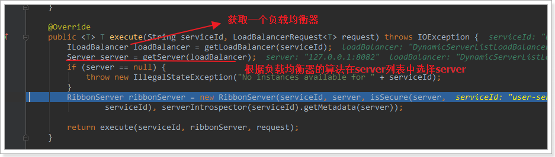
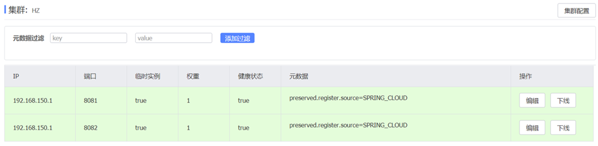
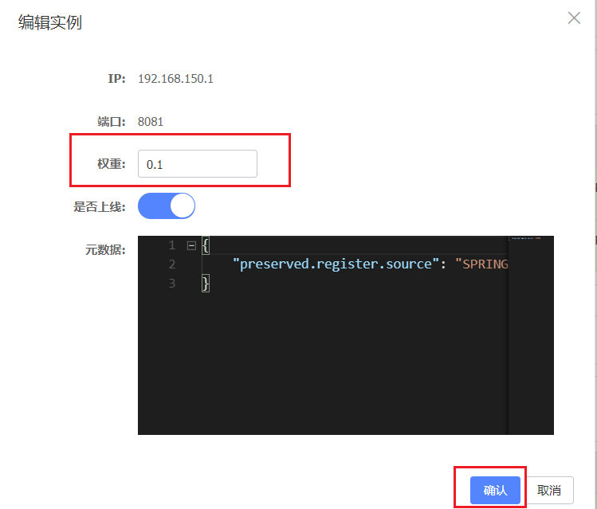
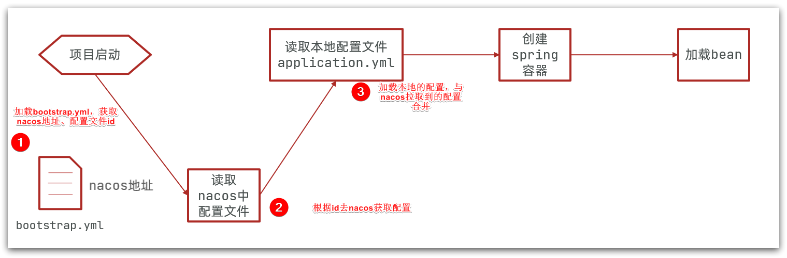
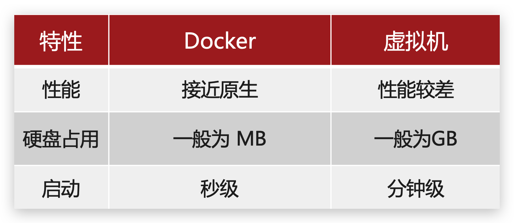
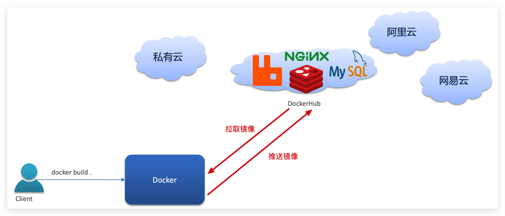
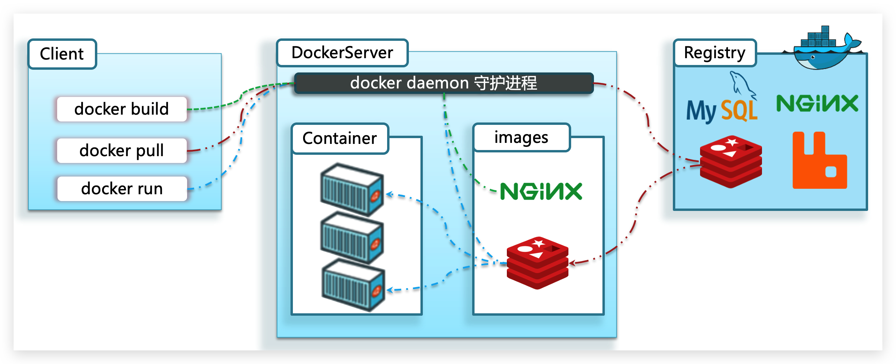
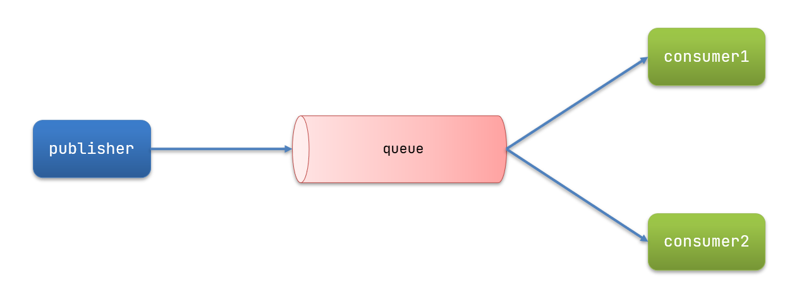

# 认识微服务
## 微服务演变

单体架构：将业务的所有功能集中在一个项目中，打成一个包部署
优点：架构简单，部署成本低
确定：耦合度高

---

分布式架构：根据业务功能对系统进行拆分，对每个业务模块作为独立项目开发，称为一个服务
优点：降低服务耦合，有利于服务升级扩展

---

### 服务治理
分布式架构的要考虑的问题

1. 服务拆分粒度如何
2. 服务集群地址如何维护
3. 服务之间如何实现远程调用
4. 服务健康状态如何感知

---

### 微服务
微服务是一种经过良好架构设计的分布式架构方案，微服务架构特征:

- 单一职责:微服务拆分粒度更小，每一个服务都对应唯一的业务能力，做到单一职责，避免重复业务开发
- 面向服务:微服务对外暴露业务接口
- 自治:团队独立、技术独立、数据独立、部署独立
- 隔离性强:服务调用做好隔离、容错、降级，避免出现级联问题

---

### 总结
单体架构特点?

- 简单方便，高度耦合，扩展性差，适合小型项目。、
- 例如: 学生管理系统

分布式架构特点?

- 松耦合，扩展性好，但架构复杂，难度大。
- 适合大型互联网项目，例如:京东、淘宝

微服务:

- 一种良好的 `分布式架构`实现方案
- 优点: 拆分粒度更小、服务更独立、耦合度更低
- 缺点:架构非常复杂，运维、监控、部署难度提高

---

## 微服务技术对比
### 微服务架构


---

### 微服务技术对比


---

### 企业需求


---

## SpringCloud


---

# 服务拆分及远程调用
## 服务拆分
### 服务拆分注意事项

1. 不同微服务，不要重复开发相同业务
2. 微服务数据独立，不要访问其它微服务的数据库
3. 微服务可以将自己的业务暴露为接口，供其它微服务调用

---

### 服务拆分Demo

1. 微服务需要根据业务模块拆分，做到单一职责不要重复开发相同

务

2. 微服务可以将业务暴露为接口，供其它微服务使用3.不同微服务都应该有自己独立的数据库

---

#### 订单服务调用用户服务

1. 注册 `RestTemplate` 


2. 服务远程调用 RestTemplate


##### 总结
微服务调用方式

1. 基于RestTemplate发起的http请求实现远程调用http请求做远程调用
2. 是与语言无关的调用，只要知道对方的ip、端口、接口路径:请求参数即可。

---

### 消费者与提供者

- 服务提供者：一次业务中，被其它微服务调用的服务。(提供接口给其它微服务)
- 服务消费者：一次业务中，调用其它微服务的服务。 (调用其它微服务提供的接口)
- 一个服务可以同时是提供者也可以是消费者

---

# Eureka
## Eureka的作用
### 服务调用出现的问题

- 服务消费者该如何获取服务提供者的地址信息?
- 如果有多个服务提供者，消费者该如何选择?
- 消费者如何得知服务提供者的健康状态?

---

- 消费者该如何获取服务提供者具体信息?
   1. 服务提供者启动时向eureka注册自己的信息
- eureka保存这些信息
   1. 消费者根据服务名称向eureka拉取提供者信息如果有多个服务提供者，消费者该如何选择?
   2. 服务消费者利用负载均衡算法，从服务列表中挑选一个消费者如何感知服务提供者健康状态?
   3. 服务提供者会每隔30秒向EurekaServer发送心跳请求，报告健康状态eureka会更新记录服务列表信息，心跳不正常会被剔除消费者就可以拉取到最新的信息


在Eureka架构中，微服务角色有两类:
EurekaServer: 服务端，注册中心

- 记录服务信息
- 心跳监控

EurekaClient: 客户端

- Provider: 服务提供者，例如案例中的 user-service
   - 注册自己的信息到EurekaServer
   - 每隔30秒向EurekaServer发送心跳
- consumer:服务消费者，例如案例中的 order-service
   - 根据服务名称从EurekaServer拉取服务列表
   - 基于服务列表做负载均衡，选中一个微服务后发起远程调用

---

## 搭建 Eureka
### 1.设置注册中心

1. 引入依赖
```xml
<dependency>
  <groupId>org.springframework.cloud</groupId>
  <artifactId>spring-cloud-starter-netflix-eureka-server</artifactId>
</dependency>
```

2. 设置启动类
```java
package cn.itcast.eureka;

import org.springframework.boot.SpringApplication;
import org.springframework.boot.autoconfigure.SpringBootApplication;
import org.springframework.cloud.netflix.eureka.server.EnableEurekaServer;

@SpringBootApplication
@EnableEurekaServer
public class EurekaApplication {
    public static void main(String[] args) {
        SpringApplication.run(EurekaApplication.class, args);
    }
}
```

3. 设置配置文件
```yaml
server:
  port: 10086
spring:
  application:
    name: eureka-server
eureka:
  client:
    service-url: 
      defaultZone: http://127.0.0.1:10086/eureka
```

---

### 2.服务注册

1. 引入依赖
```xml
<dependency>
    <groupId>org.springframework.cloud</groupId>
    <artifactId>spring-cloud-starter-netflix-eureka-client</artifactId>
</dependency>
```

2. 配置文件
```yaml
spring:
  application:
    name: userservice
eureka:
  client:
    service-url:
      defaultZone: http://127.0.0.1:10086/eureka
```

3. 设置多实例
- 首先，复制原来的user-service启动配置：


- 然后，在弹出的窗口中，填写信息：


---

#### 3.服务发现
在order-service的OrderApplication中，给RestTemplate这个Bean添加一个@LoadBalanced注解 

修改order-service服务中的cn.itcast.order.service包下的OrderService类中的queryOrderById方法。修改访问的url路径，用服务名代替ip、端口


---

## Ribbon 负载均衡
### 负载均衡原理
SpringCloud底层其实是利用了一个名为Ribbon的组件，来实现负载均衡功能的。
那么我们发出的请求明明是http://userservice/user/1，怎么变成了http://localhost:8081的呢？

### 源码跟踪
为什么我们只输入了service名称就可以访问了呢？之前还要获取ip和端口。
显然有人帮我们根据service名称，获取到了服务实例的ip和端口。它就是`LoadBalancerInterceptor`，这个类会在对RestTemplate的请求进行拦截，然后从Eureka根据服务id获取服务列表，随后利用负载均衡算法得到真实的服务地址信息，替换服务id。
我们进行源码跟踪：
#### 1）LoadBalancerIntercepor
可以看到这里的intercept方法，拦截了用户的HttpRequest请求，然后做了几件事：

- `request.getURI()`：获取请求uri，本例中就是 [http://user-service/user/8](http://user-service/user/8)
- `originalUri.getHost()`：获取uri路径的主机名，其实就是服务id，`user-service`
- `this.loadBalancer.execute()`：处理服务id，和用户请求。

这里的`this.loadBalancer`是`LoadBalancerClient`类型，我们继续跟入。

#### 2）LoadBalancerClient
继续跟入execute方法
代码是这样的：


- getLoadBalancer(serviceId)：根据服务id获取ILoadBalancer，而ILoadBalancer会拿着服务id去eureka中获取服务列表并保存起来。
- getServer(loadBalancer)：利用内置的负载均衡算法，从服务列表中选择一个。本例中，可以看到获取了8082端口的服务

放行后，再次访问并跟踪，发现获取的是8081：
果然实现了负载均衡


#### 3）负载均衡策略IRule
在刚才的代码中，可以看到获取服务使通过一个`getServer`方法来做负载均衡:

我们继续跟入：

继续跟踪源码chooseServer方法，发现这么一段代码：

我们看看这个rule是谁：

这里的rule默认值是一个`RoundRobinRule`，看类的介绍：

这不就是轮询的意思嘛。
到这里，整个负载均衡的流程我们就清楚了。
#### 4）总结
SpringCloudRibbon的底层采用了一个拦截器，拦截了RestTemplate发出的请求，对地址做了修改。用一幅图来总结一下：
基本流程如下：

- 拦截我们的RestTemplate请求http://userservice/user/1
- RibbonLoadBalancerClient会从请求url中获取服务名称，也就是user-service
- DynamicServerListLoadBalancer根据user-service到eureka拉取服务列表
- eureka返回列表，localhost:8081、localhost:8082
- IRule利用内置负载均衡规则，从列表中选择一个，例如localhost:8081
- RibbonLoadBalancerClient修改请求地址，用localhost:8081替代userservice，得到http://localhost:8081/user/1，发起真实请求

---

### 负载均衡策略
#### 负载均衡策略
负载均衡的规则都定义在IRule接口中，而IRule有很多不同的实现类：
不同规则的含义如下：

| **内置负载均衡规则类** | **规则描述** |
| --- | --- |
| RoundRobinRule | 简单轮询服务列表来选择服务器。它是Ribbon默认的负载均衡规则。 |
| AvailabilityFilteringRule | 对以下两种服务器进行忽略：   （1）在默认情况下，这台服务器如果3次连接失败，这台服务器就会被设置为“短路”状态。短路状态将持续30秒，如果再次连接失败，短路的持续时间就会几何级地增加。  （2）并发数过高的服务器。如果一个服务器的并发连接数过高，配置了AvailabilityFilteringRule规则的客户端也会将其忽略。并发连接数的上限，可以由客户端的..ActiveConnectionsLimit属性进行配置。 |
| WeightedResponseTimeRule | 为每一个服务器赋予一个权重值。服务器响应时间越长，这个服务器的权重就越小。这个规则会随机选择服务器，这个权重值会影响服务器的选择。 |
| **ZoneAvoidanceRule** | 以区域可用的服务器为基础进行服务器的选择。使用Zone对服务器进行分类，这个Zone可以理解为一个机房、一个机架等。而后再对Zone内的多个服务做轮询。 |
| BestAvailableRule | 忽略那些短路的服务器，并选择并发数较低的服务器。 |
| RandomRule | 随机选择一个可用的服务器。 |
| RetryRule | 重试机制的选择逻辑 |

默认的实现就是ZoneAvoidanceRule，是一种轮询方案

---

#### 自定义负载均衡策略
通过定义IRule实现可以修改负载均衡规则，有两种方式：

1. 代码方式：在order-service中的OrderApplication类中，定义一个新的IRule：
```java
@Bean
public IRule randomRule(){
    return new RandomRule();
}
```

2. 配置文件方式：在order-service的application.yml文件中，添加新的配置也可以修改规则：
```yaml
userservice: # 给某个微服务配置负载均衡规则，这里是userservice服务
  ribbon:
    NFLoadBalancerRuleClassName: com.netflix.loadbalancer.RandomRule # 负载均衡规则
```

> **注意**，一般用默认的负载均衡规则，不做修改。


---

#### 饥饿加载
Ribbon默认是采用懒加载，即第一次访问时才会去创建LoadBalanceClient，请求时间会很长。
而饥饿加载则会在项目启动时创建，降低第一次访问的耗时，通过下面配置开启饥饿加载：
```yaml
ribbon:
  eager-load:
    enabled: true
    clients: userservice
```

---

# nacos
启动命令
```shell
startup.cmd -m standalone
```

---

## 配置nacos

1. 引入依赖
- 父工程
```xml
<dependency>
    <groupId>com.alibaba.cloud</groupId>
    <artifactId>spring-cloud-alibaba-dependencies</artifactId>
    <version>2.2.6.RELEASE</version>
    <type>pom</type>
    <scope>import</scope>
</dependency>
```

- 子工程
```xml
<dependency>
    <groupId>com.alibaba.cloud</groupId>
    <artifactId>spring-cloud-starter-alibaba-nacos-discovery</artifactId>
</dependency>
```

2. yml 配置
```yaml
spring:
  cloud:
    nacos:
      server-addr: localhost:8848
```

---

## 服务分级存储模型
一个**服务**可以有多个**实例**，例如我们的user-service，可以有:

- 127.0.0.1:8081
- 127.0.0.1:8082
- 127.0.0.1:8083

假如这些实例分布于全国各地的不同机房，例如：

- 127.0.0.1:8081，在上海机房
- 127.0.0.1:8082，在上海机房
- 127.0.0.1:8083，在杭州机房

Nacos就将同一机房内的实例 划分为一个**集群**。

也就是说，user-service是服务，一个服务可以包含多个集群，如杭州、上海，每个集群下可以有多个实例，形成分级模型，如图：

微服务互相访问时，应该尽可能访问同集群实例，因为本地访问速度更快。当本集群内不可用时，才访问其它集群。例如：

杭州机房内的order-service应该优先访问同机房的user-service。

---

### nacos 集群配置

- 配置yml
```yaml
spring:
  cloud:
    nacos:
      server-addr: localhost:8848
      discovery:
        cluster-name: HZ # 集群名称
```
重启两个user-service实例后，我们可以在nacos控制台看到下面结果：

我们再次复制一个user-service启动配置，添加属性：
```shell
-Dserver.port=8083 -Dspring.cloud.nacos.discovery.cluster-name=SH
```
配置如图所示：


---

### 同集群优先访问

- 配置集群信息
```yaml
spring:
  cloud:
    nacos:
      server-addr: localhost:8848
      discovery:
        cluster-name: HZ # 集群名称
```

- 配置服务消费者的负载均衡策略
```yaml
userservice:
  ribbon:
    NFLoadBalancerRuleClassName: com.alibaba.cloud.nacos.ribbon.NacosRule # 负载均衡规则 
```

---

## 权重配置
服务器设备性能有差异，部分实例所在机器性能较好，另一些较差，我们希望性能好的机器承担更多的用户请求。
但默认情况下NacosRule是同集群内随机挑选，不会考虑机器的性能问题。
因此，Nacos提供了权重配置来控制访问频率，权重越大则访问频率越高。
在nacos控制台，找到user-service的实例列表，点击编辑，即可修改权重：

在弹出的编辑窗口，修改权重：

如果权重为0就不会被访问

---

## 环境隔离
Nacos提供了namespace来实现环境隔离功能。

- nacos中可以有多个namespace
- namespace下可以有group、service等
- 不同namespace之间相互隔离，例如不同namespace的服务互相不可见


### 创建namespace
默认情况下，所有service、data、group都在同一个namespace，名为public：

我们可以点击页面新增按钮，添加一个namespace：

然后，填写表单：

就能在页面看到一个新的namespace：


---

### 配置 namespace
给微服务配置namespace只能通过修改配置来实现。
例如，修改order-service的application.yml文件：
```yaml
spring:
  cloud:
    nacos:
      server-addr: localhost:8848
      discovery:
        cluster-name: HZ
        namespace: 492a7d5d-237b-46a1-a99a-fa8e98e4b0f9 # 命名空间，填ID
```
重启order-service后，访问控制台，可以看到下面的结果：


此时访问order-service，因为namespace不同，会导致找不到userservice，控制台会报错：


---

## nacos 与 Eureka 的区别
Nacos的服务实例分为两种l类型：

-  临时实例：如果实例宕机超过一定时间，会从服务列表剔除，默认的类型。 
-  非临时实例：如果实例宕机，不会从服务列表剔除，也可以叫永久实例。 

配置一个服务实例为永久实例：
```yaml
spring:
  cloud:
    nacos:
      discovery:
        ephemeral: false # 设置为非临时实例
```
Nacos和Eureka整体结构类似，服务注册、服务拉取、心跳等待，但是也存在一些差异：


-  Nacos与eureka的共同点 
   - 都支持服务注册和服务拉取
   - 都支持服务提供者心跳方式做健康检测
-  Nacos与Eureka的区别 
   - Nacos支持服务端主动检测提供者状态：临时实例采用心跳模式，非临时实例采用主动检测模式
   - 临时实例心跳不正常会被剔除，非临时实例则不会被剔除
   - Nacos支持服务列表变更的消息推送模式，服务列表更新更及时
   - Nacos集群默认采用AP方式，当集群中存在非临时实例时，采用CP模式；Eureka采用AP方式

---

## 配置管理
### 添加配置

然后在弹出的表单中，填写配置信息：

项目的核心配置，需要热更新的配置才有放到nacos管理的必要。基本不会变更的一些配置还是保存在微服务本地比较好。

---

### 拉取配置
微服务要拉取nacos中管理的配置，并且与本地的application.yml配置合并，才能完成项目启动。
但如果尚未读取application.yml，又如何得知nacos地址呢？
因此spring引入了一种新的配置文件：bootstrap.yaml文件，会在application.yml之前被读取，流程如下：


1. 添加依赖
```xml
<!--nacos配置管理依赖-->
<dependency>
    <groupId>com.alibaba.cloud</groupId>
    <artifactId>spring-cloud-starter-alibaba-nacos-config</artifactId>
</dependency>
```

2. 添加 bootstrap.yaml
```yaml
spring:
  application:
    name: userservice # 服务名称
  profiles:
    active: dev #开发环境，这里是dev 
  cloud:
    nacos:
      server-addr: localhost:8848 # Nacos地址
      config:
        file-extension: yaml # 文件后缀名
```
这里会根据spring.cloud.nacos.server-addr获取nacos地址，再根据
 `${spring.application.name}-${spring.profiles.active}.${spring.cloud.nacos.config.file-extension}`作为文件id，来读取配置。
本例中，就是去读取 `userservice-dev.yaml`：


3. 读取配置

在user-service中的UserController中添加业务逻辑，读取pattern.dateformat配置：


---

### 配置热更新
#### 使用 value 和 refreshScope 注解


---

#### 使用 ConfigurationProperties 注解代替 Value 注解
在user-service服务中，添加一个类，读取patterrn.dateformat属性：
```java
package cn.itcast.user.config;

import lombok.Data;
import org.springframework.boot.context.properties.ConfigurationProperties;
import org.springframework.stereotype.Component;

@Component
@Data
@ConfigurationProperties(prefix = "pattern")
public class PatternProperties {
    private String dateformat;
}
```
在UserController中使用这个类代替@Value：

#### 注意事项

- 不是所有的配置都适合放到配置中心，维护起来比较麻烦
- 建议将一些关键参数，需要运行时调整的参数放到nacos配置中心，一般都是自定义配置

---

### 配置共享
其实微服务启动时，会去nacos读取多个配置文件，例如：

-  `[spring.application.name]-[spring.profiles.active].yaml`，例如：userservice-dev.yaml 
-  `[spring.application.name].yaml`，例如：userservice.yaml 

而`[spring.application.name].yaml`不包含环境，因此可以被多个环境共享。

---

#### 添加环境共享配置
我们在nacos中添加一个userservice.yaml文件：

在user-service服务中，修改PatternProperties类，读取新添加的属性：

运行两个UserApplication，使用不同的profile


这样，UserApplication(8081)使用的profile是dev，UserApplication2(8082)使用的profile是test。
启动UserApplication和UserApplication2

---

#### 配置共享的优先级
当nacos、服务本地同时出现相同属性时，优先级有高低之分：


---

## 集群搭建

其中包含3个nacos节点，然后一个负载均衡器代理3个Nacos。这里负载均衡器可以使用nginx。
我们计划的集群结构：


---

1. 初始化数据库

Nacos默认数据存储在内嵌数据库Derby中，不属于生产可用的数据库。
官方推荐的最佳实践是使用带有主从的高可用数据库集群，主从模式的高可用数据库可以参考**传智教育**的后续高手课程。
这里我们以单点的数据库为例来讲解。
首先新建一个数据库，命名为nacos，而后导入下面的SQL：
```sql
CREATE TABLE `config_info` (
  `id` bigint(20) NOT NULL AUTO_INCREMENT COMMENT 'id',
  `data_id` varchar(255) NOT NULL COMMENT 'data_id',
  `group_id` varchar(255) DEFAULT NULL,
  `content` longtext NOT NULL COMMENT 'content',
  `md5` varchar(32) DEFAULT NULL COMMENT 'md5',
  `gmt_create` datetime NOT NULL DEFAULT CURRENT_TIMESTAMP COMMENT '创建时间',
  `gmt_modified` datetime NOT NULL DEFAULT CURRENT_TIMESTAMP COMMENT '修改时间',
  `src_user` text COMMENT 'source user',
  `src_ip` varchar(50) DEFAULT NULL COMMENT 'source ip',
  `app_name` varchar(128) DEFAULT NULL,
  `tenant_id` varchar(128) DEFAULT '' COMMENT '租户字段',
  `c_desc` varchar(256) DEFAULT NULL,
  `c_use` varchar(64) DEFAULT NULL,
  `effect` varchar(64) DEFAULT NULL,
  `type` varchar(64) DEFAULT NULL,
  `c_schema` text,
  PRIMARY KEY (`id`),
  UNIQUE KEY `uk_configinfo_datagrouptenant` (`data_id`,`group_id`,`tenant_id`)
) ENGINE=InnoDB DEFAULT CHARSET=utf8 COLLATE=utf8_bin COMMENT='config_info';

/******************************************/
/*   数据库全名 = nacos_config   */
/*   表名称 = config_info_aggr   */
/******************************************/
CREATE TABLE `config_info_aggr` (
  `id` bigint(20) NOT NULL AUTO_INCREMENT COMMENT 'id',
  `data_id` varchar(255) NOT NULL COMMENT 'data_id',
  `group_id` varchar(255) NOT NULL COMMENT 'group_id',
  `datum_id` varchar(255) NOT NULL COMMENT 'datum_id',
  `content` longtext NOT NULL COMMENT '内容',
  `gmt_modified` datetime NOT NULL COMMENT '修改时间',
  `app_name` varchar(128) DEFAULT NULL,
  `tenant_id` varchar(128) DEFAULT '' COMMENT '租户字段',
  PRIMARY KEY (`id`),
  UNIQUE KEY `uk_configinfoaggr_datagrouptenantdatum` (`data_id`,`group_id`,`tenant_id`,`datum_id`)
) ENGINE=InnoDB DEFAULT CHARSET=utf8 COLLATE=utf8_bin COMMENT='增加租户字段';


/******************************************/
/*   数据库全名 = nacos_config   */
/*   表名称 = config_info_beta   */
/******************************************/
CREATE TABLE `config_info_beta` (
  `id` bigint(20) NOT NULL AUTO_INCREMENT COMMENT 'id',
  `data_id` varchar(255) NOT NULL COMMENT 'data_id',
  `group_id` varchar(128) NOT NULL COMMENT 'group_id',
  `app_name` varchar(128) DEFAULT NULL COMMENT 'app_name',
  `content` longtext NOT NULL COMMENT 'content',
  `beta_ips` varchar(1024) DEFAULT NULL COMMENT 'betaIps',
  `md5` varchar(32) DEFAULT NULL COMMENT 'md5',
  `gmt_create` datetime NOT NULL DEFAULT CURRENT_TIMESTAMP COMMENT '创建时间',
  `gmt_modified` datetime NOT NULL DEFAULT CURRENT_TIMESTAMP COMMENT '修改时间',
  `src_user` text COMMENT 'source user',
  `src_ip` varchar(50) DEFAULT NULL COMMENT 'source ip',
  `tenant_id` varchar(128) DEFAULT '' COMMENT '租户字段',
  PRIMARY KEY (`id`),
  UNIQUE KEY `uk_configinfobeta_datagrouptenant` (`data_id`,`group_id`,`tenant_id`)
) ENGINE=InnoDB DEFAULT CHARSET=utf8 COLLATE=utf8_bin COMMENT='config_info_beta';

/******************************************/
/*   数据库全名 = nacos_config   */
/*   表名称 = config_info_tag   */
/******************************************/
CREATE TABLE `config_info_tag` (
  `id` bigint(20) NOT NULL AUTO_INCREMENT COMMENT 'id',
  `data_id` varchar(255) NOT NULL COMMENT 'data_id',
  `group_id` varchar(128) NOT NULL COMMENT 'group_id',
  `tenant_id` varchar(128) DEFAULT '' COMMENT 'tenant_id',
  `tag_id` varchar(128) NOT NULL COMMENT 'tag_id',
  `app_name` varchar(128) DEFAULT NULL COMMENT 'app_name',
  `content` longtext NOT NULL COMMENT 'content',
  `md5` varchar(32) DEFAULT NULL COMMENT 'md5',
  `gmt_create` datetime NOT NULL DEFAULT CURRENT_TIMESTAMP COMMENT '创建时间',
  `gmt_modified` datetime NOT NULL DEFAULT CURRENT_TIMESTAMP COMMENT '修改时间',
  `src_user` text COMMENT 'source user',
  `src_ip` varchar(50) DEFAULT NULL COMMENT 'source ip',
  PRIMARY KEY (`id`),
  UNIQUE KEY `uk_configinfotag_datagrouptenanttag` (`data_id`,`group_id`,`tenant_id`,`tag_id`)
) ENGINE=InnoDB DEFAULT CHARSET=utf8 COLLATE=utf8_bin COMMENT='config_info_tag';

/******************************************/
/*   数据库全名 = nacos_config   */
/*   表名称 = config_tags_relation   */
/******************************************/
CREATE TABLE `config_tags_relation` (
  `id` bigint(20) NOT NULL COMMENT 'id',
  `tag_name` varchar(128) NOT NULL COMMENT 'tag_name',
  `tag_type` varchar(64) DEFAULT NULL COMMENT 'tag_type',
  `data_id` varchar(255) NOT NULL COMMENT 'data_id',
  `group_id` varchar(128) NOT NULL COMMENT 'group_id',
  `tenant_id` varchar(128) DEFAULT '' COMMENT 'tenant_id',
  `nid` bigint(20) NOT NULL AUTO_INCREMENT,
  PRIMARY KEY (`nid`),
  UNIQUE KEY `uk_configtagrelation_configidtag` (`id`,`tag_name`,`tag_type`),
  KEY `idx_tenant_id` (`tenant_id`)
) ENGINE=InnoDB DEFAULT CHARSET=utf8 COLLATE=utf8_bin COMMENT='config_tag_relation';

/******************************************/
/*   数据库全名 = nacos_config   */
/*   表名称 = group_capacity   */
/******************************************/
CREATE TABLE `group_capacity` (
  `id` bigint(20) unsigned NOT NULL AUTO_INCREMENT COMMENT '主键ID',
  `group_id` varchar(128) NOT NULL DEFAULT '' COMMENT 'Group ID，空字符表示整个集群',
  `quota` int(10) unsigned NOT NULL DEFAULT '0' COMMENT '配额，0表示使用默认值',
  `usage` int(10) unsigned NOT NULL DEFAULT '0' COMMENT '使用量',
  `max_size` int(10) unsigned NOT NULL DEFAULT '0' COMMENT '单个配置大小上限，单位为字节，0表示使用默认值',
  `max_aggr_count` int(10) unsigned NOT NULL DEFAULT '0' COMMENT '聚合子配置最大个数，，0表示使用默认值',
  `max_aggr_size` int(10) unsigned NOT NULL DEFAULT '0' COMMENT '单个聚合数据的子配置大小上限，单位为字节，0表示使用默认值',
  `max_history_count` int(10) unsigned NOT NULL DEFAULT '0' COMMENT '最大变更历史数量',
  `gmt_create` datetime NOT NULL DEFAULT CURRENT_TIMESTAMP COMMENT '创建时间',
  `gmt_modified` datetime NOT NULL DEFAULT CURRENT_TIMESTAMP COMMENT '修改时间',
  PRIMARY KEY (`id`),
  UNIQUE KEY `uk_group_id` (`group_id`)
) ENGINE=InnoDB DEFAULT CHARSET=utf8 COLLATE=utf8_bin COMMENT='集群、各Group容量信息表';

/******************************************/
/*   数据库全名 = nacos_config   */
/*   表名称 = his_config_info   */
/******************************************/
CREATE TABLE `his_config_info` (
  `id` bigint(64) unsigned NOT NULL,
  `nid` bigint(20) unsigned NOT NULL AUTO_INCREMENT,
  `data_id` varchar(255) NOT NULL,
  `group_id` varchar(128) NOT NULL,
  `app_name` varchar(128) DEFAULT NULL COMMENT 'app_name',
  `content` longtext NOT NULL,
  `md5` varchar(32) DEFAULT NULL,
  `gmt_create` datetime NOT NULL DEFAULT CURRENT_TIMESTAMP,
  `gmt_modified` datetime NOT NULL DEFAULT CURRENT_TIMESTAMP,
  `src_user` text,
  `src_ip` varchar(50) DEFAULT NULL,
  `op_type` char(10) DEFAULT NULL,
  `tenant_id` varchar(128) DEFAULT '' COMMENT '租户字段',
  PRIMARY KEY (`nid`),
  KEY `idx_gmt_create` (`gmt_create`),
  KEY `idx_gmt_modified` (`gmt_modified`),
  KEY `idx_did` (`data_id`)
) ENGINE=InnoDB DEFAULT CHARSET=utf8 COLLATE=utf8_bin COMMENT='多租户改造';


/******************************************/
/*   数据库全名 = nacos_config   */
/*   表名称 = tenant_capacity   */
/******************************************/
CREATE TABLE `tenant_capacity` (
  `id` bigint(20) unsigned NOT NULL AUTO_INCREMENT COMMENT '主键ID',
  `tenant_id` varchar(128) NOT NULL DEFAULT '' COMMENT 'Tenant ID',
  `quota` int(10) unsigned NOT NULL DEFAULT '0' COMMENT '配额，0表示使用默认值',
  `usage` int(10) unsigned NOT NULL DEFAULT '0' COMMENT '使用量',
  `max_size` int(10) unsigned NOT NULL DEFAULT '0' COMMENT '单个配置大小上限，单位为字节，0表示使用默认值',
  `max_aggr_count` int(10) unsigned NOT NULL DEFAULT '0' COMMENT '聚合子配置最大个数',
  `max_aggr_size` int(10) unsigned NOT NULL DEFAULT '0' COMMENT '单个聚合数据的子配置大小上限，单位为字节，0表示使用默认值',
  `max_history_count` int(10) unsigned NOT NULL DEFAULT '0' COMMENT '最大变更历史数量',
  `gmt_create` datetime NOT NULL DEFAULT CURRENT_TIMESTAMP COMMENT '创建时间',
  `gmt_modified` datetime NOT NULL DEFAULT CURRENT_TIMESTAMP COMMENT '修改时间',
  PRIMARY KEY (`id`),
  UNIQUE KEY `uk_tenant_id` (`tenant_id`)
) ENGINE=InnoDB DEFAULT CHARSET=utf8 COLLATE=utf8_bin COMMENT='租户容量信息表';


CREATE TABLE `tenant_info` (
  `id` bigint(20) NOT NULL AUTO_INCREMENT COMMENT 'id',
  `kp` varchar(128) NOT NULL COMMENT 'kp',
  `tenant_id` varchar(128) default '' COMMENT 'tenant_id',
  `tenant_name` varchar(128) default '' COMMENT 'tenant_name',
  `tenant_desc` varchar(256) DEFAULT NULL COMMENT 'tenant_desc',
  `create_source` varchar(32) DEFAULT NULL COMMENT 'create_source',
  `gmt_create` bigint(20) NOT NULL COMMENT '创建时间',
  `gmt_modified` bigint(20) NOT NULL COMMENT '修改时间',
  PRIMARY KEY (`id`),
  UNIQUE KEY `uk_tenant_info_kptenantid` (`kp`,`tenant_id`),
  KEY `idx_tenant_id` (`tenant_id`)
) ENGINE=InnoDB DEFAULT CHARSET=utf8 COLLATE=utf8_bin COMMENT='tenant_info';

CREATE TABLE `users` (
	`username` varchar(50) NOT NULL PRIMARY KEY,
	`password` varchar(500) NOT NULL,
	`enabled` boolean NOT NULL
);

CREATE TABLE `roles` (
	`username` varchar(50) NOT NULL,
	`role` varchar(50) NOT NULL,
	UNIQUE INDEX `idx_user_role` (`username` ASC, `role` ASC) USING BTREE
);

CREATE TABLE `permissions` (
    `role` varchar(50) NOT NULL,
    `resource` varchar(255) NOT NULL,
    `action` varchar(8) NOT NULL,
    UNIQUE INDEX `uk_role_permission` (`role`,`resource`,`action`) USING BTREE
);

INSERT INTO users (username, password, enabled) VALUES ('nacos', '$2a$10$EuWPZHzz32dJN7jexM34MOeYirDdFAZm2kuWj7VEOJhhZkDrxfvUu', TRUE);

INSERT INTO roles (username, role) VALUES ('nacos', 'ROLE_ADMIN');
```

2. 配置nacos

进入nacos的conf目录，修改配置文件cluster.conf.example，重命名为cluster.conf
然后添加内容：
```sql
127.0.0.1:8845
127.0.0.1.8846
127.0.0.1.8847
```
然后修改application.properties文件，添加数据库配置
```properties
spring.datasource.platform=mysql

db.num=1

db.url.0=jdbc:mysql://127.0.0.1:3306/nacos?characterEncoding=utf8&connectTimeout=1000&socketTimeout=3000&autoReconnect=true&useUnicode=true&useSSL=false&serverTimezone=UTC
db.user.0=root
db.password.0=123
```

3. 启动

将nacos文件夹复制三份，分别命名为：nacos1、nacos2、nacos3
然后分别修改三个文件夹中的application.properties
```properties
server.port=8845
```
然后分别启动三个nacos节点：
```shell
startup.cmd
```

4. 启动 nginx

修改conf/nginx.conf文件，配置如下：
在 html 节点配置
```nginx
upstream nacos-cluster {
  server 127.0.0.1:8845;
	server 127.0.0.1:8846;
	server 127.0.0.1:8847;
}

server {
    listen       80;
    server_name  localhost;

    location /nacos {
        proxy_pass http://nacos-cluster;
    }
}
```
而后在浏览器访问：[http://localhost/nacos](http://localhost/nacos)即可。

5. 修改 yml
```yaml
spring:
  cloud:
    nacos:
      server-addr: localhost:80 # Nacos地址
```

---

# Feign
## 配置使用 Feign
地址：[https://github.com/OpenFeign/feign](https://github.com/OpenFeign/feign)

1. 引入依赖
```xml
<dependency>
    <groupId>org.springframework.cloud</groupId>
    <artifactId>spring-cloud-starter-openfeign</artifactId>
</dependency>
```

2. 添加启动注解


3. 编写客户端代码
```java
package cn.itcast.order.client;

import cn.itcast.order.pojo.User;
import org.springframework.cloud.openfeign.FeignClient;
import org.springframework.web.bind.annotation.GetMapping;
import org.springframework.web.bind.annotation.PathVariable;

@FeignClient("userservice")
public interface UserClient {
    @GetMapping("/user/{id}")
    User findById(@PathVariable("id") Long id);
}
```
这个客户端主要是基于SpringMVC的注解来声明远程调用的信息，比如：
- 服务名称：userservice
- 请求方式：GET
- 请求路径：/user/{id}
- 请求参数：Long id
- 返回值类型：User
这样，Feign就可以帮助我们发送http请求，无需自己使用RestTemplate来发送了。

4. 使用

修改order-service中的OrderService类中的queryOrderById方法，使用Feign客户端代替RestTemplate：


---

## 自定义配置
Feign可以支持很多的自定义配置，如下表所示：

| 类型 | 作用 | 说明 |
| --- | --- | --- |
| **feign.Logger.Level** | 修改日志级别 | 包含四种不同的级别：NONE、BASIC、HEADERS、FULL |
| feign.codec.Decoder | 响应结果的解析器 | http远程调用的结果做解析，例如解析json字符串为java对象 |
| feign.codec.Encoder | 请求参数编码 | 将请求参数编码，便于通过http请求发送 |
| feign. Contract | 支持的注解格式 | 默认是SpringMVC的注解 |
| feign. Retryer | 失败重试机制 | 请求失败的重试机制，默认是没有，不过会使用Ribbon的重试 |

一般情况下，默认值就能满足我们使用，如果要自定义时，只需要创建自定义的@Bean覆盖默认Bean即可。

---

1. 配置文件方式配置

基于配置文件修改feign的日志级别可以针对单个服务：
```yaml
feign:  
  client:
    config: 
      userservice: # 针对某个微服务的配置
        loggerLevel: FULL #  日志级别
```
也可以针对所有服务：
```yaml
feign:  
  client:
    config: 
      default: # 这里用default就是全局配置，如果是写服务名称，则是针对某个微服务的配置
        loggerLevel: FULL #  日志级别
```
而日志的级别分为四种：

- NONE：不记录任何日志信息，这是默认值。
- BASIC：仅记录请求的方法，URL以及响应状态码和执行时间
- HEADERS：在BASIC的基础上，额外记录了请求和响应的头信息
- FULL：记录所有请求和响应的明细，包括头信息、请求体、元数据。

---

2. 代码方式配置

也可以基于Java代码来修改日志级别，先声明一个类，然后声明一个Logger.Level的对象：
```java
public class DefaultFeignConfiguration  {
    @Bean
    public Logger.Level feignLogLevel(){
        return Logger.Level.BASIC; // 日志级别为BASIC
    }
}
```
如果要**全局生效**，将其放到启动类的@EnableFeignClients这个注解中：
```java
@EnableFeignClients(defaultConfiguration = DefaultFeignConfiguration .class)
```
如果是**局部生效**，则把它放到对应的@FeignClient这个注解中：
```java
@FeignClient(value = "userservice", configuration = DefaultFeignConfiguration .class)
```

---

## 优化
Feign底层发起http请求，依赖于其它的框架。其底层客户端实现包括：
•URLConnection：默认实现，不支持连接池
•Apache HttpClient ：支持连接池
•OKHttp：支持连接池
因此提高Feign的性能主要手段就是使用**连接池**代替默认的URLConnection。
这里我们用Apache的HttpClient来演示。

1. 引入依赖

在order-service的pom文件中引入Apache的HttpClient依赖：
```xml
<!--httpClient的依赖 -->
<dependency>
    <groupId>io.github.openfeign</groupId>
    <artifactId>feign-httpclient</artifactId>
</dependency>
```

2. 配置连接池

在order-service的application.yml中添加配置：
```yaml
feign:
  client:
    config:
      default: # default全局的配置
        loggerLevel: BASIC # 日志级别，BASIC就是基本的请求和响应信息
  httpclient:
    enabled: true # 开启feign对HttpClient的支持
    max-connections: 200 # 最大的连接数
    max-connections-per-route: 50 # 每个路径的最大连接数
```
接下来，在FeignClientFactoryBean中的loadBalance方法中打断点：

Debug方式启动order-service服务，可以看到这里的client，底层就是Apache HttpClient：

总结，Feign的优化：
1.日志级别尽量用basic
2.使用HttpClient或OKHttp代替URLConnection
①  引入feign-httpClient依赖
②  配置文件开启httpClient功能，设置连接池参数

---

## 最佳实践
所谓最近实践，就是使用过程中总结的经验，最好的一种使用方式。
自习观察可以发现，Feign的客户端与服务提供者的controller代码非常相似：
feign客户端：
UserController：


---

### 继承
一样的代码可以通过继承来共享：
1）定义一个API接口，利用定义方法，并基于SpringMVC注解做声明。
2）Feign客户端和Controller都集成改接口

优点：
- 简单
- 实现了代码共享
缺点：
- 服务提供方、服务消费方紧耦合
- 参数列表中的注解映射并不会继承，因此Controller中必须再次声明方法、参数列表、注解

---

## 抽取
将Feign的Client抽取为独立模块，并且把接口有关的POJO、默认的Feign配置都放到这个模块中，提供给所有消费者使用。
例如，将UserClient、User、Feign的默认配置都抽取到一个feign-api包中，所有微服务引用该依赖包，即可直接使用。


---

### 实现 抽取 的实现方式

1. 创建


2. 引入依赖
```xml
<dependency>
  <groupId>org.springframework.cloud</groupId>
  <artifactId>spring-cloud-starter-openfeign</artifactId>
</dependency>
```

3. 剪贴文件

order-service中编写的UserClient、User、DefaultFeignConfiguration都复制到feign-api项目中


3. 调用

首先，删除order-service中的UserClient、User、DefaultFeignConfiguration等类或接口。
在order-service的pom文件中中引入feign-api的依赖：
```xml
<dependency>
    <groupId>cn.itcast.demo</groupId>
    <artifactId>feign-api</artifactId>
    <version>1.0</version>
</dependency>
```
修改order-service中的所有与上述三个组件有关的导包部分，改成导入feign-api中的包

4. 启动测试

重启后，发现服务报错了：

这是因为UserClient现在在cn.itcast.feign.clients包下，
而order-service的@EnableFeignClients注解是在cn.itcast.order包下，不在同一个包，无法扫描到UserClient。

5. 解决方案

方式一：
指定Feign应该扫描的包：
```java
@EnableFeignClients(basePackages = "cn.itcast.feign.clients")
```
方式二：
指定需要加载的Client接口：
```java
@EnableFeignClients(clients = {UserClient.class})
```

---

# 网关
Spring Cloud Gateway 是 Spring Cloud 的一个全新项目，该项目是基于 Spring 5.0，Spring Boot 2.0 和 Project Reactor 等响应式编程和事件流技术开发的网关，它旨在为微服务架构提供一种简单有效的统一的 API 路由管理方式。 

---

## 为什么需要网关
Gateway网关是我们服务的守门神，所有微服务的统一入口。
网关的**核心功能特性**：

- 请求路由
- 权限控制
- 限流

架构图：

**权限控制**：网关作为微服务入口，需要校验用户是是否有请求资格，如果没有则进行拦截。
**路由和负载均衡**：一切请求都必须先经过gateway，但网关不处理业务，而是根据某种规则，把请求转发到某个微服务，这个过程叫做路由。当然路由的目标服务有多个时，还需要做负载均衡。
**限流**：当请求流量过高时，在网关中按照下流的微服务能够接受的速度来放行请求，避免服务压力过大。
在SpringCloud中网关的实现包括两种：

- gateway
- zuul

Zuul是基于Servlet的实现，属于阻塞式编程。而SpringCloudGateway则是基于Spring5中提供的WebFlux，属于响应式编程的实现，具备更好的性能。

---

## 搭建网关
下面，我们就演示下网关的基本路由功能。基本步骤如下：
1. 创建SpringBoot工程gateway，引入网关依赖
2. 编写启动类
3. 编写基础配置和路由规则
4. 启动网关服务进行测试

---

1. 创建模块


```xml
<!--网关-->
<dependency>
    <groupId>org.springframework.cloud</groupId>
    <artifactId>spring-cloud-starter-gateway</artifactId>
</dependency>
<!--nacos服务发现依赖-->
<dependency>
    <groupId>com.alibaba.cloud</groupId>
    <artifactId>spring-cloud-starter-alibaba-nacos-discovery</artifactId>
</dependency>
```

2. 设置启动类
```java
package cn.itcast.gateway;

import org.springframework.boot.SpringApplication;
import org.springframework.boot.autoconfigure.SpringBootApplication;

@SpringBootApplication
public class GatewayApplication {

	public static void main(String[] args) {
		SpringApplication.run(GatewayApplication.class, args);
	}
}
```

3. 设置配置文件
```yaml
server:
  port: 10010 # 网关端口
spring:
  application:
    name: gateway # 服务名称
  cloud:
    nacos:
      server-addr: localhost:8848 # nacos地址
    gateway:
      routes: # 网关路由配置
        - id: user-service # 路由id，自定义，只要唯一即可
          # uri: http://127.0.0.1:8081 # 路由的目标地址 http就是固定地址
          uri: lb://userservice # 路由的目标地址 lb就是负载均衡，后面跟服务名称
          predicates: # 路由断言，也就是判断请求是否符合路由规则的条件
            - Path=/user/** # 这个是按照路径匹配，只要以/user/开头就符合要求
```
我们将符合 `Path`规则的一切请求，都代理到 `uri`参数指定的地址。
本例中，我们将  `/user/**`开头的请求，代理到 `lb://userservice`，lb是负载均衡，根据服务名拉取服务列表，实现负载均衡。

4. 启动测试

重启网关，访问[http://localhost:10010/user/1](http://localhost:10010/user/1)时，符合`/user/**`规则，请求转发到uri：[http://userservice/user/1](http://userservice/user/1)，得到了结果：


5. 网关流程图


---

总结
网关搭建步骤：

1. 创建项目，引入nacos服务发现和gateway依赖 
2. 配置application.yml，包括服务基本信息、nacos地址、路由 

路由配置包括：

1.  路由id：路由的唯一标示 
2.  路由目标（uri）：路由的目标地址，http代表固定地址，lb代表根据服务名负载均衡 
3.  路由断言（predicates）：判断路由的规则， 
4.  路由过滤器（filters）：对请求或响应做处理 

---

## 断言工厂
我们在配置文件中写的断言规则只是字符串，这些字符串会被Predicate Factory读取并处理，转变为路由判断的条件
例如Path=/user/**是按照路径匹配，这个规则是由
 `org.springframework.cloud.gateway.handler.predicate.PathRoutePredicateFactory`类来
处理的，像这样的断言工厂在SpringCloudGateway还有十几个:

| **名称** | **说明** | **示例** |
| --- | --- | --- |
| After | 是某个时间点后的请求 | -  After=2037-01-20T17:42:47.789-07:00[America/Denver] |
| Before | 是某个时间点之前的请求 | -  Before=2031-04-13T15:14:47.433+08:00[Asia/Shanghai] |
| Between | 是某两个时间点之前的请求 | -  Between=2037-01-20T17:42:47.789-07:00[America/Denver],  2037-01-21T17:42:47.789-07:00[America/Denver] |
| Cookie | 请求必须包含某些cookie | - Cookie=chocolate, ch.p |
| Header | 请求必须包含某些header | - Header=X-Request-Id, \\d+ |
| Host | 请求必须是访问某个host（域名） | -  Host=**.somehost.org,**.anotherhost.org |
| Method | 请求方式必须是指定方式 | - Method=GET,POST |
| Path | 请求路径必须符合指定规则 | - Path=/red/{segment},/blue/** |
| Query | 请求参数必须包含指定参数 | - Query=name, Jack或者-  Query=name |
| RemoteAddr | 请求者的ip必须是指定范围 | - RemoteAddr=192.168.1.1/24 |
| Weight | 权重处理 |  |


---

## 过滤器工厂
GatewayFilter是网关中提供的一种过滤器，可以对进入网关的请求和微服务返回的响应做处理：


---

## 过滤器种类
Spring提供了31种不同的路由过滤器工厂。例如：

| **名称** | **说明** |
| --- | --- |
| AddRequestHeader | 给当前请求添加一个请求头 |
| RemoveRequestHeader | 移除请求中的一个请求头 |
| AddResponseHeader | 给响应结果中添加一个响应头 |
| RemoveResponseHeader | 从响应结果中移除有一个响应头 |
| RequestRateLimiter | 限制请求的流量 |


---

## 添加过滤器
下面我们以AddRequestHeader 为例来讲解。
> **需求**：给所有进入userservice的请求添加一个请求头：Truth=itcast is freaking awesome!

只需要修改gateway服务的application.yml文件，添加路由过滤即可：
```yaml
spring:
  cloud:
    gateway:
      routes:
      - id: user-service 
        uri: lb://userservice 
        predicates: 
        - Path=/user/** 
        filters: # 过滤器
        - AddRequestHeader=Truth, Itcast is freaking awesome! # 添加请求头
```
当前过滤器写在userservice路由下，因此仅仅对访问userservice的请求有效。

---

### 默认过滤器
如果要对所有的路由都生效，则可以将过滤器工厂写到default下。格式如下：
```yaml
spring:
  cloud:
    gateway:
      routes:
      - id: user-service 
        uri: lb://userservice 
        predicates: 
        - Path=/user/**
      default-filters: # 默认过滤项
      - AddRequestHeader=Truth, Itcast is freaking awesome!
```

---

## 总结
过滤器的作用是什么？
① 对路由的请求或响应做加工处理，比如添加请求头
② 配置在路由下的过滤器只对当前路由的请求生效
defaultFilters的作用是什么？
① 对所有路由都生效的过滤器

---

## 全局过滤器
上一节学习的过滤器，网关提供了31种，但每一种过滤器的作用都是固定的。如果我们希望拦截请求，做自己的业务逻辑则没办法实现。
## 作用
全局过滤器的作用也是处理一切进入网关的请求和微服务响应，与GatewayFilter的作用一样。区别在于GatewayFilter通过配置定义，处理逻辑是固定的；而GlobalFilter的逻辑需要自己写代码实现
定义方式是实现GlobalFilter接口。
```java
public interface GlobalFilter {
    /**
     *  处理当前请求，有必要的话通过{@link GatewayFilterChain}将请求交给下一个过滤器处理
     *
     * @param exchange 请求上下文，里面可以获取Request、Response等信息
     * @param chain 用来把请求委托给下一个过滤器 
     * @return {@code Mono<Void>} 返回标示当前过滤器业务结束
     */
    Mono<Void> filter(ServerWebExchange exchange, GatewayFilterChain chain);
}
```
在filter中编写自定义逻辑，可以实现下列功能：

- 登录状态判断
- 权限校验
- 请求限流等

---

## 自定义全局过滤器
需求：定义全局过滤器，拦截请求，判断请求的参数是否满足下面条件：

-  参数中是否有authorization， 
-  authorization参数值是否为admin 

如果同时满足则放行，否则拦截
在gateway中定义一个过滤器：
```java
package cn.itcast.gateway.filters;

import org.springframework.cloud.gateway.filter.GatewayFilterChain;
import org.springframework.cloud.gateway.filter.GlobalFilter;
import org.springframework.core.annotation.Order;
import org.springframework.http.HttpStatus;
import org.springframework.stereotype.Component;
import org.springframework.web.server.ServerWebExchange;
import reactor.core.publisher.Mono;

@Order(-1)
@Component
public class AuthorizeFilter implements GlobalFilter {
    @Override
    public Mono<Void> filter(ServerWebExchange exchange, GatewayFilterChain chain) {
        // 1.获取请求参数
        MultiValueMap<String, String> params = exchange.getRequest().getQueryParams();
        // 2.获取authorization参数
        String auth = params.getFirst("authorization");
        // 3.校验
        if ("admin".equals(auth)) {
            // 放行
            return chain.filter(exchange);
        }
        // 4.拦截
        // 4.1.禁止访问，设置状态码
        exchange.getResponse().setStatusCode(HttpStatus.FORBIDDEN);
        // 4.2.结束处理
        return exchange.getResponse().setComplete();
    }
}
```

---

## 过滤器执行顺序
请求进入网关会碰到三类过滤器：当前路由的过滤器、DefaultFilter、GlobalFilter
请求路由后，会将当前路由过滤器和DefaultFilter、GlobalFilter，合并到一个过滤器链（集合）中，排序后依次执行每个过滤器：

排序的规则是什么呢？

- 每一个过滤器都必须指定一个int类型的order值，**order值越小，优先级越高，执行顺序越靠前**。
- GlobalFilter通过实现Ordered接口，或者添加@Order注解来指定order值，由我们自己指定
- 路由过滤器和defaultFilter的order由Spring指定，默认是按照声明顺序从1递增。
- 当过滤器的order值一样时，会按照 defaultFilter > 路由过滤器 > GlobalFilter的顺序执行。

详细内容，可以查看源码：
`org.springframework.cloud.gateway.route.RouteDefinitionRouteLocator#getFilters()`方法是先加载defaultFilters，然后再加载某个route的filters，然后合并。
`org.springframework.cloud.gateway.handler.FilteringWebHandler#handle()`方法会加载全局过滤器，与前面的过滤器合并后根据order排序，组织过滤器链

---

## 跨域问题
### 什么是跨域问题
跨域：域名不一致就是跨域，主要包括：

-  域名不同： www.taobao.com 和 www.taobao.org 和 www.jd.com 和 miaosha.jd.com 
-  域名相同，端口不同：localhost:8080和localhost8081 

跨域问题：浏览器禁止请求的发起者与服务端发生跨域ajax请求，请求被浏览器拦截的问题
解决方案：CORS，这个以前应该学习过，这里不再赘述了。不知道的小伙伴可以查看https://www.ruanyifeng.com/blog/2016/04/cors.html
### 模拟跨域问题
找到课前资料的页面文件：

放入tomcat或者nginx这样的web服务器中，启动并访问。
可以在浏览器控制台看到下面的错误：

从localhost:8090访问localhost:10010，端口不同，显然是跨域的请求。

---

### 解决跨域问题
在gateway服务的application.yml文件中，添加下面的配置：
```yaml
spring:
  cloud:
    gateway:
      # 。。。
      globalcors: # 全局的跨域处理
        add-to-simple-url-handler-mapping: true # 解决options请求被拦截问题
        corsConfigurations:
          '[/**]':
            allowedOrigins: # 允许哪些网站的跨域请求 
              - "http://localhost:8090"
            allowedMethods: # 允许的跨域ajax的请求方式
              - "GET"
              - "POST"
              - "DELETE"
              - "PUT"
              - "OPTIONS"
            allowedHeaders: "*" # 允许在请求中携带的头信息
            allowCredentials: true # 是否允许携带cookie
            maxAge: 360000 # 这次跨域检测的有效期
```

---

# Docker
## 安装
### 安装Docker

1. 卸载（可选

如果之前安装过旧版本的Docker，可以使用下面命令卸载：
```
yum remove docker \
                  docker-client \
                  docker-client-latest \
                  docker-common \
                  docker-latest \
                  docker-latest-logrotate \
                  docker-logrotate \
                  docker-selinux \
                  docker-engine-selinux \
                  docker-engine \
                  docker-ce
```

2. 安装

首先需要大家虚拟机联网，安装yum工具
```shell
yum install -y yum-utils \
           device-mapper-persistent-data \
           lvm2 --skip-broken
```
然后更新本地镜像源：
```shell
# 设置docker镜像源
yum-config-manager \
    --add-repo \
    https://mirrors.aliyun.com/docker-ce/linux/centos/docker-ce.repo
    
sed -i 's/download.docker.com/mirrors.aliyun.com\/docker-ce/g' /etc/yum.repos.d/docker-ce.repo

yum makecache fast
```
然后输入命令：
```shell
yum install -y docker-ce
```
docker-ce为社区免费版本。稍等片刻，docker即可安装成功。

3. 启动

Docker应用需要用到各种端口，逐一去修改防火墙设置。非常麻烦，因此建议大家直接关闭防火墙！
启动docker前，一定要关闭防火墙后！！
启动docker前，一定要关闭防火墙后！！
启动docker前，一定要关闭防火墙后！！
```shell
# 关闭
systemctl stop firewalld
# 禁止开机启动防火墙
systemctl disable firewalld
```
#### 通过命令启动docker：
```shell
systemctl start docker  # 启动docker服务

systemctl stop docker  # 停止docker服务

systemctl restart docker  # 重启docker服务
```
然后输入命令，可以查看docker版本：
```
docker -v
```
如图：


4. 配置加速
```shell
sudo mkdir -p /etc/docker
sudo tee /etc/docker/daemon.json <<-'EOF'
{
  "registry-mirrors": ["https://qx071wuz.mirror.aliyuncs.com"]
}
EOF
sudo systemctl daemon-reload
sudo systemctl restart docker
```

---

### 安装DockerCompose

1. 下载
```shell
# 安装
curl -L https://github.com/docker/compose/releases/download/1.23.1/docker-compose-`uname -s`-`uname -m` > /usr/local/bin/docker-compose
```

2. 修改权限
```shell
# 修改权限
chmod +x /usr/local/bin/docker-compose
```

3. 自动补全命令
```shell
# 补全命令
curl -L https://raw.githubusercontent.com/docker/compose/1.29.1/contrib/completion/bash/docker-compose > /etc/bash_completion.d/docker-compose
```
如果这里出现错误，需要修改自己的hosts文件：
```shell
echo "199.232.68.133 raw.githubusercontent.com" >> /etc/hosts
```

---

## 何为docker
微服务虽然具备各种各样的优势，但服务的拆分通用给部署带来了很大的麻烦。

- 分布式系统中，依赖的组件非常多，不同组件之间部署时往往会产生一些冲突。
- 在数百上千台服务中重复部署，环境不一定一致，会遇到各种问题

---

### 应用部署遇到的问题
大型项目组件较多，运行环境也较为复杂，部署时会碰到一些问题、

-  依赖关系复杂，容易出现兼容性问题 
-  开发、测试、生产环境有差异 


例如一个项目中，部署时需要依赖于node.js、Redis、RabbitMQ、MySQL等，这些服务部署时所需要的函数库、依赖项各不相同，甚至会有冲突。给部署带来了极大的困难。

---

### docker解决依赖兼容问题
而Docker确巧妙的解决了这些问题，Docker是如何实现的呢？
Docker为了解决依赖的兼容问题的，采用了两个手段：

-  将应用的Libs（函数库）、Deps（依赖）、配置与应用一起打包 
-  将每个应用放到一个隔离**容器**去运行，避免互相干扰 


这样打包好的应用包中，既包含应用本身，也保护应用所需要的Libs、Deps，无需再操作系统上安装这些，自然就不存在不同应用之间的兼容问题了。
虽然解决了不同应用的兼容问题，但是开发、测试等环境会存在差异，操作系统版本也会有差异，怎么解决这些问题呢？

---

### Docker解决操作系统环境差异
要解决不同操作系统环境差异问题，必须先了解操作系统结构。以一个Ubuntu操作系统为例，结构如下：


结构包括：

- 计算机硬件：例如CPU、内存、磁盘等
- 系统内核：所有Linux发行版的内核都是Linux，例如CentOS、Ubuntu、Fedora等。内核可以与计算机硬件交互，对外提供**内核指令**，用于操作计算机硬件。
- 系统应用：操作系统本身提供的应用、函数库。这些函数库是对内核指令的封装，使用更加方便。

应用于计算机交互的流程如下：
1）应用调用操作系统应用（函数库），实现各种功能
2）系统函数库是对内核指令集的封装，会调用内核指令
3）内核指令操作计算机硬件
Ubuntu和CentOSpringBoot都是基于Linux内核，无非是系统应用不同，提供的函数库有差异：

此时，如果将一个Ubuntu版本的MySQL应用安装到CentOS系统，MySQL在调用Ubuntu函数库时，会发现找不到或者不匹配，就会报错了：

Docker如何解决不同系统环境的问题？

- Docker将用户程序与所需要调用的系统(比如Ubuntu)函数库一起打包
- Docker运行到不同操作系统时，直接基于打包的函数库，借助于操作系统的Linux内核来运行

如图：


---

### 小结
Docker如何解决大型项目依赖关系复杂，不同组件依赖的兼容性问题？

- Docker允许开发中将应用、依赖、函数库、配置一起**打包**，形成可移植镜像
- Docker应用运行在容器中，使用沙箱机制，相互**隔离**

Docker如何解决开发、测试、生产环境有差异的问题？

- Docker镜像中包含完整运行环境，包括系统函数库，仅依赖系统的Linux内核，因此可以在任意Linux操作系统上运行

Docker是一个快速交付应用、运行应用的技术，具备下列优势：

- 可以将程序及其依赖、运行环境一起打包为一个镜像，可以迁移到任意Linux操作系统
- 运行时利用沙箱机制形成隔离容器，各个应用互不干扰
- 启动、移除都可以通过一行命令完成，方便快捷

---

## Docker和虚拟机的区别
Docker可以让一个应用在任何操作系统中非常方便的运行。而以前我们接触的虚拟机，也能在一个操作系统中，运行另外一个操作系统，保护系统中的任何应用。
两者有什么差异呢？
 **虚拟机**（virtual machine）是在操作系统中**模拟**硬件设备，然后运行另一个操作系统，比如在 Windows 系统里面运行 Ubuntu 系统，这样就可以运行任意的Ubuntu应用了。
 **Docker**仅仅是封装函数库，并没有模拟完整的操作系统，如图：


小结：
Docker和虚拟机的差异：

-  docker是一个系统进程；虚拟机是在操作系统中的操作系统 
-  docker体积小、启动速度快、性能好；虚拟机体积大、启动速度慢、性能一般 

---

## Docker架构
### 镜像与容器
Docker中有几个重要的概念：
 **镜像（Image）**：Docker将应用程序及其所需的依赖、函数库、环境、配置等文件打包在一起，称为镜像。
 **容器（Container）**：镜像中的应用程序运行后形成的进程就是 **容器**，只是Docker会给容器进程做隔离，对外不可见。
一切应用最终都是代码组成，都是硬盘中的一个个的字节形成的 **文件**。只有运行时，才会加载到内存，形成进程。
而 **镜像**，就是把一个应用在硬盘上的文件、及其运行环境、部分系统函数库文件一起打包形成的文件包。这个文件包是只读的。
 **容器**呢，就是将这些文件中编写的程序、函数加载到内存中允许，形成进程，只不过要隔离起来。因此一个镜像可以启动多次，形成多个容器进程。


---

### DockerHub
开源应用程序非常多，打包这些应用往往是重复的劳动。为了避免这些重复劳动，人们就会将自己打包的应用镜像，例如Redis、MySQL镜像放到网络上，共享使用，就像GitHub的代码共享一样。

-  DockerHub：DockerHub是一个官方的Docker镜像的托管平台。这样的平台称为Docker Registry。 
-  国内也有类似于DockerHub 的公开服务，比如 [网易云镜像服务](https://c.163yun.com/hub)、[阿里云镜像库](https://cr.console.aliyun.com/)等。 

我们一方面可以将自己的镜像共享到DockerHub，另一方面也可以从DockerHub拉取镜像：


---

### 架构
我们要使用Docker来操作镜像、容器，就必须要安装Docker。
Docker是一个CS架构的程序，由两部分组成：

-  服务端(server)：Docker守护进程，负责处理Docker指令，管理镜像、容器等 
-  客户端(client)：通过命令或RestAPI向Docker服务端发送指令。可以在本地或远程向服务端发送指令。 

如图：


---

### 小结
镜像：

- 将应用程序及其依赖、环境、配置打包在一起

容器：

- 镜像运行起来就是容器，一个镜像可以运行多个容器

Docker结构：

-  服务端：接收命令或远程请求，操作镜像或容器 
-  客户端：发送命令或者请求到Docker服务端 

DockerHub：

- 一个镜像托管的服务器，类似的还有阿里云镜像服务，统称为DockerRegistry

---

## 镜像
### 镜像名称
首先来看下镜像的名称组成：

- 镜名称一般分两部分组成：[repository]:[tag]。
- 在没有指定tag时，默认是latest，代表最新版本的镜像

如图：

这里的mysql就是repository，5.7就是tag，合一起就是镜像名称，代表5.7版本的MySQL镜像。

---

### 镜像命令
常见的镜像操作命令如图：

---

#### 安装

1. 搜索镜像

首先去镜像仓库搜索nginx镜像

2. 拉取

根据查看到的镜像名称，拉取自己需要的镜像，通过命令：docker pull nginx


3. 查询拉取到的镜像


---

#### 保存与导入

1. 查询

利用docker xx --help命令查看docker save和docker load的语法
```shell
docker save --help
```

命令格式：
```shell
docker save -o [保存的目标文件名称] [镜像名称]
```

2. 使用docker save导出镜像到磁盘

运行命令：
```shell
docker save -o nginx.tar nginx:latest
```
结果如图：


3. 加载镜像

先删除本地的nginx镜像
```shell
docker rmi nginx:latest
```
然后运行命令，加载本地文件：
```shell
docker load -i nginx.tar
```
结果：


---

## 容器
### 命令
 容器操作的命令如图：

容器保护三个状态：

- 运行：进程正常运行
- 暂停：进程暂停，CPU不再运行，并不释放内存
- 停止：进程终止，回收进程占用的内存、CPU等资源

其中：

-  docker run：创建并运行一个容器，处于运行状态 
-  docker pause：让一个运行的容器暂停 
-  docker unpause：让一个容器从暂停状态恢复运行 
-  docker stop：停止一个运行的容器 
-  docker start：让一个停止的容器再次运行 
-  docker rm：删除一个容器 

---

### 创建
创建并运行nginx容器的命令：
```shell
docker run --name containerName -p 80:80 -d nginx
```
命令解读：

- docker run ：创建并运行一个容器
- --name : 给容器起一个名字，比如叫做mn
- -p ：将宿主机端口与容器端口映射，冒号左侧是宿主机端口，右侧是容器端口
- -d：后台运行容器
- nginx：镜像名称，例如nginx

这里的`-p`参数，是将容器端口映射到宿主机端口。
默认情况下，容器是隔离环境，我们直接访问宿主机的80端口，肯定访问不到容器中的nginx。
现在，将容器的80与宿主机的80关联起来，当我们访问宿主机的80端口时，就会被映射到容器的80，这样就能访问到nginx了：


---

### 进入容器
**需求**：进入Nginx容器，修改HTML文件内容，添加“传智教育欢迎您”
**提示**：进入容器要用到docker exec命令。
**步骤**：
1）进入容器。进入我们刚刚创建的nginx容器的命令为：
```shell
docker exec -it mn bash
```
命令解读：

-  docker exec ：进入容器内部，执行一个命令 
-  -it : 给当前进入的容器创建一个标准输入、输出终端，允许我们与容器交互 
-  mn ：要进入的容器的名称 
-  bash：进入容器后执行的命令，bash是一个linux终端交互命令 

2）进入nginx的HTML所在目录 /usr/share/nginx/html
容器内部会模拟一个独立的Linux文件系统，看起来如同一个linux服务器一样：

nginx的环境、配置、运行文件全部都在这个文件系统中，包括我们要修改的html文件。
查看DockerHub网站中的nginx页面，可以知道nginx的html目录位置在`/usr/share/nginx/html`
我们执行命令，进入该目录：
```shell
cd /usr/share/nginx/html
```
查看目录下文件：

3）修改index.html的内容
容器内没有vi命令，无法直接修改，我们用下面的命令来修改：
```shell
sed -i -e 's#Welcome to nginx#传智教育欢迎您#g' -e 's#<head>#<head><meta charset="utf-8">#g' index.html
```

在浏览器访问自己的虚拟机地址，例如我的是：http://192.168.150.101，即可看到结果
#### 小结
docker run命令的常见参数有哪些？

- --name：指定容器名称
- -p：指定端口映射
- -d：让容器后台运行

查看容器日志的命令：

- docker logs
- 添加 -f 参数可以持续查看日志

查看容器状态：

- docker ps
- docker ps -a 查看所有容器，包括已经停止的

---

## 数据卷
在之前的nginx案例中，修改nginx的html页面时，需要进入nginx内部。并且因为没有编辑器，修改文件也很麻烦。
这就是因为容器与数据（容器内文件）耦合带来的后果。

要解决这个问题，必须将数据与容器解耦，这就要用到数据卷了。

---

### 什么是数据卷
**数据卷（volume）**是一个虚拟目录，指向宿主机文件系统中的某个目录。

一旦完成数据卷挂载，对容器的一切操作都会作用在数据卷对应的宿主机目录了。
这样，我们操作宿主机的/var/lib/docker/volumes/html目录，就等于操作容器内的/usr/share/nginx/html目录了

---

### 命令
数据卷操作的基本语法如下：
```shell
docker volume [COMMAND]
```
docker volume命令是数据卷操作，根据命令后跟随的command来确定下一步的操作：

- create 创建一个volume
- inspect 显示一个或多个volume的信息
- ls 列出所有的volume
- prune 删除未使用的volume
- rm 删除一个或多个指定的volume （空格隔开

---

#### 创建和查看数据卷
**需求**：创建一个数据卷，并查看数据卷在宿主机的目录位置
① 创建数据卷
```shell
docker volume create html
```
② 查看所有数据
```shell
docker volume ls
```
结果：

③ 查看数据卷详细信息卷
```shell
docker volume inspect html
```
结果：

可以看到，我们创建的html这个数据卷关联的宿主机目录为`/var/lib/docker/volumes/html/_data`目录。
**小结**：
数据卷的作用：

- 将容器与数据分离，解耦合，方便操作容器内数据，保证数据安全

数据卷操作：

- docker volume create：创建数据卷
- docker volume ls：查看所有数据卷
- docker volume inspect：查看数据卷详细信息，包括关联的宿主机目录位置
- docker volume rm：删除指定数据卷
- docker volume prune：删除所有未使用的数据卷

---

### 挂载
我们在创建容器时，可以通过 -v 参数来挂载一个数据卷到某个容器内目录，命令格式如下：
```shell
docker run \
  --name mn \
  -v html:/root/html \
  -p 8080:80
  nginx \
```
这里的-v就是挂载数据卷的命令：

- `-v html:/root/htm` ：把html数据卷挂载到容器内的/root/html这个目录

---

#### 案例
**需求**：创建一个nginx容器，修改容器内的html目录内的index.html内容
**分析**：上个案例中，我们进入nginx容器内部，已经知道nginx的html目录所在位置/usr/share/nginx/html ，我们需要把这个目录挂载到html这个数据卷上，方便操作其中的内容。
**提示**：运行容器时使用 -v 参数挂载数据卷
步骤：
① 创建容器并挂载数据卷到容器内的HTML目录
```shell
docker run --name mn -v html:/usr/share/nginx/html -p 80:80 -d nginx
```
② 进入html数据卷所在位置，并修改HTML内容
```shell
# 查看html数据卷的位置
docker volume inspect html
# 进入该目录
cd /var/lib/docker/volumes/html/_data
# 修改文件
vi index.html
```

---

给MySQL挂载本地目录
容器不仅仅可以挂载数据卷，也可以直接挂载到宿主机目录上。关联关系如下：

- 带数据卷模式：宿主机目录 --> 数据卷 ---> 容器内目录
- 直接挂载模式：宿主机目录 ---> 容器内目录

如图：

**语法**：
目录挂载与数据卷挂载的语法是类似的：

- -v [宿主机目录]:[容器内目录]
- -v [宿主机文件]:[容器内文件]

 **需求**：创建并运行一个MySQL容器，将宿主机目录直接挂载到容器
实现思路如下：
1）在将课前资料中的mysql.tar文件上传到虚拟机，通过load命令加载为镜像
2）创建目录/tmp/mysql/data
3）创建目录/tmp/mysql/conf，将课前资料提供的hmy.cnf文件上传到/tmp/mysql/conf
4）去DockerHub查阅资料，创建并运行MySQL容器，要求：
① 挂载/tmp/mysql/data到mysql容器内数据存储目录
② 挂载/tmp/mysql/conf/hmy.cnf到mysql容器的配置文件
③ 设置MySQL密码

---

### 小结
docker run的命令中通过 -v 参数挂载文件或目录到容器中：

- -v volume名称:容器内目录
- -v 宿主机文件:容器内文
- -v 宿主机目录:容器内目录

数据卷挂载与目录直接挂载的

- 数据卷挂载耦合度低，由docker来管理目录，但是目录较深，不好找
- 目录挂载耦合度高，需要我们自己管理目录，不过目录容易寻找查看

---

## 打包 部署
此内容更偏向运维，此外docker-compose 现已被K8s代替

---

# RabbitMQ
## MQ
### 同步和异步通讯
微服务间通讯有同步和异步两种方式：
同步通讯：就像打电话，需要实时响应。
异步通讯：就像发邮件，不需要马上回复。

两种方式各有优劣，打电话可以立即得到响应，但是你却不能跟多个人同时通话。发送邮件可以同时与多个人收发邮件，但是往往响应会有延迟。

---

#### 同步通讯
我们之前学习的Feign调用就属于同步方式，虽然调用可以实时得到结果，但存在下面的问题：

总结：
同步调用的优点：

- 时效性较强，可以立即得到结果

同步调用的问题：

- 耦合度高
- 性能和吞吐能力下降
- 有额外的资源消耗
- 有级联失败问题

---

#### 异步通讯
异步调用则可以避免上述问题：
我们以购买商品为例，用户支付后需要调用订单服务完成订单状态修改，调用物流服务，从仓库分配响应的库存并准备发货。
在事件模式中，支付服务是事件发布者（publisher），在支付完成后只需要发布一个支付成功的事件（event），事件中带上订单id。
订单服务和物流服务是事件订阅者（Consumer），订阅支付成功的事件，监听到事件后完成自己业务即可。
为了解除事件发布者与订阅者之间的耦合，两者并不是直接通信，而是有一个中间人（Broker）。发布者发布事件到Broker，不关心谁来订阅事件。订阅者从Broker订阅事件，不关心谁发来的消息。

Broker 是一个像数据总线一样的东西，所有的服务要接收数据和发送数据都发到这个总线上，这个总线就像协议一样，让服务间的通讯变得标准和可控。
好处：

-  吞吐量提升：无需等待订阅者处理完成，响应更快速 
-  故障隔离：服务没有直接调用，不存在级联失败问题 
-  调用间没有阻塞，不会造成无效的资源占用 
-  耦合度极低，每个服务都可以灵活插拔，可替换 
-  流量削峰：不管发布事件的流量波动多大，都由Broker接收，订阅者可以按照自己的速度去处理事件 

缺点：

- 架构复杂了，业务没有明显的流程线，不好管理
- 需要依赖于Broker的可靠、安全、性能

好在现在开源软件或云平台上 Broker 的软件是非常成熟的，比较常见的一种就是我们今天要学习的MQ技术。

---

## 安装

1. 拉取镜像

方式一：在线拉取
```shell
docker pull rabbitmq:3-management
```
方式二：从本地加载
在课前资料已经提供了镜像包：

上传到虚拟机中后，使用命令加载镜像即可：
```shell
docker load -i mq.tar
```

2. 启动

执行下面的命令来运行MQ容器：
```shell
docker run \
 -e RABBITMQ_DEFAULT_USER=root \
 -e RABBITMQ_DEFAULT_PASS=123 \
 --name MyRabbitMQ \
 --hostname MyRabbitMQ1 \
 -p 15672:15672 \
 -p 5672:5672 \
 -d \
 rabbitmq:3-management
```

---

## 基本架构

### 角色
RabbitMQ中的一些角色：

- publisher：生产者
- consumer：消费者
- exchange个：交换机，负责消息路由
- queue：队列，存储消息
- virtualHost：虚拟主机，隔离不同租户的exchange、queue、消息的隔离

---

## 消息模型
RabbitMQ官方提供了5个不同的Demo示例，对应了不同的消息模型：


---

## 入门案例 Basic Queue
简单队列模式的模型图：

官方的HelloWorld是基于最基础的消息队列模型来实现的，只包括三个角色：

- publisher：消息发布者，将消息发送到队列queue
- queue：消息队列，负责接受并缓存消息
- consumer：订阅队列，处理队列中的消息
### publisher实现
思路：

- 建立连接
- 创建Channel
- 声明队列
- 发送消息
- 关闭连接和channel

代码实现：
```java
package cn.itcast.mq.helloworld;

import com.rabbitmq.client.Channel;
import com.rabbitmq.client.Connection;
import com.rabbitmq.client.ConnectionFactory;
import org.junit.Test;

import java.io.IOException;
import java.util.concurrent.TimeoutException;

public class PublisherTest {
    @Test
    public void testSendMessage() throws IOException, TimeoutException {
        // 1.建立连接
        ConnectionFactory factory = new ConnectionFactory();
        // 1.1.设置连接参数，分别是：主机名、端口号、vhost、用户名、密码
        factory.setHost("192.168.150.101");
        factory.setPort(5672);
        factory.setVirtualHost("/");
        factory.setUsername("itcast");
        factory.setPassword("123321");
        // 1.2.建立连接
        Connection connection = factory.newConnection();

        // 2.创建通道Channel
        Channel channel = connection.createChannel();

        // 3.创建队列
        String queueName = "simple.queue";
        channel.queueDeclare(queueName, false, false, false, null);

        // 4.发送消息
        String message = "hello, rabbitmq!";
        channel.basicPublish("", queueName, null, message.getBytes());
        System.out.println("发送消息成功：【" + message + "】");

        // 5.关闭通道和连接
        channel.close();
        connection.close();

    }
}
```

---

### consumer实现
代码思路：

- 建立连接
- 创建Channel
- 声明队列
- 订阅消息

代码实现：
```java
package cn.itcast.mq.helloworld;

import com.rabbitmq.client.*;

import java.io.IOException;
import java.util.concurrent.TimeoutException;

public class ConsumerTest {

    public static void main(String[] args) throws IOException, TimeoutException {
        // 1.建立连接
        ConnectionFactory factory = new ConnectionFactory();
        // 1.1.设置连接参数，分别是：主机名、端口号、vhost、用户名、密码
        factory.setHost("192.168.150.101");
        factory.setPort(5672);
        factory.setVirtualHost("/");
        factory.setUsername("itcast");
        factory.setPassword("123321");
        // 1.2.建立连接
        Connection connection = factory.newConnection();

        // 2.创建通道Channel
        Channel channel = connection.createChannel();

        // 3.创建队列
        String queueName = "simple.queue";
        channel.queueDeclare(queueName, false, false, false, null);

        // 4.订阅消息
        channel.basicConsume(queueName, true, new DefaultConsumer(channel){
            @Override
            public void handleDelivery(String consumerTag, Envelope envelope,
                                       AMQP.BasicProperties properties, byte[] body) throws IOException {
                // 5.处理消息
                String message = new String(body);
                System.out.println("接收到消息：【" + message + "】");
            }
        });
        System.out.println("等待接收消息。。。。");
    }
}
```

---

### 总结
基本消息队列的消息发送流程：

1.  建立connection 
2.  创建channel 
3.  利用channel声明队列 
4.  利用channel向队列发送消息 

基本消息队列的消息接收流程：

1.  建立connection 
2.  创建channel 
3.  利用channel声明队列 
4.  定义consumer的消费行为handleDelivery() 
5.  利用channel将消费者与队列绑定 

---

## SpringAMQP
SpringAMQP是基于RabbitMQ封装的一套模板，并且还利用SpringBoot对其实现了自动装配，使用起来非常方便。

SpringAmqp的官方地址：[https://spring.io/projects/spring-amqp](https://spring.io/projects/spring-amqp)


SpringAMQP提供了三个功能：

- 自动声明队列、交换机及其绑定关系
- 基于注解的监听器模式，异步接收消息
- 封装了RabbitTemplate工具，用于发送消息

---

### Basic Queue

1. 在父工程mq-demo中引入依赖
```xml
<!--AMQP依赖，包含RabbitMQ-->
<dependency>
    <groupId>org.springframework.boot</groupId>
    <artifactId>spring-boot-starter-amqp</artifactId>
</dependency>
```

2. 消息发送

首先配置MQ地址，在publisher服务的application.yml中添加配置：
```yaml
spring:
  rabbitmq:
    host: 192.168.150.101 # 主机名
    port: 5672 # 端口
    virtual-host: / # 虚拟主机
    username: itcast # 用户名
    password: 123321 # 密码
```
然后在publisher服务中编写测试类SpringAmqpTest，并利用RabbitTemplate实现消息发送：
```java
package cn.itcast.mq.spring;

import org.junit.Test;
import org.junit.runner.RunWith;
import org.springframework.amqp.rabbit.core.RabbitTemplate;
import org.springframework.beans.factory.annotation.Autowired;
import org.springframework.boot.test.context.SpringBootTest;
import org.springframework.test.context.junit4.SpringRunner;

@RunWith(SpringRunner.class)
@SpringBootTest
public class SpringAmqpTest {

    @Autowired
    private RabbitTemplate rabbitTemplate;

    @Test
    public void testSimpleQueue() {
        // 队列名称
        String queueName = "simple.queue";
        // 消息
        String message = "hello, spring amqp!";
        // 发送消息
        rabbitTemplate.convertAndSend(queueName, message);
    }
}
```

3. 消息接收

首先配置MQ地址，在consumer服务的application.yml中添加配置：
```yaml
spring:
  rabbitmq:
    host: 192.168.150.101 # 主机名
    port: 5672 # 端口
    virtual-host: / # 虚拟主机
    username: itcast # 用户名
    password: 123321 # 密码
```
然后在consumer服务的`cn.itcast.mq.listener`包中新建一个类SpringRabbitListener，代码如下：
```java
package cn.itcast.mq.listener;

import org.springframework.amqp.rabbit.annotation.RabbitListener;
import org.springframework.stereotype.Component;

@Component
public class SpringRabbitListener {

    @RabbitListener(queues = "simple.queue")
    public void listenSimpleQueueMessage(String msg) throws InterruptedException {
        System.out.println("spring 消费者接收到消息：【" + msg + "】");
    }
}
```

3. 测试

启动consumer服务，然后在publisher服务中运行测试代码，发送MQ消息

---

### WorkQueue
Work queues，也被称为（Task queues），任务模型。简单来说就是**让多个消费者绑定到一个队列，共同消费队列中的消息**。

当消息处理比较耗时的时候，可能生产消息的速度会远远大于消息的消费速度。长此以往，消息就会堆积越来越多，无法及时处理。
此时就可以使用work 模型，多个消费者共同处理消息处理，速度就能大大提高了。
#### 消息发送
这次我们循环发送，模拟大量消息堆积现象。
在publisher服务中的SpringAmqpTest类中添加一个测试方法：
```java
/**
     * workQueue
     * 向队列中不停发送消息，模拟消息堆积。
     */
@Test
public void testWorkQueue() throws InterruptedException {
    // 队列名称
    String queueName = "simple.queue";
    // 消息
    String message = "hello, message_";
    for (int i = 0; i < 50; i++) {
        // 发送消息
        rabbitTemplate.convertAndSend(queueName, message + i);
        Thread.sleep(20);
    }
}
```

---

#### 消息接收
要模拟多个消费者绑定同一个队列，我们在consumer服务的SpringRabbitListener中添加2个新的方法：
```java
@RabbitListener(queues = "simple.queue")
public void listenWorkQueue1(String msg) throws InterruptedException {
    System.out.println("消费者1接收到消息：【" + msg + "】" + LocalTime.now());
    Thread.sleep(20);
}

@RabbitListener(queues = "simple.queue")
public void listenWorkQueue2(String msg) throws InterruptedException {
    System.err.println("消费者2........接收到消息：【" + msg + "】" + LocalTime.now());
    Thread.sleep(200);
}
```
注意到这个消费者sleep了1000秒，模拟任务耗时。

---

#### 测试
启动ConsumerApplication后，在执行publisher服务中刚刚编写的发送测试方法testWorkQueue。
可以看到消费者1很快完成了自己的25条消息。消费者2却在缓慢的处理自己的25条消息。
也就是说消息是平均分配给每个消费者，并没有考虑到消费者的处理能力。这样显然是有问题的。

---

#### 能者多劳
在spring中有一个简单的配置，可以解决这个问题。我们修改consumer服务的application.yml文件，添加配置：
```yaml
spring:
  rabbitmq:
    listener:
      simple:
        prefetch: 1 # 每次只能获取一条消息，处理完成才能获取下一个消息
```

---

#### 总结
Work模型的使用：

- 多个消费者绑定到一个队列，同一条消息只会被一个消费者处理
- 通过设置prefetch来控制消费者预取的消息数量

---

### 发布订阅
发布订阅的模型如图：

可以看到，在订阅模型中，多了一个exchange角色，而且过程略有变化：

- Publisher：生产者，也就是要发送消息的程序，但是不再发送到队列中，而是发给X（交换机）
- Exchange：交换机，图中的X。一方面，接收生产者发送的消息。另一方面，知道如何处理消息，例如递交给某个特别队列、递交给所有队列、或是将消息丢弃。到底如何操作，取决于Exchange的类型。Exchange有以下3种类型： 
   - Fanout：广播，将消息交给所有绑定到交换机的队列
   - Direct：定向，把消息交给符合指定routing key 的队列
   - Topic：通配符，把消息交给符合routing pattern（路由模式） 的队列
- Consumer：消费者，与以前一样，订阅队列，没有变化
- Queue：消息队列也与以前一样，接收消息、缓存消息。

**Exchange（交换机）只负责转发消息，不具备存储消息的能力**，因此如果没有任何队列与Exchange绑定，或者没有符合路由规则的队列，那么消息会丢失！

---

#### Fanout
Fanout，英文翻译是扇出，我觉得在MQ中叫广播更合适。
在广播模式下，消息发送流程是这样的：


- 1）  可以有多个队列
- 2）  每个队列都要绑定到Exchange（交换机）
- 3）  生产者发送的消息，只能发送到交换机，交换机来决定要发给哪个队列，生产者无法决定
- 4）  交换机把消息发送给绑定过的所有队列
- 5）  订阅队列的消费者都能拿到消息

我们的计划是这样的：

- 创建一个交换机 itcast.fanout，类型是Fanout
- 创建两个队列fanout.queue1和fanout.queue2，绑定到交换机itcast.fanout


---

##### 声明队列和交换机
Spring提供了一个接口Exchange，来表示所有不同类型的交换机：

在consumer中创建一个类，声明队列和交换机：
```java
package cn.itcast.mq.config;

import org.springframework.amqp.core.Binding;
import org.springframework.amqp.core.BindingBuilder;
import org.springframework.amqp.core.FanoutExchange;
import org.springframework.amqp.core.Queue;
import org.springframework.context.annotation.Bean;
import org.springframework.context.annotation.Configuration;

@Configuration
public class FanoutConfig {
    /**
     * 声明交换机
     * @return Fanout类型交换机
     */
    @Bean
    public FanoutExchange fanoutExchange(){
        return new FanoutExchange("itcast.fanout");
    }

    /**
     * 第1个队列
     */
    @Bean
    public Queue fanoutQueue1(){
        return new Queue("fanout.queue1");
    }

    /**
     * 绑定队列和交换机
     */
    @Bean
    public Binding bindingQueue1(Queue fanoutQueue1, FanoutExchange fanoutExchange){
        return BindingBuilder.bind(fanoutQueue1).to(fanoutExchange);
    }

    /**
     * 第2个队列
     */
    @Bean
    public Queue fanoutQueue2(){
        return new Queue("fanout.queue2");
    }

    /**
     * 绑定队列和交换机
     */
    @Bean
    public Binding bindingQueue2(Queue fanoutQueue2, FanoutExchange fanoutExchange){
        return BindingBuilder.bind(fanoutQueue2).to(fanoutExchange);
    }
}
```

---

##### 消息发送
在publisher服务的SpringAmqpTest类中添加测试方法：
```java
@Test
public void testFanoutExchange() {
    // 队列名称
    String exchangeName = "itcast.fanout";
    // 消息
    String message = "hello, everyone!";
    rabbitTemplate.convertAndSend(exchangeName, "", message);
}
```

---

##### 消息接收
在consumer服务的SpringRabbitListener中添加两个方法，作为消费者
```java
@RabbitListener(queues = "fanout.queue1")
public void listenFanoutQueue1(String msg) {
    System.out.println("消费者1接收到Fanout消息：【" + msg + "】");
}

@RabbitListener(queues = "fanout.queue2")
public void listenFanoutQueue2(String msg) {
    System.out.println("消费者2接收到Fanout消息：【" + msg + "】");
}
```

---

##### 总结
交换机的作用是什么？

- 接收publisher发送的消息
- 将消息按照规则路由到与之绑定的队列
- 不能缓存消息，路由失败，消息丢失
- FanoutExchange的会将消息路由到每个绑定的队列

声明队列、交换机、绑定关系的Bean是什么？

- Queue
- FanoutExchange
- Binding

---

#### Direct
在Fanout模式中，一条消息，会被所有订阅的队列都消费。但是，在某些场景下，我们希望不同的消息被不同的队列消费。这时就要用到Direct类型的Exchange。

在Direct模型下：

- 队列与交换机的绑定，不能是任意绑定了，而是要指定一个`RoutingKey`（路由key）
- 消息的发送方在 向 Exchange发送消息时，也必须指定消息的 `RoutingKey`。
- Exchange不再把消息交给每一个绑定的队列，而是根据消息的`Routing Key`进行判断，只有队列的`Routingkey`与消息的 `Routing key`完全一致，才会接收到消息

---

##### 案例需求如下

1.  利用@RabbitListener声明Exchange、Queue、RoutingKey 
2.  在consumer服务中，编写两个消费者方法，分别监听direct.queue1和direct.queue2 
3.  在publisher中编写测试方法，向itcast. direct发送消息 


---

##### 基于注解声明队列和交换机
基于@Bean的方式声明队列和交换机比较麻烦，Spring还提供了基于注解方式来声明。

在consumer的SpringRabbitListener中添加两个消费者，同时基于注解来声明队列和交换机：

```java
@RabbitListener(bindings = @QueueBinding(
    value = @Queue(name = "direct.queue1"),
    exchange = @Exchange(name = "itcast.direct", type = ExchangeTypes.DIRECT),
    key = {"red", "blue"}
))
public void listenDirectQueue1(String msg){
    System.out.println("消费者接收到direct.queue1的消息：【" + msg + "】");
}

@RabbitListener(bindings = @QueueBinding(
    value = @Queue(name = "direct.queue2"),
    exchange = @Exchange(name = "itcast.direct", type = ExchangeTypes.DIRECT),
    key = {"red", "yellow"}
))
public void listenDirectQueue2(String msg){
    System.out.println("消费者接收到direct.queue2的消息：【" + msg + "】");
}
```

---

##### 消息发送

在publisher服务的SpringAmqpTest类中添加测试方法：
```java
@Test
public void testSendDirectExchange() {
    // 交换机名称
    String exchangeName = "itcast.direct";
    // 消息
    String message = "红色警报！日本乱排核废水，导致海洋生物变异，惊现哥斯拉！";
    // 发送消息
    rabbitTemplate.convertAndSend(exchangeName, "red", message);
}
```

---

##### 总结
描述下Direct交换机与Fanout交换机的差异？

- Fanout交换机将消息路由给每一个与之绑定的队列
- Direct交换机根据RoutingKey判断路由给哪个队列
- 如果多个队列具有相同的RoutingKey，则与Fanout功能类似

基于@RabbitListener注解声明队列和交换机有哪些常见注解？

- [@Queue ](/Queue ) 
- [@Exchange ](/Exchange ) 

---

#### Topic
##### 说明
`Topic`类型的`Exchange`与`Direct`相比，都是可以根据`RoutingKey`把消息路由到不同的队列。只不过`Topic`类型`Exchange`可以让队列在绑定`Routing key` 的时候使用通配符！

`Routingkey` 一般都是有一个或多个单词组成，多个单词之间以”.”分割，例如： `item.insert`
通配符规则：
`#`：匹配一个或多个词
`*`：匹配不多不少恰好1个词

举例：
`item.#`：能够匹配`item.spu.insert` 或者 `item.spu`
`item.*`：只能匹配`item.spu`

图示：

解释：

- Queue1：绑定的是`china.#` ，因此凡是以 `china.`开头的`routing key` 都会被匹配到。包括china.news和china.weather
- Queue2：绑定的是`#.news` ，因此凡是以 `.news`结尾的 `routing key` 都会被匹配。包括china.news和japan.news

---

##### 案例需求
实现思路如下：

1.  并利用@RabbitListener声明Exchange、Queue、RoutingKey 
2.  在consumer服务中，编写两个消费者方法，分别监听topic.queue1和topic.queue2 
3.  在publisher中编写测试方法，向itcast. topic发送消息 


---

##### 消息发送
在publisher服务的SpringAmqpTest类中添加测试方法：
```java
/**
     * topicExchange
     */
@Test
public void testSendTopicExchange() {
    // 交换机名称
    String exchangeName = "itcast.topic";
    // 消息
    String message = "喜报！孙悟空大战哥斯拉，胜!";
    // 发送消息
    rabbitTemplate.convertAndSend(exchangeName, "china.news", message);
}
```

---

##### 消息接收
在consumer服务的SpringRabbitListener中添加方法：
```java
@RabbitListener(bindings = @QueueBinding(
    value = @Queue(name = "topic.queue1"),
    exchange = @Exchange(name = "itcast.topic", type = ExchangeTypes.TOPIC),
    key = "china.#"
))
public void listenTopicQueue1(String msg){
    System.out.println("消费者接收到topic.queue1的消息：【" + msg + "】");
}

@RabbitListener(bindings = @QueueBinding(
    value = @Queue(name = "topic.queue2"),
    exchange = @Exchange(name = "itcast.topic", type = ExchangeTypes.TOPIC),
    key = "#.news"
))
public void listenTopicQueue2(String msg){
    System.out.println("消费者接收到topic.queue2的消息：【" + msg + "】");
}
```

---

###### 总结
描述下Direct交换机与Topic交换机的差异？

- Topic交换机接收的消息RoutingKey必须是多个单词，以 `**.**` 分割
- Topic交换机与队列绑定时的bindingKey可以指定通配符
- `#`：代表0个或多个词
- `*`：代表1个词

---

### 消息转换器
之前说过，Spring会把你发送的消息序列化为字节发送给MQ，接收消息的时候，还会把字节反序列化为Java对象。

只不过，默认情况下Spring采用的序列化方式是JDK序列化。众所周知，JDK序列化存在下列问题：

- 数据体积过大
- 有安全漏洞
- 可读性差

我们来测试一下。

---

#### 测试默认转换器
我们修改消息发送的代码，发送一个Map对象：
```java
@Test
public void testSendMap() throws InterruptedException {
    // 准备消息
    Map<String,Object> msg = new HashMap<>();
    msg.put("name", "Jack");
    msg.put("age", 21);
    // 发送消息
    rabbitTemplate.convertAndSend("simple.queue","", msg);
}
```
停止consumer服务
发送消息后查看控制台：


---

#### 配置JSON转换器
显然，JDK序列化方式并不合适。我们希望消息体的体积更小、可读性更高，因此可以使用JSON方式来做序列化和反序列化。
在publisher和consumer两个服务中都引入依赖：
```xml
<dependency>
    <groupId>com.fasterxml.jackson.dataformat</groupId>
    <artifactId>jackson-dataformat-xml</artifactId>
    <version>2.9.10</version>
</dependency>
```
配置消息转换器。
在启动类中添加一个Bean即可：
```java
@Bean
public MessageConverter jsonMessageConverter(){
    return new Jackson2JsonMessageConverter();
}
```

---

# ElasticSearch
## 简介
### 作用
elasticsearch是一款非常强大的开源搜索引擎，具备非常多强大功能，可以帮助我们从海量数据中快速找到需要的内容

例如：

- 在GitHub搜索代码


- 在电商网站搜索商品


- 在百度搜索答案


- 在打车软件搜索附近的车


---

### ELK 技术栈
elasticsearch结合kibana、Logstash、Beats，也就是elastic stack（ELK）。被广泛应用在日志数据分析、实时监控等领域：

而elasticsearch是elastic stack的核心，负责存储、搜索、分析数据。


---

### elasticsearch和lucene
lasticsearch底层是基于**lucene**来实现的。

**Lucene**是一个Java语言的搜索引擎类库，是Apache公司的顶级项目，由DougCutting于1999年研发。官网地址：[https://lucene.apache.org/](https://lucene.apache.org/) 。


---

**elasticsearch**的发展历史：

- 2004年Shay Banon基于Lucene开发了Compass
- 2010年Shay Banon 重写了Compass，取名为Elasticsearch。


---

### 为什么不是其他搜索技术？
目前比较知名的搜索引擎技术排名：

虽然在早期，Apache Solr是最主要的搜索引擎技术，但随着发展elasticsearch已经渐渐超越了Solr，独占鳌头：


---

### 总结
什么是elasticsearch？

- 一个开源的分布式搜索引擎，可以用来实现搜索、日志统计、分析、系统监控等功能

什么是elastic stack（ELK）？

- 是以elasticsearch为核心的技术栈，包括beats、Logstash、kibana、elasticsearch

什么是Lucene？

- 是Apache的开源搜索引擎类库，提供了搜索引擎的核心API

---

## 倒排索引
倒排索引的概念是基于MySQL这样的正向索引而言的

---

### 正向索引
那么什么是正向索引呢？例如给下表（tb_goods）中的id创建索引：

如果是根据id查询，那么直接走索引，查询速度非常快。

但如果是基于title做模糊查询，只能是逐行扫描数据，流程如下：
1）用户搜索数据，条件是title符合`"%手机%"`
2）逐行获取数据，比如id为1的数据
3）判断数据中的title是否符合用户搜索条件
4）如果符合则放入结果集，不符合则丢弃。回到步骤1

逐行扫描，也就是全表扫描，随着数据量增加，其查询效率也会越来越低。当数据量达到数百万时，就是一场灾难。

---

### 倒排索引
倒排索引中有两个非常重要的概念：

- 文档（`Document`）：用来搜索的数据，其中的每一条数据就是一个文档。例如一个网页、一个商品信息
- 词条（`Term`）：对文档数据或用户搜索数据，利用某种算法分词，得到的具备含义的词语就是词条。例如：我是中国人，就可以分为：我、是、中国人、中国、国人这样的几个词条

**创建倒排索引**是对正向索引的一种特殊处理，流程如下：

- 将每一个文档的数据利用算法分词，得到一个个词条
- 创建表，每行数据包括词条、词条所在文档id、位置等信息
- 因为词条唯一性，可以给词条创建索引，例如hash表结构索引

如图：


倒排索引的**搜索流程**如下（以搜索"华为手机"为例）：
1）用户输入条件`"华为手机"`进行搜索。
2）对用户输入内容**分词**，得到词条：`华为`、`手机`。
3）拿着词条在倒排索引中查找，可以得到包含词条的文档id：1、2、3。
4）拿着文档id到正向索引中查找具体文档。
如图：

虽然要先查询倒排索引，再查询倒排索引，但是无论是词条、还是文档id都建立了索引，查询速度非常快！无需全表扫描。

---

### 正向和倒排
那么为什么一个叫做正向索引，一个叫做倒排索引呢？

-  **正向索引**是最传统的，根据id索引的方式。但根据词条查询时，必须先逐条获取每个文档，然后判断文档中是否包含所需要的词条，是**根据文档找词条的过程**。 
-  而**倒排索引**则相反，是先找到用户要搜索的词条，根据词条得到保护词条的文档的id，然后根据id获取文档。是**根据词条找文档的过程**。 

是不是恰好反过来了？
那么两者方式的优缺点是什么呢？
**正向索引**：

- 优点： 
   - 可以给多个字段创建索引
   - 根据索引字段搜索、排序速度非常快
- 缺点： 
   - 根据非索引字段，或者索引字段中的部分词条查找时，只能全表扫描。

**倒排索引**：

- 优点： 
   - 根据词条搜索、模糊搜索时，速度非常快
- 缺点： 
   - 只能给词条创建索引，而不是字段
   - 无法根据字段做排序

---

## ES的一些概念
elasticsearch中有很多独有的概念，与mysql中略有差别，但也有相似之处。

---

### 文档和字段
elasticsearch是面向**文档（Document）**存储的，可以是数据库中的一条商品数据，一个订单信息。文档数据会被序列化为json格式后存储在elasticsearch中：

而Json文档中往往包含很多的**字段（Field）**，类似于数据库中的列。

---

### 索引和映射
**索引（Index）**，就是相同类型的文档的集合。
例如：

- 所有用户文档，就可以组织在一起，称为用户的索引；
- 所有商品的文档，可以组织在一起，称为商品的索引；
- 所有订单的文档，可以组织在一起，称为订单的索引；


因此，我们可以把索引当做是数据库中的表。
数据库的表会有约束信息，用来定义表的结构、字段的名称、类型等信息。因此，索引库中就有**映射（mapping）**，是索引中文档的字段约束信息，类似表的结构约束。

---

### mysql与elasticsearch
我们统一的把mysql与elasticsearch的概念做一下对比：

| **MySQL** | **Elasticsearch** | **说明** |
| --- | --- | --- |
| Table | Index | 索引(index)，就是文档的集合，类似数据库的表(table) |
| Row | Document | 文档（Document），就是一条条的数据，类似数据库中的行（Row），文档都是JSON格式 |
| Column | Field | 字段（Field），就是JSON文档中的字段，类似数据库中的列（Column） |
| Schema | Mapping | Mapping（映射）是索引中文档的约束，例如字段类型约束。类似数据库的表结构（Schema） |
| SQL | DSL | DSL是elasticsearch提供的JSON风格的请求语句，用来操作elasticsearch，实现CRUD |

是不是说，我们学习了elasticsearch就不再需要mysql了呢？
并不是如此，两者各自有自己的擅长支出：

-  Mysql：擅长事务类型操作，可以确保数据的安全和一致性 
-  Elasticsearch：擅长海量数据的搜索、分析、计算 

因此在企业中，往往是两者结合使用：

- 对安全性要求较高的写操作，使用mysql实现
- 对查询性能要求较高的搜索需求，使用elasticsearch实现
- 两者再基于某种方式，实现数据的同步，保证一致性


---

## 安装
### 单点部署ES

1. 创建网络

因为我们还需要部署kibana容器，因此需要让es和kibana容器互联。这里先创建一个网络：
```shell
docker network create es-net
```

2. 加载
```shell
docker load -i es.tar
```

3. 运行
```shell
docker run -d \
	--name es \
    -e "ES_JAVA_OPTS=-Xms512m -Xmx512m" \
    -e "discovery.type=single-node" \
    -v es-data:/usr/share/elasticsearch/data \
    -v es-plugins:/usr/share/elasticsearch/plugins \
    --privileged \
    --network es-net \
    -p 9200:9200 \
    -p 9300:9300 \
elasticsearch:7.12.1
```
命令解释：

- `-e "cluster.name=es-docker-cluster"`：设置集群名称
- `-e "http.host=0.0.0.0"`：监听的地址，可以外网访问
- `-e "ES_JAVA_OPTS=-Xms512m -Xmx512m"`：内存大小
- `-e "discovery.type=single-node"`：非集群模式
- `-v es-data:/usr/share/elasticsearch/data`：挂载逻辑卷，绑定es的数据目录
- `-v es-logs:/usr/share/elasticsearch/logs`：挂载逻辑卷，绑定es的日志目录
- `-v es-plugins:/usr/share/elasticsearch/plugins`：挂载逻辑卷，绑定es的插件目录
- `--privileged`：授予逻辑卷访问权
- `--network es-net` ：加入一个名为es-net的网络中
- `-p 9200:9200`：端口映射配置

在浏览器中输入即可看到elasticsearch的响应结果：

---

### 部署Kibna
kibana可以给我们提供一个elasticsearch的可视化界面，便于我们学习。

1. 部署
```shell
docker run -d \
--name kibana \
-e ELASTICSEARCH_HOSTS=http://es:9200 \
--network=es-net \
-p 5601:5601  \
kibana:7.12.1
```

- `--network es-net` ：加入一个名为es-net的网络中，与elasticsearch在同一个网络中
- `-e ELASTICSEARCH_HOSTS=http://es:9200"`：设置elasticsearch的地址，因为kibana已经与elasticsearch在一个网络，因此可以用容器名直接访问elasticsearch
- `-p 5601:5601`：端口映射配置

kibana启动一般比较慢，需要多等待一会，可以通过命令：
```shell
docker logs -f kibana
```

查看运行日志，当查看到下面的日志，说明成功：


2. devTools

kibana中提供了一个DevTools界面：

这个界面中可以编写DSL来操作elasticsearch。并且对DSL语句有自动补全功能。

---

### 安装 IK 分词器
#### 在线安装ik插件（较慢）
```shell
# 进入容器内部
docker exec -it elasticsearch /bin/bash

# 在线下载并安装
./bin/elasticsearch-plugin  install https://github.com/medcl/elasticsearch-analysis-ik/releases/download/v7.12.1/elasticsearch-analysis-ik-7.12.1.zip

#退出
exit
#重启容器
docker restart elasticsearch
```

---

#### 离线安装ik插件（推荐）
##### 1）查看数据卷目录
安装插件需要知道elasticsearch的plugins目录位置，而我们用了数据卷挂载，因此需要查看elasticsearch的数据卷目录，通过下面命令查看:
```shell
docker volume inspect es-plugins
```
显示结果：
```json
[
    {
        "CreatedAt": "2022-05-06T10:06:34+08:00",
        "Driver": "local",
        "Labels": null,
        "Mountpoint": "/var/lib/docker/volumes/es-plugins/_data",
        "Name": "es-plugins",
        "Options": null,
        "Scope": "local"
    }
]
```

说明plugins目录被挂载到了：`/var/lib/docker/volumes/es-plugins/_data`这个目录中。

---

##### 2）解压缩分词器安装包
下面我们需要把课前资料中的ik分词器解压缩，重命名为ik


---

##### 3）上传到es容器的插件数据卷中
也就是`/var/lib/docker/volumes/es-plugins/_data`：

---

##### 4）重启容器
```shell
# 4、重启容器
docker restart es
```
```shell
# 查看es日志
docker logs -f es
```

---

##### 5）测试
IK分词器包含两种模式：

-  `ik_smart`：最少切分 
-  `ik_max_word`：最细切分 

---

#### 扩展
随着互联网的发展，“造词运动”也越发的频繁。出现了很多新的词语，在原有的词汇列表中并不存在。比如：“奥力给”，“传智播客” 等。
所以我们的词汇也需要不断的更新，IK分词器提供了扩展词汇的功能。

1）打开IK分词器config目录：


2）在IKAnalyzer.cfg.xml配置文件内容添加：
```xml
<?xml version="1.0" encoding="UTF-8"?>
<!DOCTYPE properties SYSTEM "http://java.sun.com/dtd/properties.dtd">
<properties>
        <comment>IK Analyzer 扩展配置</comment>
        <!--用户可以在这里配置自己的扩展字典 *** 添加扩展词典-->
        <entry key="ext_dict">ext.dic</entry>
</properties>
```

3）新建一个 ext.dic，可以参考config目录下复制一个配置文件进行修改
```properties
传智播客
奥力给
```

4）重启elasticsearch
```shell
docker restart es

# 查看 日志
docker logs -f elasticsearch
```
日志中已经成功加载ext.dic配置文件

5）测试效果：
```json
GET /_analyze
{
  "analyzer": "ik_max_word",
  "text": "传智播客Java就业超过90%,奥力给！"
}
```

> 注意当前文件的编码必须是 UTF-8 格式，严禁使用Windows记事本编辑


---

##### 停用词词典
在互联网项目中，在网络间传输的速度很快，所以很多语言是不允许在网络上传递的，如：关于宗教、政治等敏感词语，那么我们在搜索时也应该忽略当前词汇。
IK分词器也提供了强大的停用词功能，让我们在索引时就直接忽略当前的停用词汇表中的内容。
1）IKAnalyzer.cfg.xml配置文件内容添加：
```xml
<?xml version="1.0" encoding="UTF-8"?>
<!DOCTYPE properties SYSTEM "http://java.sun.com/dtd/properties.dtd">
<properties>
        <comment>IK Analyzer 扩展配置</comment>
        <!--用户可以在这里配置自己的扩展字典-->
        <entry key="ext_dict">ext.dic</entry>
         <!--用户可以在这里配置自己的扩展停止词字典  *** 添加停用词词典-->
        <entry key="ext_stopwords">stopword.dic</entry>
</properties>
```
3）在 stopword.dic 添加停用词
```properties
习大大
```
4）重启elasticsearch
```shell
# 重启服务
docker restart elasticsearch
docker restart kibana

# 查看 日志
docker logs -f elasticsearch
```
日志中已经成功加载stopword.dic配置文件
5）测试效果：
```json
GET /_analyze
{
  "analyzer": "ik_max_word",
  "text": "传智播客Java就业率超过95%,习大大都点赞,奥力给！"
}
```
> 注意当前文件的编码必须是 UTF-8 格式，严禁使用Windows记事本编辑


---

### 总结
分词器的作用是什么？

- 创建倒排索引时对文档分词
- 用户搜索时，对输入的内容分词

IK分词器有几种模式？

- ik_smart：智能切分，粗粒度
- ik_max_word：最细切分，细粒度

IK分词器如何拓展词条？如何停用词条？

- 利用config目录的IkAnalyzer.cfg.xml文件添加拓展词典和停用词典
- 在词典中添加拓展词条或者停用词条

---

索引库就类似数据库表，mapping映射就类似表的结构。

我们要向es中存储数据，必须先创建“库”和“表”。

---

## mapping属性映射
mapping是对索引库中文档的约束，常见的mapping属性包括：

- type：字段数据类型，常见的简单类型有： 
   - 字符串：text（可分词的文本）、keyword（精确值，例如：品牌、国家、ip地址）
   - 数值：long、integer、short、byte、double、float、
   - 布尔：boolean
   - 日期：date
   - 对象：object
- index：是否创建索引，默认为true
- analyzer：使用哪种分词器
- properties：该字段的子字段

例如下面的json文档：

```json
{
    "age": 21,
    "weight": 52.1,
    "isMarried": false,
    "info": "黑马程序员Java讲师",
    "email": "zy@itcast.cn",
    "score": [99.1, 99.5, 98.9],
    "name": {
        "firstName": "云",
        "lastName": "赵"
    }
}
```

对应的每个字段映射（mapping）：

- age：类型为 integer；参与搜索，因此需要index为true；无需分词器
- weight：类型为float；参与搜索，因此需要index为true；无需分词器
- isMarried：类型为boolean；参与搜索，因此需要index为true；无需分词器
- info：类型为字符串，需要分词，因此是text；参与搜索，因此需要index为true；分词器可以用ik_smart
- email：类型为字符串，但是不需要分词，因此是keyword；不参与搜索，因此需要index为false；无需分词器
- score：虽然是数组，但是我们只看元素的类型，类型为float；参与搜索，因此需要index为true；无需分词器
- name：类型为object，需要定义多个子属性 
   - name.firstName；类型为字符串，但是不需要分词，因此是keyword；参与搜索，因此需要index为true；无需分词器
   - name.lastName；类型为字符串，但是不需要分词，因此是keyword；参与搜索，因此需要index为true；无需分词器

---

## 索引库的CRUD
这里我们统一使用Kibana编写DSL的方式来演示。

---

### 创建索引库和映射
基本语法：

- 请求方式：PUT
- 请求路径：/索引库名，可以自定义
- 请求参数：mapping映射

格式：

```json
PUT /索引库名称
{
  "mappings": {
    "properties": {
      "字段名":{
        "type": "text",
        "analyzer": "ik_smart"
      },
      "字段名2":{
        "type": "keyword",
        "index": "false"
      },
      "字段名3":{
        "properties": {
          "子字段": {
            "type": "keyword"
          }
        }
      },
      // ...略
    }
  }
}
```

示例：

```shell
PUT /heima
{
  "mappings": {
    "properties": {
      "info":{
        "type": "text",
        "analyzer": "ik_smart"
      },
      "email":{
        "type": "keyword",
        "index": "falsae"
      },
      "name":{
        "properties": {
          "firstName": {
            "type": "keyword"
          }
        }
      },
      // ... 略
    }
  }
}
```

---

### 查询索引库
**基本语法**：

-  请求方式：GET 
-  请求路径：/索引库名 
-  请求参数：无 

**格式**：

```
GET /索引库名
```

**示例**：


---

### 修改索引库

倒排索引结构虽然不复杂，但是一旦数据结构改变（比如改变了分词器），就需要重新创建倒排索引，这简直是灾难。因此索引库**一旦创建，无法修改mapping**。

虽然无法修改mapping中已有的字段，但是却允许添加新的字段到mapping中，因为不会对倒排索引产生影响。

**语法说明**：

```json
PUT /索引库名/_mapping
{
  "properties": {
    "新字段名":{
      "type": "integer"
    }
  }
}
```

**示例**：


---

### 删除索引库

**语法：**

-  请求方式：DELETE 
-  请求路径：/索引库名 
-  请求参数：无 

**格式：**

```
DELETE /索引库名
```

在kibana中测试：


---

### 总结
索引库操作有哪些？

- 创建索引库：PUT /索引库名
- 查询索引库：GET /索引库名
- 删除索引库：DELETE /索引库名
- 添加字段：PUT /索引库名/_mapping

---

## 文档操作
### 新增
**语法：**
```json
POST /索引库名/_doc/文档id
{
    "字段1": "值1",
    "字段2": "值2",
    "字段3": {
        "子属性1": "值3",
        "子属性2": "值4"
    },
    // ...
}
```

**示例：**
```json
POST /heima/_doc/1
{
    "info": "黑马程序员Java讲师",
    "email": "zy@itcast.cn",
    "name": {
        "firstName": "云",
        "lastName": "赵"
    }
}
```

**响应：**


---

### 查询
根据rest风格，新增是post，查询应该是get，不过查询一般都需要条件，这里我们把文档id带上。

**语法：**
```json
GET /{索引库名称}/_doc/{id}
```

**通过kibana查看数据：**
```javascript
GET /heima/_doc/1
```

**查看结果：**


---

### 删除
删除使用DELETE请求，同样，需要根据id进行删除：

**语法：**
```javascript
DELETE /{索引库名}/_doc/id值
```

**示例：**
```json
# 根据id删除数据
DELETE /heima/_doc/1
```

**结果：**


---

### 修改
修改有两种方式：

- 全量修改：直接覆盖原来的文档
- 增量修改：修改文档中的部分字段

---

#### 全量修改
全量修改是覆盖原来的文档，其本质是：

- 根据指定的id删除文档
- 新增一个相同id的文档

**注意**：如果根据id删除时，id不存在，第二步的新增也会执行，也就从修改变成了新增操作了。

**语法：**
```json
PUT /{索引库名}/_doc/文档id
{
    "字段1": "值1",
    "字段2": "值2",
    // ... 略
}
```

**示例：**
```json
PUT /heima/_doc/1
{
    "info": "黑马程序员高级Java讲师",
    "email": "zy@itcast.cn",
    "name": {
        "firstName": "云",
        "lastName": "赵"
    }
}
```

---

#### 增量修改

增量修改是只修改指定id匹配的文档中的部分字段。

**语法：**
```json
POST /{索引库名}/_update/文档id
{
    "doc": {
         "字段名": "新的值",
    }
}
```

**示例：**
```json
POST /heima/_update/1
{
  "doc": {
    "email": "ZhaoYun@itcast.cn"
  }
}
```

---

### 总结
文档操作有哪些？

- 创建文档：POST /{索引库名}/_doc/文档id   { json文档 }
- 查询文档：GET /{索引库名}/_doc/文档id
- 删除文档：DELETE /{索引库名}/_doc/文档id
- 修改文档： 
   - 全量修改：PUT /{索引库名}/_doc/文档id { json文档 }
   - 增量修改：POST /{索引库名}/_update/文档id { "doc": {字段}}

---

## RestAPI
ES官方提供了各种不同语言的客户端，用来操作ES。这些客户端的本质就是组装DSL语句，通过http请求发送给ES。官方文档地址：[https://www.elastic.co/guide/en/elasticsearch/client/index.html](https://www.elastic.co/guide/en/elasticsearch/client/index.html)
其中的Java Rest Client又包括两种：

- Java Low Level Rest Client
- Java High Level Rest Client


我们学习的是Java HighLevel Rest Client客户端API

---

### mapping映射分析
创建索引库，最关键的是mapping映射，而mapping映射要考虑的信息包括：

- 字段名
- 字段数据类型
- 是否参与搜索
- 是否需要分词
- 如果分词，分词器是什么？

其中：

- 字段名、字段数据类型，可以参考数据表结构的名称和类型
- 是否参与搜索要分析业务来判断，例如图片地址，就无需参与搜索
- 是否分词呢要看内容，内容如果是一个整体就无需分词，反之则要分词
- 分词器，我们可以统一使用ik_max_word

来看下酒店数据的索引库结构:
```json
PUT /hotel
{
  "mappings": {
    "properties": {
      "id": {
        "type": "keyword"
      },
      "name":{
        "type": "text",
        "analyzer": "ik_max_word",
        "copy_to": "all"
      },
      "address":{
        "type": "keyword",
        "index": false
      },
      "price":{
        "type": "integer"
      },
      "score":{
        "type": "integer"
      },
      "brand":{
        "type": "keyword",
        "copy_to": "all"
      },
      "city":{
        "type": "keyword",
        "copy_to": "all"
      },
      "starName":{
        "type": "keyword"
      },
      "business":{
        "type": "keyword"
      },
      "location":{
        "type": "geo_point"
      },
      "pic":{
        "type": "keyword",
        "index": false
      },
      "all":{
        "type": "text",
        "analyzer": "ik_max_word"
      }
    }
  }
}
```
几个特殊字段说明：

- location：地理坐标，里面包含精度、纬度
- all：一个组合字段，其目的是将多字段的值 利用copy_to合并，提供给用户搜索

地理坐标说明：


copy_to说明：


---
### 索引库

#### 初始化RestClient

在elasticsearch提供的API中，与elasticsearch一切交互都封装在一个名为RestHighLevelClient的类中，必须先完成这个对象的初始化，建立与elasticsearch的连接。
分为三步：
1）引入es的RestHighLevelClient依赖：

```xml
<dependency>
    <groupId>org.elasticsearch.client</groupId>
    <artifactId>elasticsearch-rest-high-level-client</artifactId>
</dependency>
```
2）因为SpringBoot默认的ES版本是7.6.2，所以我们需要覆盖默认的ES版本：
```xml
<properties>
    <java.version>1.8</java.version>
    <elasticsearch.version>7.12.1</elasticsearch.version>
</properties>
```
3）初始化RestHighLevelClient：
初始化的代码如下：
```java
RestHighLevelClient client = new RestHighLevelClient(RestClient.builder(
        HttpHost.create("http://192.168.150.101:9200")
));
```
这里为了单元测试方便，我们创建一个测试类HotelIndexTest，然后将初始化的代码编写在@BeforeEach方法中：
```java
package cn.itcast.hotel;

import org.apache.http.HttpHost;
import org.elasticsearch.client.RestHighLevelClient;
import org.junit.jupiter.api.AfterEach;
import org.junit.jupiter.api.BeforeEach;
import org.junit.jupiter.api.Test;

import java.io.IOException;

public class HotelIndexTest {
    private RestHighLevelClient client;

    @BeforeEach
    void setUp() {
        this.client = new RestHighLevelClient(RestClient.builder(
                HttpHost.create("http://192.168.150.101:9200")
        ));
    }

    @AfterEach
    void tearDown() throws IOException {
        this.client.close();
    }
}
```

---

#### 创建索引库

创建索引库的API如下：
![[images/Pasted image 20230709165121.png]]
代码分为三步：

- 1）创建Request对象。因为是创建索引库的操作，因此Request是CreateIndexRequest。
  
- 2）添加请求参数，其实就是DSL的JSON参数部分。因为json字符串很长，这里是定义了静态字符串常量MAPPING_TEMPLATE，让代码看起来更加优雅。
  
- 3）发送请求，client.indices()方法的返回值是IndicesClient类型，封装了所有与索引库操作有关的方法。
---
##### 示例代码


在hotel-demo的cn.itcast.hotel.constants包下，创建一个类，定义mapping映射的JSON字符串常量：
```java
package cn.itcast.hotel.constants;  
​  
public class HotelConstants {  
    public static final String MAPPING_TEMPLATE = "{\n" +  
            "  \"mappings\": {\n" +  
            "    \"properties\": {\n" +  
            "      \"id\": {\n" +  
            "        \"type\": \"keyword\"\n" +  
            "      },\n" +  
            "      \"name\":{\n" +  
            "        \"type\": \"text\",\n" +  
            "        \"analyzer\": \"ik_max_word\",\n" +  
            "        \"copy_to\": \"all\"\n" +  
            "      },\n" +  
            "      \"address\":{\n" +  
            "        \"type\": \"keyword\",\n" +  
            "        \"index\": false\n" +  
            "      },\n" +  
            "      \"price\":{\n" +  
            "        \"type\": \"integer\"\n" +  
            "      },\n" +  
            "      \"score\":{\n" +  
            "        \"type\": \"integer\"\n" +  
            "      },\n" +  
            "      \"brand\":{\n" +  
            "        \"type\": \"keyword\",\n" +  
            "        \"copy_to\": \"all\"\n" +  
            "      },\n" +  
            "      \"city\":{\n" +  
            "        \"type\": \"keyword\",\n" +  
            "        \"copy_to\": \"all\"\n" +  
            "      },\n" +  
            "      \"starName\":{\n" +  
            "        \"type\": \"keyword\"\n" +  
            "      },\n" +  
            "      \"business\":{\n" +  
            "        \"type\": \"keyword\"\n" +  
            "      },\n" +  
            "      \"location\":{\n" +  
            "        \"type\": \"geo_point\"\n" +  
            "      },\n" +  
            "      \"pic\":{\n" +  
            "        \"type\": \"keyword\",\n" +  
            "        \"index\": false\n" +  
            "      },\n" +  
            "      \"all\":{\n" +  
            "        \"type\": \"text\",\n" +  
            "        \"analyzer\": \"ik_max_word\"\n" +  
            "      }\n" +  
            "    }\n" +  
            "  }\n" +  
            "}";  
}
```


在hotel-demo中的HotelIndexTest测试类中，编写单元测试，实现创建索引：
```java
@Test  
void createHotelIndex() throws IOException {  
    // 1.创建Request对象  
    CreateIndexRequest request = new CreateIndexRequest("hotel");  
    // 2.准备请求的参数：DSL语句  
    request.source(MAPPING_TEMPLATE, XContentType.JSON);  
    // 3.发送请求  
    client.indices().create(request, RequestOptions.DEFAULT);  
}
```
---
#### 删除索引库
删除索引库的DSL语句非常简单：

```json
DELETE /hotel
```

与创建索引库相比：

- 请求方式从PUT变为DELTE
- 请求路径不变
- 无请求参数

所以代码的差异，注意体现在Request对象上。依然是三步走：

- 1）创建Request对象。这次是DeleteIndexRequest对象
- 2）准备参数。这里是无参
- 3）发送请求。改用delete方法

在hotel-demo中的HotelIndexTest测试类中，编写单元测试，实现删除索引：

```java
@Test
void testDeleteHotelIndex() throws IOException {
    // 1.创建Request对象
    DeleteIndexRequest request = new DeleteIndexRequest("hotel");
    // 2.发送请求
    client.indices().delete(request, RequestOptions.DEFAULT);
}
```

---

#### 判断索引库是否存在

判断索引库是否存在，本质就是查询，对应的DSL是：

```json
GET /hotel
```

因此与删除的Java代码流程是类似的。依然是三步走：

- 1）创建Request对象。这次是GetIndexRequest对象
- 2）准备参数。这里是无参
- 3）发送请求。改用exists方法

```java
@Test
void testExistsHotelIndex() throws IOException {
    // 1.创建Request对象
    GetIndexRequest request = new GetIndexRequest("hotel");
    // 2.发送请求
    boolean exists = client.indices().exists(request, RequestOptions.DEFAULT);
    // 3.输出
    System.err.println(exists ? "索引库已经存在！" : "索引库不存在！");
}
```

---
### 文档

#### 新增文档

新增文档的DSL语句如下：

```json
POST /{索引库名}/_doc/1
{
    "name": "Jack",
    "age": 21
}
```

对应的java代码如图：
![[images/Pasted image 20230709165051.png]]
可以看到与创建索引库类似，同样是三步走：

- 1）创建Request对象
- 2）准备请求参数，也就是DSL中的JSON文档
- 3）发送请求

变化的地方在于，这里直接使用client.xxx()的API，不再需要client.indices()了。

```java
@Test
void testAddDocument() throws IOException {
    // 1.根据id查询酒店数据
    Hotel hotel = hotelService.getById(61083L);
    // 2.转换为文档类型
    HotelDoc hotelDoc = new HotelDoc(hotel);
    // 3.将HotelDoc转json
    String json = JSON.toJSONString(hotelDoc);

    // 1.准备Request对象
    IndexRequest request = new IndexRequest("hotel").id(hotelDoc.getId().toString());
    // 2.准备Json文档
    request.source(json, XContentType.JSON);
    // 3.发送请求
    client.index(request, RequestOptions.DEFAULT);
}
```
---
#### 查询文档
查询的DSL语句如下：

```json
GET /hotel/_doc/{id}
```

非常简单，因此代码大概分两步：

- 准备Request对象
- 发送请求

不过查询的目的是得到结果，解析为HotelDoc，因此难点是结果的解析。完整代码如下：

![[images/Pasted image 20230709171430.png]]

可以看到，结果是一个JSON，其中文档放在一个`_source`属性中，因此解析就是拿到`_source`，反序列化为Java对象即可。

与之前类似，也是三步走：

- 1）准备Request对象。这次是查询，所以是GetRequest
  
- 2）发送请求，得到结果。因为是查询，这里调用client.get()方法
  
- 3）解析结果，就是对JSON做反序列化

```java
@Test
void testGetDocumentById() throws IOException {
    // 1.准备Request
    GetRequest request = new GetRequest("hotel", "61082");
    // 2.发送请求，得到响应
    GetResponse response = client.get(request, RequestOptions.DEFAULT);
    // 3.解析响应结果
    String json = response.getSourceAsString();

    HotelDoc hotelDoc = JSON.parseObject(json, HotelDoc.class);
    System.out.println(hotelDoc);
}
```
---
#### 删除文档
删除的DSL为是这样的：

```json
DELETE /hotel/_doc/{id}
```

与查询相比，仅仅是请求方式从DELETE变成GET，可以想象Java代码应该依然是三步走：

- 1）准备Request对象，因为是删除，这次是DeleteRequest对象。要指定索引库名和id
- 2）准备参数，无参
- 3）发送请求。因为是删除，所以是client.delete()方法


在hotel-demo的HotelDocumentTest测试类中，编写单元测试：

```java
@Test
void testDeleteDocument() throws IOException {
    // 1.准备Request
    DeleteRequest request = new DeleteRequest("hotel", "61083");
    // 2.发送请求
    client.delete(request, RequestOptions.DEFAULT);
}
```

---
#### 修改文档
修改我们讲过两种方式：

- 全量修改：本质是先根据id删除，再新增
- 增量修改：修改文档中的指定字段值


在RestClient的API中，全量修改与新增的API完全一致，判断依据是ID：

- 如果新增时，ID已经存在，则修改
- 如果新增时，ID不存在，则新增

这里不再赘述，我们主要关注增量修改。
与之前类似，也是三步走：

- 1）准备Request对象。这次是修改，所以是UpdateRequest
- 2）准备参数。也就是JSON文档，里面包含要修改的字段
- 3）更新文档。这里调用client.update()方法

在hotel-demo的HotelDocumentTest测试类中，编写单元测试：

```java
@Test
void testUpdateDocument() throws IOException {
    // 1.准备Request
    UpdateRequest request = new UpdateRequest("hotel", "61083");
    // 2.准备请求参数
    request.doc(
        "price", "952",
        "starName", "四钻"
    );
    // 3.发送请求
    client.update(request, RequestOptions.DEFAULT);
}
```
---
#### 批量导入
批量处理BulkRequest，其本质就是将多个普通的CRUD请求组合在一起发送。

其中提供了一个add方法，用来添加其他请求：
![[images/Pasted image 20230709181134.png]]
可以看到，能添加的请求包括：

- IndexRequest，也就是新增
- UpdateRequest，也就是修改
- DeleteRequest，也就是删除

因此Bulk中添加了多个IndexRequest，就是批量新增功能了。示例：
![[images/Pasted image 20230709181143.png]]
其实还是三步走：

- 1）创建Request对象。这里是BulkRequest
  
- 2）准备参数。批处理的参数，就是其它Request对象，这里就是多个IndexRequest
  
- 3）发起请求。这里是批处理，调用的方法为client.bulk()方法
  

我们在导入酒店数据时，将上述代码改造成for循环处理即可

在hotel-demo的HotelDocumentTest测试类中，编写单元测试：

```java
@Test
void testBulkRequest() throws IOException {
    // 批量查询酒店数据
    List<Hotel> hotels = hotelService.list();

    // 1.创建Request
    BulkRequest request = new BulkRequest();
    // 2.准备参数，添加多个新增的Request
    for (Hotel hotel : hotels) {
        // 2.1.转换为文档类型HotelDoc
        HotelDoc hotelDoc = new HotelDoc(hotel);
        // 2.2.创建新增文档的Request对象
        request.add(new IndexRequest("hotel")
                    .id(hotelDoc.getId().toString())
                    .source(JSON.toJSONString(hotelDoc), XContentType.JSON));
    }
    // 3.发送请求
    client.bulk(request, RequestOptions.DEFAULT);
}
```
---
## DLS 查询文档
### 分类

Elasticsearch提供了基于JSON的DSL（[Domain Specific Language](https://www.elastic.co/guide/en/elasticsearch/reference/current/query-dsl.html)）来定义查询。常见的查询类型包括：

- **查询所有**：查询出所有数据，一般测试用。例如：match_all

- **全文检索（full text）查询**：利用分词器对用户输入内容分词，然后去倒排索引库中匹配。例如：
  - match_query
  - multi_match_query
- **精确查询**：根据精确词条值查找数据，一般是查找keyword、数值、日期、boolean等类型字段。例如：
  - ids
  - range
  - term
- **地理（geo）查询**：根据经纬度查询。例如：
  - geo_distance
  - geo_bounding_box
- **复合（compound）查询**：复合查询可以将上述各种查询条件组合起来，合并查询条件。例如：
  - bool
  - function_score


查询的语法基本一致：

```json
GET /indexName/_search
{
  "query": {
    "查询类型": {
      "查询条件": "条件值"
    }
  }
}
```

我们以查询所有为例，其中：

- 查询类型为match_all
- 没有查询条件

```json
// 查询所有
GET /indexName/_search
{
  "query": {
    "match_all": {
    }
  }
}
```

其它查询无非就是**查询类型**、**查询条件**的变化。

---

### 全文检索查询

全文检索查询的基本流程如下：

- 对用户搜索的内容做分词，得到词条
- 根据词条去倒排索引库中匹配，得到文档id
- 根据文档id找到文档，返回给用户

比较常用的场景包括：

- 商城的输入框搜索
- 百度输入框搜索

因为是拿着词条去匹配，因此参与搜索的字段也必须是可分词的text类型的字段。

---

常见的全文检索查询包括：

- match查询：单字段查询
- multi_match查询：多字段查询，任意一个字段符合条件就算符合查询条件

match查询语法如下：

```json
GET /indexName/_search
{
  "query": {
    "match": {
      "FIELD": "TEXT"
    }
  }
}
```

mulit_match语法如下：

```json
GET /indexName/_search
{
  "query": {
    "multi_match": {
      "query": "TEXT",
      "fields": ["FIELD1", " FIELD12"]
    }
  }
}
```

搜索字段越多，对查询性能影响越大，因此建议采用copy_to，然后单字段查询的方式。

match和multi_match的区别是什么？

- match：根据一个字段查询
- multi_match：根据多个字段查询，参与查询字段越多，查询性能越差

只要包含任意一个字符就会被搜索出来

---

### 精确查询

精确查询一般是查找keyword、数值、日期、boolean等类型字段。所以**不会**对搜索条件分词。常见的有：

- term：根据词条精确值查询
- range：根据值的范围查询

---

#### term查询

因为精确查询的字段搜是不分词的字段，因此查询的条件也必须是**不分词**的词条。查询时，用户输入的内容跟自动值完全匹配时才认为符合条件。如果用户输入的内容过多，反而搜索不到数据。

语法说明：

```json
// term查询
GET /indexName/_search
{
  "query": {
    "term": {
      "FIELD": {
        "value": "VALUE"
      }
    }
  }
}
```

与 match 搜索不同，必须全部且连续匹配

---

#### range查询

范围查询，一般应用在对数值类型做范围过滤的时候。比如做价格范围过滤。

基本语法：

```json
// range查询
GET /indexName/_search
{
  "query": {
    "range": {
      "FIELD": {
        "gte": 10, // 这里的gte代表大于等于，gt则代表大于
        "lte": 20 // lte代表小于等于，lt则代表小于
      }
    }
  }
}
```

---

### 地理查询

所谓的地理坐标查询，其实就是根据经纬度查询，官方文档：https://www.elastic.co/guide/en/elasticsearch/reference/current/geo-queries.html

常见的使用场景包括：

- 携程：搜索我附近的酒店
- 滴滴：搜索我附近的出租车
- 微信：搜索我附近的人

---

#### 矩形范围查询

矩形范围查询，也就是geo_bounding_box查询，查询坐标落在某个矩形范围的所有文档：


查询时，需要指定矩形的**左上**、**右下**两个点的坐标，然后画出一个矩形，落在该矩形内的都是符合条件的点。

语法如下：

```json
// geo_bounding_box查询
GET /indexName/_search
{
  "query": {
    "geo_bounding_box": {
      "FIELD": {
        "top_left": { // 左上点
          "lat": 31.1,
          "lon": 121.5
        },
        "bottom_right": { // 右下点
          "lat": 30.9,
          "lon": 121.7
        }
      }
    }
  }
}
```

这种并不符合“附近的人”这样的需求，所以我们就不做了。

---

#### 附近查询

附近查询，也叫做距离查询（geo_distance）：查询到指定中心点小于某个距离值的所有文档。


换句话来说，在地图上找一个点作为圆心，以指定距离为半径，画一个圆，落在圆内的坐标都算符合条件：


语法说明：

```json
// geo_distance 查询
GET /indexName/_search
{
  "query": {
    "geo_distance": {
      "distance": "15km", // 半径
      "FIELD": "31.21,121.5" // 圆心
    }
  }
}
```

---

### 复合查询

复合（compound）查询：复合查询可以将其它简单查询组合起来，实现更复杂的搜索逻辑。常见的有两种：

- fuction score：算分函数查询，可以控制文档相关性算分，控制文档排名
- bool query：布尔查询，利用逻辑关系组合多个其它的查询，实现复杂搜索

---

#### 相关性算分

当我们利用match查询时，文档结果会根据与搜索词条的关联度打分（_score），返回结果时按照分值降序排列。

例如，我们搜索 "虹桥如家"，结果如下：

```json
[
  {
    "_score" : 17.850193,
    "_source" : {
      "name" : "虹桥如家酒店真不错",
    }
  },
  {
    "_score" : 12.259849,
    "_source" : {
      "name" : "外滩如家酒店真不错",
    }
  },
  {
    "_score" : 11.91091,
    "_source" : {
      "name" : "迪士尼如家酒店真不错",
    }
  }
]
```


在elasticsearch中，早期使用的打分算法是TF-IDF算法，公式如下：


在后来的5.1版本升级中，elasticsearch将算法改进为BM25算法，公式如下：


TF-IDF算法有一各缺陷，就是词条频率越高，文档得分也会越高，单个词条对文档影响较大。而BM25则会让单个词条的算分有一个上限，曲线更加平滑：


小结：elasticsearch会根据词条和文档的相关度做打分，算法由两种：

- TF-IDF算法
- BM25算法，elasticsearch5.1版本后采用的算法

---

#### 算分函数查询

根据相关度打分是比较合理的需求，但**合理的不一定是产品经理需要**的。

以百度为例，你搜索的结果中，并不是相关度越高排名越靠前，而是谁掏的钱多排名就越靠前

要想认为控制相关性算分，就需要利用elasticsearch中的function score 查询了。

---

##### 语法说明


function score 查询中包含四部分内容：

- **原始查询**条件：query部分，基于这个条件搜索文档，并且基于BM25算法给文档打分，**原始算分**（query score)
- **过滤条件**：filter部分，符合该条件的文档才会重新算分
- **算分函数**：符合filter条件的文档要根据这个函数做运算，得到的**函数算分**（function score），有四种函数
  - weight：函数结果是常量
  - field_value_factor：以文档中的某个字段值作为函数结果
  - random_score：以随机数作为函数结果
  - script_score：自定义算分函数算法
- **运算模式**：算分函数的结果、原始查询的相关性算分，两者之间的运算方式，包括：
  - multiply：相乘
  - replace：用function score替换query score
  - 其它，例如：sum、avg、max、min


function score的运行流程如下：

- 1）根据**原始条件**查询搜索文档，并且计算相关性算分，称为**原始算分**（query score）
- 2）根据**过滤条件**，过滤文档
- 3）符合**过滤条件**的文档，基于**算分函数**运算，得到**函数算分**（function score）
- 4）将**原始算分**（query score）和**函数算分**（function score）基于**运算模式**做运算，得到最终结果，作为相关性算分。


因此，其中的关键点是：

- 过滤条件：决定哪些文档的算分被修改
- 算分函数：决定函数算分的算法
- 运算模式：决定最终算分结果

---

##### 示例

需求：给“如家”这个品牌的酒店排名靠前一些

翻译一下这个需求，转换为之前说的四个要点：

- 原始条件：不确定，可以任意变化
- 过滤条件：brand = "如家"
- 算分函数：可以简单粗暴，直接给固定的算分结果，weight
- 运算模式：比如求和

因此最终的DSL语句如下：

```json
GET /hotel/_search
{
  "query": {
    "function_score": {
      "query": {  .... }, // 原始查询，可以是任意条件
      "functions": [ // 算分函数
        {
          "filter": { // 满足的条件，品牌必须是如家
            "term": {
              "brand": "如家"
            }
          },
          "weight": 2 // 算分权重为2
        }
      ],
      "boost_mode": "sum" // 加权模式，求和
    }
  }
}
```


测试，在未添加算分函数时，如家得分如下：


添加了算分函数后，如家得分就提升了：


---

##### 小结

function score query定义的三要素是什么？

- 过滤条件：哪些文档要加分
- 算分函数：如何计算function score
- 加权方式：function score 与 query score如何运算

---

#### 布尔查询

布尔查询是一个或多个查询子句的组合，每一个子句就是一个**子查询**。子查询的组合方式有：

- must：必须匹配每个子查询，类似“与”
- should：选择性匹配子查询，类似“或”
- must_not：必须不匹配，**不参与算分**，类似“非”
- filter：必须匹配，**不参与算分**


比如在搜索酒店时，除了关键字搜索外，我们还可能根据品牌、价格、城市等字段做过滤：


每一个不同的字段，其查询的条件、方式都不一样，必须是多个不同的查询，而要组合这些查询，就必须用bool查询了。

需要注意的是，搜索时，参与**打分的字段越多，查询的性能也越差**。因此这种多条件查询时，建议这样做：

- 搜索框的关键字搜索，是全文检索查询，使用must查询，参与算分
- 其它过滤条件，采用filter查询。不参与算分

---

##### 语法示例：

```json
GET /hotel/_search
{
  "query": {
    "bool": {
      "must": [
        {"term": {"city": "上海" }}
      ],
      "should": [
        {"term": {"brand": "皇冠假日" }},
        {"term": {"brand": "华美达" }}
      ],
      "must_not": [
        { "range": { "price": { "lte": 500 } }}
      ],
      "filter": [
        { "range": {"score": { "gte": 45 } }}
      ]
    }
  }
}
```

---

##### 示例

需求：搜索名字包含“如家”，价格不高于400，在坐标31.21,121.5周围10km范围内的酒店。

分析：

- 名称搜索，属于全文检索查询，应该参与算分。放到must中
- 价格不高于400，用range查询，属于过滤条件，不参与算分。放到must_not中
- 周围10km范围内，用geo_distance查询，属于过滤条件，不参与算分。放到filter中


---

##### 小结

bool查询有几种逻辑关系？

- must：必须匹配的条件，可以理解为“与”
- should：选择性匹配的条件，可以理解为“或”
- must_not：必须不匹配的条件，不参与打分
- filter：必须匹配的条件，不参与打分

---

### 搜索结果处理

搜索的结果可以按照用户指定的方式去处理或展示。

#### 排序

elasticsearch默认是根据相关度算分（_score）来排序，但是也支持自定义方式对搜索[结果排序](https://www.elastic.co/guide/en/elasticsearch/reference/current/sort-search-results.html)。可以排序字段类型有：keyword类型、数值类型、地理坐标类型、日期类型等。

##### 普通字段排序

keyword、数值、日期类型排序的语法基本一致。

**语法**：

```json
GET /indexName/_search
{
  "query": {
    "match_all": {}
  },
  "sort": [
    {
      "FIELD": "desc"  // 排序字段、排序方式ASC、DESC
    }
  ]
}
```

排序条件是一个数组，也就是可以写多个排序条件。按照声明的顺序，当第一个条件相等时，再按照第二个条件排序，以此类推


**示例**：

需求描述：酒店数据按照用户评价（score)降序排序，评价相同的按照价格(price)升序排序


---

##### 地理坐标排序

地理坐标排序略有不同。

**语法说明**：

```json
GET /indexName/_search
{
  "query": {
    "match_all": {}
  },
  "sort": [
    {
      "_geo_distance" : {
          "FIELD" : "纬度，经度", // 文档中geo_point类型的字段名、目标坐标点
          "order" : "asc", // 排序方式
          "unit" : "km" // 排序的距离单位
      }
    }
  ]
}
```

这个查询的含义是：

- 指定一个坐标，作为目标点
- 计算每一个文档中，指定字段（必须是geo_point类型）的坐标 到目标点的距离是多少
- 根据距离排序


**示例：**

需求描述：实现对酒店数据按照到你的位置坐标的距离升序排序

提示：获取你的位置的经纬度的方式：https://lbs.amap.com/demo/jsapi-v2/example/map/click-to-get-lnglat/


假设我的位置是：31.034661，121.612282，寻找我周围距离最近的酒店。


---

#### 分页

elasticsearch 默认情况下只返回top10的数据。而如果要查询更多数据就需要修改分页参数了。elasticsearch中通过修改from、size参数来控制要返回的分页结果：

- from：从第几个文档开始
- size：总共查询几个文档

类似于mysql中的`limit ?, ?`

---

##### 基本的分页

分页的基本语法如下：

```json
GET /hotel/_search
{
  "query": {
    "match_all": {}
  },
  "from": 0, // 分页开始的位置，默认为0
  "size": 10, // 期望获取的文档总数
  "sort": [
    {"price": "asc"}
  ]
}
```

---

##### 深度分页问题

现在，我要查询990~1000的数据，查询逻辑要这么写：

```json
GET /hotel/_search
{
  "query": {
    "match_all": {}
  },
  "from": 990, // 分页开始的位置，默认为0
  "size": 10, // 期望获取的文档总数
  "sort": [
    {"price": "asc"}
  ]
}
```

这里是查询990开始的数据，也就是 第990~第1000条 数据。

不过，elasticsearch内部分页时，必须先查询 0~1000条，然后截取其中的990 ~ 1000的这10条：


查询TOP1000，如果es是单点模式，这并无太大影响。

但是elasticsearch将来一定是集群，例如我集群有5个节点，我要查询TOP1000的数据，并不是每个节点查询200条就可以了。

因为节点A的TOP200，在另一个节点可能排到10000名以外了。

因此要想获取整个集群的TOP1000，必须先查询出每个节点的TOP1000，汇总结果后，重新排名，重新截取TOP1000。


那如果我要查询9900~10000的数据呢？是不是要先查询TOP10000呢？那每个节点都要查询10000条？汇总到内存中？


当查询分页深度较大时，汇总数据过多，对内存和CPU会产生非常大的压力，因此elasticsearch会禁止from+ size 超过10000的请求。


针对深度分页，ES提供了两种解决方案，[官方文档](https://www.elastic.co/guide/en/elasticsearch/reference/current/paginate-search-results.html)：

- search after：分页时需要排序，原理是从上一次的排序值开始，查询下一页数据。官方推荐使用的方式。
- scroll：原理将排序后的文档id形成快照，保存在内存。官方已经不推荐使用。

---

#### 小结

分页查询的常见实现方案以及优缺点：

- `from + size`：
  - 优点：支持随机翻页
  - 缺点：深度分页问题，默认查询上限（from + size）是10000
  - 场景：百度、京东、谷歌、淘宝这样的随机翻页搜索
- `after search`：
  - 优点：没有查询上限（单次查询的size不超过10000）
  - 缺点：只能向后逐页查询，不支持随机翻页
  - 场景：没有随机翻页需求的搜索，例如手机向下滚动翻页

- `scroll`：
  - 优点：没有查询上限（单次查询的size不超过10000）
  - 缺点：会有额外内存消耗，并且搜索结果是非实时的
  - 场景：海量数据的获取和迁移。从ES7.1开始不推荐，建议用 after search方案。

---

### 高亮

#### 高亮原理

什么是高亮显示呢？

我们在百度，京东搜索时，关键字会变成红色，比较醒目，这叫高亮显示

高亮显示的实现分为两步：

- 1）给文档中的所有关键字都添加一个标签，例如`<em>`标签
- 2）页面给`<em>`标签编写CSS样式

---

#### 实现高亮

**高亮的语法**：

```json
GET /hotel/_search
{
  "query": {
    "match": {
      "FIELD": "TEXT" // 查询条件，高亮一定要使用全文检索查询
    }
  },
  "highlight": {
    "fields": { // 指定要高亮的字段
      "FIELD": {
        "pre_tags": "<em>",  // 用来标记高亮字段的前置标签
        "post_tags": "</em>" // 用来标记高亮字段的后置标签
      }
    }
  }
}
```

**注意：**

- 高亮是对关键字高亮，因此**搜索条件必须带有关键字**，而不能是范围这样的查询。
- 默认情况下，**高亮的字段，必须与搜索指定的字段一致**，否则无法高亮
- 如果要对非搜索字段高亮，则需要添加一个属性：required_field_match=false

**示例**：


---

### 总结

查询的DSL是一个大的JSON对象，包含下列属性：

- query：查询条件
- from和size：分页条件
- sort：排序条件
- highlight：高亮条件

示例：


---

## RestClient 查询文档

### match_all


代码解读：

- 第一步，创建`SearchRequest`对象，指定索引库名

- 第二步，利用`request.source()`构建DSL，DSL中可以包含查询、分页、排序、高亮等
  - `query()`：代表查询条件，利用`QueryBuilders.matchAllQuery()`构建一个match_all查询的DSL
- 第三步，利用client.search()发送请求，得到响应

这里关键的API有两个，一个是`request.source()`，其中包含了查询、排序、分页、高亮等所有功能：


另一个是`QueryBuilders`，其中包含match、term、function_score、bool等各种查询：


---

#### 解析响应

响应结果的解析：


elasticsearch返回的结果是一个JSON字符串，结构包含：

- `hits`：命中的结果
  - `total`：总条数，其中的value是具体的总条数值
  - `max_score`：所有结果中得分最高的文档的相关性算分
  - `hits`：搜索结果的文档数组，其中的每个文档都是一个json对象
    - `_source`：文档中的原始数据，也是json对象

因此，我们解析响应结果，就是逐层解析JSON字符串，流程如下：

- `SearchHits`：通过response.getHits()获取，就是JSON中的最外层的hits，代表命中的结果
  - `SearchHits#getTotalHits().value`：获取总条数信息
  - `SearchHits#getHits()`：获取SearchHit数组，也就是文档数组
    - `SearchHit#getSourceAsString()`：获取文档结果中的_source，也就是原始的json文档数据

---

#### 完整代码

完整代码如下：

```java
@Test
void testMatchAll() throws IOException {
    // 1.准备Request
    SearchRequest request = new SearchRequest("hotel");
    // 2.准备DSL
    request.source()
        .query(QueryBuilders.matchAllQuery());
    // 3.发送请求
    SearchResponse response = client.search(request, RequestOptions.DEFAULT);

    // 4.解析响应
    handleResponse(response);
}

private void handleResponse(SearchResponse response) {
    // 4.解析响应
    SearchHits searchHits = response.getHits();
    // 4.1.获取总条数
    long total = searchHits.getTotalHits().value;
    System.out.println("共搜索到" + total + "条数据");
    // 4.2.文档数组
    SearchHit[] hits = searchHits.getHits();
    // 4.3.遍历
    for (SearchHit hit : hits) {
        // 获取文档source
        String json = hit.getSourceAsString();
        // 反序列化
        HotelDoc hotelDoc = JSON.parseObject(json, HotelDoc.class);
        System.out.println("hotelDoc = " + hotelDoc);
    }
}
```

---

#### 小结

查询的基本步骤是：

1. 创建SearchRequest对象

2. 准备Request.source()，也就是DSL。

   ① QueryBuilders来构建查询条件

   ② 传入Request.source() 的 query() 方法

3. 发送请求，得到结果

4. 解析结果（参考JSON结果，从外到内，逐层解析）

---

### match

全文检索的match和multi_match查询与match_all的API基本一致。差别是查询条件，也就是query的部分。


因此，Java代码上的差异主要是request.source().query()中的参数了。同样是利用QueryBuilders提供的方法：


而结果解析代码则完全一致，可以抽取并共享。

---

#### 完整代码

```java
@Test
void testMatch() throws IOException {
    // 1.准备Request
    SearchRequest request = new SearchRequest("hotel");
    // 2.准备DSL
    request.source()
        .query(QueryBuilders.matchQuery("all", "如家"));
    // 3.发送请求
    SearchResponse response = client.search(request, RequestOptions.DEFAULT);
    // 4.解析响应
    handleResponse(response);
}
```

---

### 精确查询

精确查询主要是两者：

- term：词条精确匹配
- range：范围查询

与之前的查询相比，差异同样在查询条件，其它都一样。

查询条件构造的API如下：


---

### 布尔查询

布尔查询是用must、must_not、filter等方式组合其它查询，代码示例如下：


可以看到，API与其它查询的差别同样是在查询条件的构建，QueryBuilders，结果解析等其他代码完全不变。

---

#### 完整代码

```java
@Test
void testBool() throws IOException {
    // 1.准备Request
    SearchRequest request = new SearchRequest("hotel");
    // 2.准备DSL
    // 2.1.准备BooleanQuery
    BoolQueryBuilder boolQuery = QueryBuilders.boolQuery();
    // 2.2.添加term
    boolQuery.must(QueryBuilders.termQuery("city", "杭州"));
    // 2.3.添加range
    boolQuery.filter(QueryBuilders.rangeQuery("price").lte(250));

    request.source().query(boolQuery);
    // 3.发送请求
    SearchResponse response = client.search(request, RequestOptions.DEFAULT);
    // 4.解析响应
    handleResponse(response);

}
```

---

### 排序、分页

搜索结果的排序和分页是与query同级的参数，因此同样是使用request.source()来设置。

对应的API如下：


---

#### 完整代码

```java
@Test
void testPageAndSort() throws IOException {
    // 页码，每页大小
    int page = 1, size = 5;

    // 1.准备Request
    SearchRequest request = new SearchRequest("hotel");
    // 2.准备DSL
    // 2.1.query
    request.source().query(QueryBuilders.matchAllQuery());
    // 2.2.排序 sort
    request.source().sort("price", SortOrder.ASC);
    // 2.3.分页 from、size
    request.source().from((page - 1) * size).size(5);
    // 3.发送请求
    SearchResponse response = client.search(request, RequestOptions.DEFAULT);
    // 4.解析响应
    handleResponse(response);

}
```

---

### 高亮

高亮的代码与之前代码差异较大，有两点：

- 查询的DSL：其中除了查询条件，还需要添加高亮条件，同样是与query同级。
- 结果解析：结果除了要解析_source文档数据，还要解析高亮结果

---

#### 高亮请求构建

高亮请求的构建API如下：


上述代码省略了查询条件部分，但是大家不要忘了：高亮查询必须使用全文检索查询，并且要有搜索关键字，将来才可以对关键字高亮。

---

#### 完整代码

```java
@Test
void testHighlight() throws IOException {
    // 1.准备Request
    SearchRequest request = new SearchRequest("hotel");
    // 2.准备DSL
    // 2.1.query
    request.source().query(QueryBuilders.matchQuery("all", "如家"));
    // 2.2.高亮
    request.source().highlighter(new HighlightBuilder().field("name").requireFieldMatch(false));
    // 3.发送请求
    SearchResponse response = client.search(request, RequestOptions.DEFAULT);
    // 4.解析响应
    handleResponse(response);

}
```

---

#### 高亮结果解析

高亮的结果与查询的文档结果默认是分离的，并不在一起。

因此解析高亮的代码需要额外处理：


代码解读：

- 第一步：从结果中获取source。hit.getSourceAsString()，这部分是非高亮结果，json字符串。还需要反序列为HotelDoc对象
- 第二步：获取高亮结果。hit.getHighlightFields()，返回值是一个Map，key是高亮字段名称，值是HighlightField对象，代表高亮值
- 第三步：从map中根据高亮字段名称，获取高亮字段值对象HighlightField
- 第四步：从HighlightField中获取Fragments，并且转为字符串。这部分就是真正的高亮字符串了
- 第五步：用高亮的结果替换HotelDoc中的非高亮结果

---

##### 完整代码

```java
private void handleResponse(SearchResponse response) {
    // 4.解析响应
    SearchHits searchHits = response.getHits();
    // 4.1.获取总条数
    long total = searchHits.getTotalHits().value;
    System.out.println("共搜索到" + total + "条数据");
    // 4.2.文档数组
    SearchHit[] hits = searchHits.getHits();
    // 4.3.遍历
    for (SearchHit hit : hits) {
        // 获取文档source
        String json = hit.getSourceAsString();
        // 反序列化
        HotelDoc hotelDoc = JSON.parseObject(json, HotelDoc.class);
        // 获取高亮结果
        Map<String, HighlightField> highlightFields = hit.getHighlightFields();
        if (!CollectionUtils.isEmpty(highlightFields)) {
            // 根据字段名获取高亮结果
            HighlightField highlightField = highlightFields.get("name");
            if (highlightField != null) {
                // 获取高亮值
                String name = highlightField.getFragments()[0].string();
                // 覆盖非高亮结果
                hotelDoc.setName(name);
            }
        }
        System.out.println("hotelDoc = " + hotelDoc);
    }
}
```

----

### 地理位置

修改在`cn.itcast.hotel.pojo`包下的实体类RequestParams：

```java
package cn.itcast.hotel.pojo;

import lombok.Data;

@Data
public class RequestParams {
    private String key;
    private Integer page;
    private Integer size;
    private String sortBy;
    private String city;
    private String brand;
    private String starName;
    private Integer minPrice;
    private Integer maxPrice;
    // 我当前的地理坐标
    private String location;
}

```

---

我们以前学习过排序功能，包括两种：

- 普通字段排序
- 地理坐标排序

我们只讲了普通字段排序对应的java写法。地理坐标排序只学过DSL语法，如下：

```json
GET /indexName/_search
{
  "query": {
    "match_all": {}
  },
  "sort": [
    {
      "price": "asc"  
    },
    {
      "_geo_distance" : {
          "FIELD" : "纬度，经度",
          "order" : "asc",
          "unit" : "km"
      }
    }
  ]
}
```

对应的java代码示例：


在`cn.itcast.hotel.service.impl`的`HotelService`的`search`方法中，添加一个排序功能：


---

#### 完整代码

```java
@Override
public PageResult search(RequestParams params) {
    try {
        // 1.准备Request
        SearchRequest request = new SearchRequest("hotel");
        // 2.准备DSL
        // 2.1.query
        buildBasicQuery(params, request);

        // 2.2.分页
        int page = params.getPage();
        int size = params.getSize();
        request.source().from((page - 1) * size).size(size);

        // 2.3.排序
        String location = params.getLocation();
        if (location != null && !location.equals("")) {
            request.source().sort(SortBuilders
                                  .geoDistanceSort("location", new GeoPoint(location))
                                  .order(SortOrder.ASC)
                                  .unit(DistanceUnit.KILOMETERS)
                                 );
        }

        // 3.发送请求
        SearchResponse response = client.search(request, RequestOptions.DEFAULT);
        // 4.解析响应
        return handleResponse(response);
    } catch (IOException e) {
        throw new RuntimeException(e);
    }
}
```


重启服务后，测试我的酒店功能：


发现确实可以实现对我附近酒店的排序，不过并没有看到酒店到底距离我多远，这该怎么办？


排序完成后，页面还要获取我附近每个酒店的具体**距离**值，这个值在响应结果中是独立的：


因此，我们在结果解析阶段，除了解析source部分以外，还要得到sort部分，也就是排序的距离，然后放到响应结果中。

我们要做两件事：

- 修改HotelDoc，添加排序距离字段，用于页面显示
- 修改HotelService类中的handleResponse方法，添加对sort值的获取


1）修改HotelDoc类，添加距离字段

```java
package cn.itcast.hotel.pojo;

import lombok.Data;
import lombok.NoArgsConstructor;


@Data
@NoArgsConstructor
public class HotelDoc {
    private Long id;
    private String name;
    private String address;
    private Integer price;
    private Integer score;
    private String brand;
    private String city;
    private String starName;
    private String business;
    private String location;
    private String pic;
    // 排序时的 距离值
    private Object distance;

    public HotelDoc(Hotel hotel) {
        this.id = hotel.getId();
        this.name = hotel.getName();
        this.address = hotel.getAddress();
        this.price = hotel.getPrice();
        this.score = hotel.getScore();
        this.brand = hotel.getBrand();
        this.city = hotel.getCity();
        this.starName = hotel.getStarName();
        this.business = hotel.getBusiness();
        this.location = hotel.getLatitude() + ", " + hotel.getLongitude();
        this.pic = hotel.getPic();
    }
}

```


2）修改HotelService中的handleResponse方法


重启后测试，发现页面能成功显示距离了：


----

### 自定义排序

页面会给指定的酒店添加**广告**标记。

我们之前学习过的function_score查询可以影响算分，算分高了，自然排名也就高了。而function_score包含3个要素：

- 过滤条件：哪些文档要加分
- 算分函数：如何计算function score
- 加权方式：function score 与 query score如何运算

这里的需求是：让**指定酒店**排名靠前。因此我们需要给这些酒店添加一个标记，这样在过滤条件中就可以**根据这个标记来判断，是否要提高算分**。

比如，我们给酒店添加一个字段：isAD，Boolean类型：

- true：是广告
- false：不是广告

这样function_score包含3个要素就很好确定了：

- 过滤条件：判断isAD 是否为true
- 算分函数：我们可以用最简单暴力的weight，固定加权值
- 加权方式：可以用默认的相乘，大大提高算分

因此，业务的实现步骤包括：

1. 给HotelDoc类添加isAD字段，Boolean类型

2. 挑选几个你喜欢的酒店，给它的文档数据添加isAD字段，值为true

3. 修改search方法，添加function score功能，给isAD值为true的酒店增加权重

给`cn.itcast.hotel.pojo`包下的HotelDoc类添加isAD字段：


接下来，我们挑几个酒店，添加isAD字段，设置为true：

```json
POST /hotel/_update/1902197537
{
    "doc": {
        "isAD": true
    }
}
POST /hotel/_update/2056126831
{
    "doc": {
        "isAD": true
    }
}
POST /hotel/_update/1989806195
{
    "doc": {
        "isAD": true
    }
}
POST /hotel/_update/2056105938
{
    "doc": {
        "isAD": true
    }
}
```

接下来我们就要修改查询条件了。之前是用的boolean 查询，现在要改成function_socre查询。

function_score查询结构如下：


对应的JavaAPI如下：


我们可以将之前写的boolean查询作为**原始查询**条件放到query中，接下来就是添加**过滤条件**、**算分函数**、**加权模式**了。所以原来的代码依然可以沿用。

修改`cn.itcast.hotel.service.impl`包下的`HotelService`类中的`buildBasicQuery`方法，添加算分函数查询：

#### 完整代码

```java
private void buildBasicQuery(RequestParams params, SearchRequest request) {
    // 1.构建BooleanQuery
    BoolQueryBuilder boolQuery = QueryBuilders.boolQuery();
    // 关键字搜索
    String key = params.getKey();
    if (key == null || "".equals(key)) {
        boolQuery.must(QueryBuilders.matchAllQuery());
    } else {
        boolQuery.must(QueryBuilders.matchQuery("all", key));
    }
    // 城市条件
    if (params.getCity() != null && !params.getCity().equals("")) {
        boolQuery.filter(QueryBuilders.termQuery("city", params.getCity()));
    }
    // 品牌条件
    if (params.getBrand() != null && !params.getBrand().equals("")) {
        boolQuery.filter(QueryBuilders.termQuery("brand", params.getBrand()));
    }
    // 星级条件
    if (params.getStarName() != null && !params.getStarName().equals("")) {
        boolQuery.filter(QueryBuilders.termQuery("starName", params.getStarName()));
    }
    // 价格
    if (params.getMinPrice() != null && params.getMaxPrice() != null) {
        boolQuery.filter(QueryBuilders
                         .rangeQuery("price")
                         .gte(params.getMinPrice())
                         .lte(params.getMaxPrice())
                        );
    }

    // 2.算分控制
    FunctionScoreQueryBuilder functionScoreQuery =
        QueryBuilders.functionScoreQuery(
        // 原始查询，相关性算分的查询
        boolQuery,
        // function score的数组
        new FunctionScoreQueryBuilder.FilterFunctionBuilder[]{
            // 其中的一个function score 元素
            new FunctionScoreQueryBuilder.FilterFunctionBuilder(
                // 过滤条件
                QueryBuilders.termQuery("isAD", true),
                // 算分函数
                ScoreFunctionBuilders.weightFactorFunction(10)
            )
        });
    request.source().query(functionScoreQuery);
}
```

---

## 数据聚合

**[聚合（](https://www.elastic.co/guide/en/elasticsearch/reference/current/search-aggregations.html)[aggregations](https://www.elastic.co/guide/en/elasticsearch/reference/current/search-aggregations.html)[）](https://www.elastic.co/guide/en/elasticsearch/reference/current/search-aggregations.html)**可以让我们极其方便的实现对数据的统计、分析、运算。例如：

- 什么品牌的手机最受欢迎？
- 这些手机的平均价格、最高价格、最低价格？
- 这些手机每月的销售情况如何？

实现这些统计功能的比数据库的sql要方便的多，而且查询速度非常快，可以实现近实时搜索效果。

---

### 聚合的种类

聚合常见的有三类：

- **桶（Bucket）**聚合：用来对文档做分组
  - TermAggregation：按照文档字段值分组，例如按照品牌值分组、按照国家分组
  - Date Histogram：按照日期阶梯分组，例如一周为一组，或者一月为一组

- **度量（Metric）**聚合：用以计算一些值，比如：最大值、最小值、平均值等
  - Avg：求平均值
  - Max：求最大值
  - Min：求最小值
  - Stats：同时求max、min、avg、sum等
- **管道（pipeline）**聚合：其它聚合的结果为基础做聚合

> **注意：**参加聚合的字段必须是keyword、日期、数值、布尔类型

---

### DSL 聚合

#### Bucket聚合

语法如下：

```json
GET /hotel/_search
{
  "size": 0,  // 设置size为0，结果中不包含文档，只包含聚合结果
  "aggs": { // 定义聚合
    "brandAgg": { //给聚合起个名字
      "terms": { // 聚合的类型，按照品牌值聚合，所以选择term
        "field": "brand", // 参与聚合的字段
        "size": 20 // 希望获取的聚合结果数量
      }
    }
  }
}
```

结果如图：


---

##### 聚合结果排序

默认情况下，Bucket聚合会统计Bucket内的文档数量，记为_count，并且按照_count降序排序。

我们可以指定order属性，自定义聚合的排序方式：

```json
GET /hotel/_search
{
  "size": 0, 
  "aggs": {
    "brandAgg": {
      "terms": {
        "field": "brand",
        "order": {
          "_count": "asc" // 按照_count升序排列
        },
        "size": 20
      }
    }
  }
}
```

---

##### 限定聚合范围

默认情况下，Bucket聚合是对索引库的所有文档做聚合，但真实场景下，用户会输入搜索条件，因此聚合必须是对搜索结果聚合。那么聚合必须添加限定条件。

我们可以限定要聚合的文档范围，只要添加query条件即可：

```json
GET /hotel/_search
{
  "query": {
    "range": {
      "price": {
        "lte": 200 // 只对200元以下的文档聚合
      }
    }
  }, 
  "size": 0, 
  "aggs": {
    "brandAgg": {
      "terms": {
        "field": "brand",
        "size": 20
      }
    }
  }
}
```

这次，聚合得到的品牌明显变少了：


---