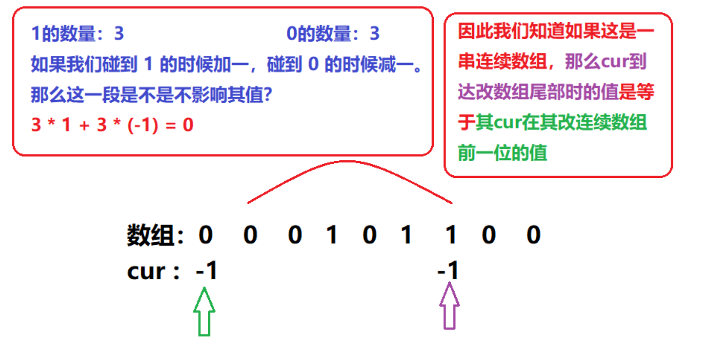
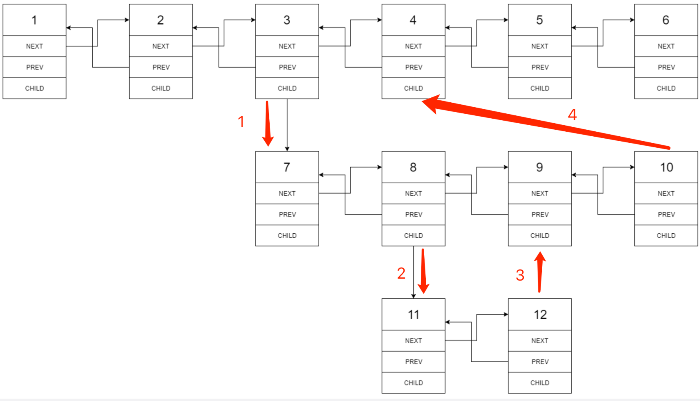
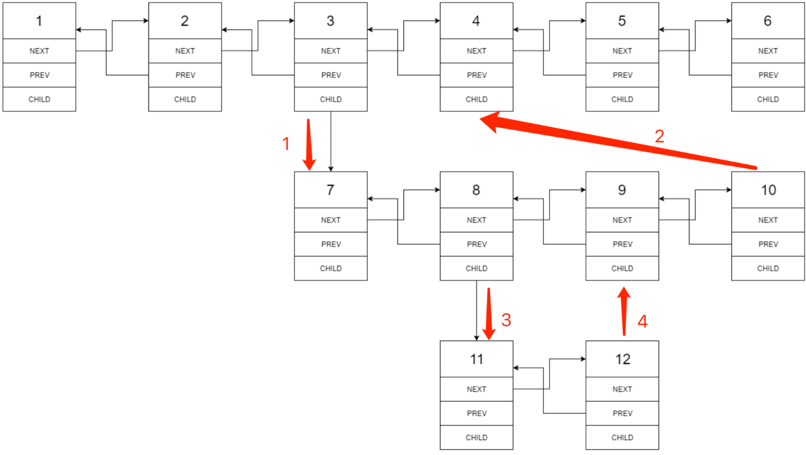

## 1.整数除法
本题是不通过乘除法和取余来求两个数的商
我们很容易就能想到用减法来操作
首先我们先考虑一下边界情况

1. 除数为 0 和被除数为 0 的情况
2. 越界的情况，比如最小负数除以 -1

这两个条件都好说我们只需要添加 if 进行判断即可
其实我们这里还需要考虑一个问题就是正负数的问题，如果不统一在进行减法操作的时候就要进行判断，所以我们可以在一开始的时候就行判断，根据正负数的数量来判断结果正负数
我们这里就统一为负数，因为负数能表示的范围比正数大
用减法来实现除法思路很简单，不停的用除数减去被除数，看看能减多少次，这时候的复杂度就是 On 的，此时我们来看能不能进行优化
如果除数减去被除数，被除数还是大于除数的时候，我们可以将除数 X2 再次进行判断，这样速度就会快起来，每次都会比上一次快 2 倍，此时的时间复杂度就是 logN 
我们此时就来看一下这个思路的一些边界

1. 除数在乘二之前不能超过被除数
2. 除数也不能超过 int 的表示范围

按照这个思路我们就可以实现代码了！
```java
public int divide(int a, int b) {
        if (a == Integer.MIN_VALUE && b == -1) return Integer.MAX_VALUE;
        int negative = 2;
        if (a > 0) {
            negative--;
            a = -a;
        }
        if (b > 0) {
            negative--;
            b = -b;
        }
        int res = divideCore(a, b);
        return negative == 1 ? -res : res;
    }

    private int divideCore(int a, int b) {
        int res = 0;
        while (a <= b) {
            int value = b;
            int quotine = 1;
            while (value >= Integer.MIN_VALUE / 2 && a <= value + value) {
                quotine += quotine;
                value += value;
            }
            res += quotine;
            a -= value;
        }
        return res;
    }
```

---

## 2.二进制加法
最直观的解法就是将二进制字符串转换成十进制数字，对两个十进制数字进行加法，在转换成二进制字符串即可
那有没有一种解法可以不用进制转换呢？
我们可以按照十进制加法进行处理
对两个二进制字符串直接进行加法操作

1. 获取长度
2. 创建进位数
3. 开始遍历字符串 （这里需要注意两个字符串可能长度不一致，所以我们需要加一个判断处理
4. 两个字符的结果相加并加上进位
5. 进位处理 （大于等于2，则进一位
6. 如果相加结果大于等于2，则添加 0
7. 遍历完毕后判断进位
8. 翻转字符串
```java
public String addBinary(String a, String b) {
        int aLen = a.length() - 1;
        int bLen = b.length() - 1;
        int carry = 0;
        StringBuilder sb = new StringBuilder();
        while (aLen >= 0 || bLen >= 0) {
            int aChar = aLen >= 0 ? a.charAt(aLen--) == '1' ? 1 : 0 : 0;
            int bChar = bLen >= 0 ? b.charAt(bLen--) == '1' ? 1 : 0 : 0;
            int sum = aChar + bChar + carry;
            carry = sum >= 2 ? 1 : 0;
            sb.append(sum % 2);
        }
        if(carry==1)sb.append(1);
        return sb.reverse().toString();
    }
```

---

## 3.前 n 个数字二进制中 1 的个数
本题涉及到一个找规律，先将规律总结出来
二进制左移一位就相当于十进制中的乘二
从这里我们可以得到一个数的十进制偶数和它的两倍或者二分之一的十进制数在二进制中的 1 的个数都是相同的，当然0不在考虑范围内
那么奇数呢
奇数就是他前一个偶数 +1 ，我们那 2 举例，2 左移一位就是 100 也就是 4 ，那么 3 呢，就是 2 +1 ，这里我们可以直接在 10 后面 +1 ，同理 4 也是一样 100 + 1 => 101，因为所有的偶数都是它除以二后左移一位的结果，即尾部不可能为 1 ，所以不需要考虑进位的问题
这里我们可以得到两个规律

1. 偶数的二进制 1 的个数和它除以 2 的数都是相同，除去0
2. 奇数的二进制 1 的个数是它前一个偶数的个数 +1
3. 偶数的二进制最右边的一位都是 0 

所以我们可以得到以下代码
```java
	public int[] countBits(int n) {
        int[] res = new int[n + 1];
        for (int i = 0; i <= n; i++) {
            res[i] = res[i >> 1] + (i & 1);
        }
        return res;
    }
```

---

## 4.只出现一次的数字
这里采用位运算的方式进行处理
直接举例子，将所有的数字转换成对应的二进制，如果每个数字都只出现了 3 次，那么转换成二进制，那么在出现 1 的二进制位中 1 出现的次数肯定能被 3 整除，如果不能就说明这一位出现了一个只出现一次的数字
代码说明

1. 因为在这里 int 整数是 32 位的，所以我们要循环32次
2.  >> i 就是在将本次要计数的二进制位位移到最低位，然后和 1 做与运算，如果这一位是 1 则结果就是1
3. |= (1 << i) 如果这一位 1 出现的次数不能被 3 整除那么我们就需要加上去，做或运算可以理解为保留每一位 1
```java
    public int singleNumber(int[] nums) {
        int res = 0;
        for (int i = 0; i < 32; i++) {
            int total = 0;
            for (int num : nums) {
                total += ((num >> i) & 1);
            }
            if (total % 3 != 0) {
                res |= (1 << i);
            }
        }
        return res;
    }
```

---

## 5.单词长度的最大乘积
仍然采取位运算的方式
将每一个字母转换成一个二进制 1
a 就是在第零位的 1，b 就是第二位，以此类推
这样我们就能将一个单词转换成一个二进制数
如果两个单词不存在相同字母，那也就是说这两个二进制数进行与运算就应该是 0 ，因为在相同的位上面两个都不应该为 1 
```java
    public int maxProduct(String[] words) {
        int len = words.length;
        int[] mark = new int[len];
        for (int i = 0; i < words.length; i++) {
            String word = words[i];
            int workLength = word.length();
            for (int k = 0; k < workLength; k++) {
                mark[i] |= 1 << (word.charAt(k) - 'a');
            }
        }
        int max=0;
        for (int i = 0; i < len; i++) {
            for (int j = i + 1; j < len; j++) {
                if ((mark[i] & mark[j]) == 0) {
                    max=Math.max(words[i].length() * words[j].length(),max); ;
                }
            }
        }
        return max;
    }
```

---

## 6.排序数组中的两个数字之和
可以采取第一题两数之和的哈希表写法，但是这里的数组是排序过的，所以可以采取双指针
将两个指针指向数组的头和尾，如果两个指针指向的数字之和相等，那么直接返回结果
如果大于目标值，则只需要移动右指针，因为数组是递增的
反之则需要左移
```java
    public int[] twoSum(int[] numbers, int target) {
        int l = 0, r = numbers.length - 1;
        int[] res = new int[2];
        while (l < r) {
            int a = numbers[l];
            int b = numbers[r];
            if (a + b == target) {
                res[0] = l;
                res[1] = r;
                return res;
            }
            if (a + b < target) {
                ++l;
                continue;
            }
            if (a + b > target) {
                --r;
            }
        }
        return res;
    }
```

---

## 7.数组中和为 0 的三个数字
跟上一题类似，我们需要先进行排序，然后用双指针进行处理，虽然这里要求是三个数字，但是我们可以先固定一个数字，然后在用两个指针指向另外两个数字，这两个数字和固定的数字之和为 0 ，那么这三个数字就是我们需要的答案
注意这里需要排重，所以我们需要判断一下当前指针指向的数字和上一轮指向的数字是否相同，如果相同则应该跳过这个数字
```java
    public List<List<Integer>> threeSum(int[] nums) {
        ArrayList<List<Integer>> res = new ArrayList<>();
        Arrays.sort(nums);
        for (int i = 0; i < nums.length - 1; i++) {
            if (nums[i] > 0) break;
            if (i > 0 && nums[i] == nums[i - 1]) continue;

            int l = i + 1;
            int r = nums.length - 1;

            while (l < r) {
                while (l > i + 1 && l < nums.length && (nums[l] == nums[l - 1])) ++l;
                if (l >= r) break;

                if (r == i) {
                    --r;
                    continue;
                }
                if (nums[l] + nums[r] + nums[i] == 0) {
                    res.add(Arrays.asList(nums[l], nums[r], nums[i]));
                    ++l;
                }
                if (nums[r] + nums[l] + nums[i] > 0) --r;
                if (nums[r] + nums[l] + nums[i] < 0) ++l;
            }
        }
        return res;
```

---

## 8.和大于等于 target 的最短数组
采用滑动窗口解决
一开始全部指向第 0 位，然后右指针向右移动，符合条件则开始收缩，直至不满足

1. 创建结果 min 变量，默认为最大值
2. 左右指针全部指向第 0 位
3. 终止条件 r 小于数组长度
4. 进入循环后先将右指针指向数字加入 sum
5. 判断是否符合，符合则开始收缩
6. 不符合继续移动右指针
```java
    public int minSubArrayLen(int target, int[] nums) {
        int min = Integer.MAX_VALUE;
        int l = 0, r = 0;
        int sum = 0;
        while (r< nums.length) {
            sum += nums[r];
            while (target <= sum) {
                min = Math.min(min, r - l + 1);
                sum -= nums[l];
                ++l;
            }
            ++r;
        }
        return min == Integer.MAX_VALUE ? 0 : min;
    }
```

---

## 9.乘积小于 k 的子数组
依旧采取滑动窗口
例如，假设我们有一个数组[2, 3, 4]，且当前窗口为整个数组，那么以4结尾的子数组有：[4]，[3, 4]和[2, 3, 4]。在这种情况下，right等于2（数组下标从0开始），left等于0，所以窗口大小为right - left + 1，也就是3，刚好是以4结尾的子数组的个数。
这样，我们就可以在遍历数组的过程中，累加每个位置处满足条件的子数组个数，最后得到整个数组中满足条件的子数组总数。
```java
    public int numSubarrayProductLessThanK(int[] nums, int k) {
        if (k == 0) return 0;
        int sum = 1, l = 0, res = 0;
        for (int r = 0; r < nums.length; ++r) {
            sum *= nums[r];
            while (sum >= k && l <= r)
                sum /= nums[l++];
            res += r - l + 1;
        }
        return res;
    }
```

---

## 10.和为 K 的子数组
因为本题例子不能保证数组中的元素不包含负数，所以不能采用滑动窗口
如果要使用滑动窗口我们必须保证在加入元素或者减少元素的时候所有数组的和能单调递增递减

本题可以采用前缀和的方式处理
举个例子，如何计算数组中所有的元素之和，很简单，累加就行了。那么我们如何计算后两位元素之和呢？最直观的方法就是直接计算后两位数字之和。这里我们换个思路，我们如果已知所有元素之和，并且知道除了后两位元素以外的所有元素之和，那么我们就可以用总元素之和减去除后两位元素的其他元素之和得到后两位元素之和。
所以我们可以累加元素，每加一个就将和存储在map中，然后将当前和减去目标值，查询是否存在一个数字 K-sum ，也就是查询前面是否出现 K-sum，如果有那么中间会有一个子数组和为 K 
```java
    public int subarraySum(int[] nums, int k) {
        HashMap<Integer, Integer> map = new HashMap<>();
        int count = 0;
        int sum = 0;
        map.put(0, 1);
        for (int num : nums) {
            sum += num;
            count += map.getOrDefault(sum - k, 0);
            map.put(sum, map.getOrDefault(sum, 0)+1);
        }
        return count;
    }
```

---

## 11.0 和 1 个数相同的子数组
采取前缀和的方式，设定遇到 0 -1，遇到 1 +1，这样就能转换问题为找到和为 0 的最长子数组长度
为了方便计算，我们在哈希表中默认插入 0，-1


```java
    public int findMaxLength(int[] nums) {
        HashMap<Integer, Integer> map = new HashMap<>();
        map.put(0, -1);
        int ans = 0, sum = 0, index = 0;
        for (int num : nums) {
            if (num == 0) sum -= 1;
            else sum += num;
            if (map.containsKey(sum)) ans = Math.max(index - map.get(sum), ans);
            else map.put(sum, index);
            ++index;
        }
        return ans;
    }
```

---

## 12.左右两边子数组和相等
分别计算数组值的和，然后一起遍历，如果值相同，则改索引就是答案
```java
class Solution {
    public int pivotIndex(int[] nums) {
        int index = -1;
        int[] lNum = new int[nums.length];
        int[] rNum = new int[nums.length];
        int lSum = 0, rSum = 0;
        for (int i = 0; i < nums.length; i++) {
            lNum[i] = lSum += nums[i];
            rNum[nums.length - i - 1] = rSum += nums[nums.length - i - 1];
        }
        for (int i = 0; i < lNum.length; i++) {
            if(lNum[i]==rNum[i])return i;
        }
        return -1;
    }
}
```
假设左侧元素之和为 `sum` ，那么右侧元素之和就为 `total`- `num[index]`- `sum`，左右相等即为 `sum`= `total`- `num[index]`- `sum` ，即为 `2*sum`+ `num[index]`= `total`
```java
class Solution {
    public int pivotIndex(int[] nums) {
        int total = Arrays.stream(nums).sum();
        int sum = 0;
        for (int i = 0; i < nums.length; ++i) {
            if (2 * sum + nums[i] == total) {
                return i;
            }
            sum += nums[i];
        }
        return -1;
    }
}
```

---

## 13.二维子矩阵的和
此题需要用到前缀和，我们先看看下面的前缀和入门题目
### 区域和检索 - 数组不可变
在定义原数组的时候再定义一个数组，用来存放当前下标（不包含）到开头所有数字的和
当需要知道对应区间所有数字的和，我们只需要右指针到开头所有数字的和减去左指针到开头所有数字的和
```java
    private int[] nums;
    private int[] sum;

    public NumArray(int[] nums) {
        this.nums = nums;
        sum = new int[nums.length + 1];
        for (int i = 0; i < nums.length; i++) {
            sum[i + 1] = sum[i] + nums[i];
        }
    }

    public int sumRange(int left, int right) {
        return sum[right+1]-sum[left];
    }
```
再来看这个，我们也需要定义一个数组存放所有的前缀和，如何计算前缀和，我们只需要计算当前下标左侧元素和上方元素以及他本身的和即可，这样我们就得到了一个前缀和数组
然后如何使用前缀和计算指定子矩阵的和呢，看下面的图就会很清楚


```java
    private int[][] preSum;

    public NumMatrix(int[][] matrix) {
        preSum = new int[matrix.length + 1][matrix[0].length + 1];
        for (int i = 1; i < preSum.length; i++) {
            for (int j = 1; j < preSum[i].length; j++) {
                preSum[i][j] = preSum[i][j - 1] + preSum[i - 1][j] - preSum[i - 1][j - 1] + matrix[i - 1][j - 1];
            }
        }
    }

    public int sumRegion(int row1, int col1, int row2, int col2) {
        return preSum[row2 + 1][col2 + 1] - preSum[row2 + 1][col1] - preSum[row1][col2 + 1] + preSum[row1][col1];
    }
```

---

## 14.字符串中的变位词
使用哈希表和滑动窗口的方式
因为只包含小写字母所以可以使用一个长度为 26 的整数数组来替代哈希表，常规的哈希表速度是比数组要慢的
因为并不能保证 s1 长度比 s2 短，所以在一开始做个判断
先将 s1 字符出现数量计入哈希表中，此时也顺便将对应长度的 s2 也计入另一个哈希表中
此时我们就可以先做判断，判断是否相等
然后进入滑动窗口，向右移动，左边字符舍去，右侧字符进入，然后对比
```java
    public boolean checkInclusion(String s1, String s2) {
        if (s1.length() > s2.length()) return false;
        int[] a = new int[26];
        int[] b = new int[26];
        for (int i = 0; i < s1.length(); i++) {
            a[s1.charAt(i) - 'a']++;
            b[s2.charAt(i) - 'a']++;
        }
        if (Arrays.equals(a, b)) return true;
        int left = 0, right = s1.length();
        while (right < s2.length()) {
            b[s2.charAt(left) - 'a']--;
            b[s2.charAt(right) - 'a']++;
            if (Arrays.equals(a, b)) return true;
            ++left;
            ++right;
        }
        return false;
    }
```

---

## 15.字符串中所有的变位词
解法跟上题一样，只是不在 return 而是添加元素到 list 中
```java
    public List<Integer> findAnagrams(String s, String p) {
        if (p.length() > s.length()) return new ArrayList<>();
        ArrayList<Integer> list = new ArrayList<>();
        int[] a = new int[26];
        int[] b = new int[26];
        for (int i = 0; i < p.length(); i++) {
            a[s.charAt(i) - 'a']++;
            b[p.charAt(i) - 'a']++;
        }
        if (Arrays.equals(a, b)) list.add(0);
        int left = 0, right = p.length();
        while (right < s.length()) {
            a[s.charAt(left) - 'a']--;
            a[s.charAt(right) - 'a']++;
            if (Arrays.equals(a, b)) list.add(left + 1);
            ++left;
            ++right;
        }
        return list;
    }
```

---

## 16.不含重复字符的最长子字符串
依旧使用哈希表和双指针来解决本题
本题所出现的字符包含空格和其他符号，所以我们不能使用上面的数组来模拟哈希表
首先还是先进行一些边界条件判断
然后开始逐一遍历字符串的字符存入哈希表中，如果哈希表中存在该字符，就需要移动 left 指针，然后更新 maxLength ，然后还需要更新这个重复出现的下标
关于为什么要添加这个条件 map.get(currentChar) >= left 如果当前位置的字符在 left 指针左边的话，left 就会出现在之前出现的地方，这样反而会让指针区间变大，而且可能不是一个不含重复字符的字串了，所以需要加入这个条件
```java
    public int lengthOfLongestSubstring(String s) {
        if (s == null || s.length() == 0) return 0;
        if (s.length() == 1) return 1;
        HashMap<Character, Integer> map = new HashMap<>();
        int maxLength = 1;
        int left = 0, right = 0;
        while (right < s.length()) {
            char currentChar = s.charAt(right);
            if (map.containsKey(currentChar) && map.get(currentChar) >= left) {
                left = map.get(currentChar) + 1;
            }
            maxLength = Math.max(maxLength, right - left + 1);
            map.put(currentChar, right);
            ++right;
        }
        return maxLength;
    }
```

---

## 17.含所有字符的最短字符串
依旧采取滑动窗口的方法
先判断目标字符串是否大于待搜索的字符串，如果大于则定不包含所有字符
遍历 target 字符串将字符和出现的次数存入 hash 表中
开始滑动窗口，如果一个字符出现的次数和 target 一致则 count++ ，如果count 和 needMap 长度一致则说明所有字符都出现了，那么就可以开始缩小窗口，如果去除的字符是出现过的字符则需要更新 map ，并且更新 count 
```java
    public String minWindow(String s, String t) {
        if (t.length() > s.length()) return "";
        HashMap<Character, Integer> need = new HashMap<>();
        HashMap<Character, Integer> window = new HashMap<>();
        for (char c : t.toCharArray()) {
            need.put(c, need.getOrDefault(c, 0) + 1);
        }
        int start = 0, len = Integer.MAX_VALUE;
        int count = 0;
        int left = 0, right = 0;
        while (right < s.length()) {
            char entrance = s.charAt(right++);
            if (need.containsKey(entrance)) {
                window.put(entrance, window.getOrDefault(entrance, 0) + 1);
                if (window.get(entrance).equals(need.get(entrance))) {
                    ++count;
                }
            }
            while (count == need.size()) {
                if (right - left < len) {
                    start = left;
                    len = right - left;
                }
                char exit = s.charAt(left++);
                if (window.containsKey(exit)) {
                    if (window.get(exit).equals(need.get(exit))) {
                        --count;
                    }
                    window.put(exit, window.get(exit) - 1);
                }
            }
        }
        return len == Integer.MAX_VALUE ? "" : s.substring(start, start + len);
    }
```

---

## 18.有效的回文
使用双指针，这里需要注意在判断一个字符是否为字母或者数字的时候需要添加 left <= right 条件防止出现越界的情况
```java
    public boolean isPalindrome(String s) {
        if (s.length() == 0) return true;
        int left = 0, right = s.length() - 1;
        while (left <= right) {
            while (left <= right && !Character.isLetterOrDigit(s.charAt(left)))
                ++left;
            while (left <= right && !Character.isLetterOrDigit(s.charAt(right)))
                --right;

            if (left <= right && Character.toLowerCase(s.charAt(left)) != Character.toLowerCase(s.charAt(right)))
                return false;
            ++left;
            --right;
        }
        return true;
    }
```

---

## 19.最多删除一个字符得到回文
因为最多只能删除一个字符，所以遇到不一样的字符时只需要分两种情况判断就能得到结果
```java
    public boolean validPalindrome(String s) {
        if (s.length() == 1) return true;
        int left = 0, right = s.length() - 1;
        while (left <= right) {
            if (s.charAt(left) != s.charAt(right)) {
                return validPalindrome(s, left + 1, right) || validPalindrome(s, left, right - 1);
            }
            ++left;
            --right;
        }
        return true;
    }

    private boolean validPalindrome(String s, int left, int right) {
        while (left <= right) {
            if (s.charAt(left) != s.charAt(right)) {
                return false;
            }
            ++left;
            --right;
        }
        return true;
    }
```

---

## 20.回文子字符串的个数
使用中心扩展的方法解答
这个方法就是在数组中定一个点，向左右两边同时扩散同时判断是否相等
这里存在一个奇偶数问题，就是中心点会有一个元素和两个元素的情况
所以可以使用两个指针，两个指针重叠就是单个中心点，没有重叠就是两个中心点
然后同时扩散，扩散之前需要检查两个字符是否相同，且不能超过数组边界
现在的问题是如何确定这两个指针下标
首先确定个数，如果是单个字符为中心点，则个数就为数组的长度，如果是两个字符则数量就是数组的长度减一，所以个数为 2*n-1
```java
    public int countSubstrings(String s) {
        int ans = 0;
        for (int i = 0; i < s.length() * 2 - 1; i++) {
            int left = i/2;
            int right = left + i % 2;
            while (left >= 0 && right < s.length() && s.charAt(left) == s.charAt(right)) {
                --left;
                ++right;
                ++ans;
            }
        }
        return ans;
    }
```

---

## 21.删除链表的倒数第 N 个节点
如果遇到链表的题目，建议建立一个哨兵节点，将哨兵节点的 next 指针指向 head 节点，这样可以避免出现空指针的情况
我们可以先定义一个指针，先向前走 N 步，然后在定义一个指针从 dummy 开始跟 front 指针一起向前，等front 指针为 null ，那么就说明 dummy 已经走到了要被删除节点的前一个结点，我们只需要将当前节点的 next 指向他的下下个节点即可
```java
    public ListNode removeNthFromEnd(ListNode head, int n) {
        ListNode dummy = new ListNode();
        dummy.next = head;
        ListNode front = head;
        for (int i = 0; i < n; i++) {
            front = front.next;
        }
        ListNode back = dummy;
        while (front != null) {
            back = back.next;
            front = front.next;
        }
        back.next = back.next.next;
        return dummy.next;
    }
```

---

## 22.链表环中的入口节点
这题我们需要判断这个链表是否为一个环形链表
使用快慢指针即可，如果为环则必定会相遇
现在就是要找到入口节点
假设慢指针走了 K 步，则快指针走了 2K 步，多出来的 K 步则为在环中走的步数也就是环周长的整数倍
假设入口节点到相遇节点的举例为 m ，k-m 是链表开头距离入口的距离，也是相遇节点到入口节点顺时针的举例，所以我们只需要重新从头节点开始走，相遇节点也随着头节点一起走，则再次相遇的几点就是入口节点
```java
    public ListNode detectCycle(ListNode head) {
        ListNode fast = head, slow = head;
        while (fast != null && fast.next != null) {
            fast = fast.next.next;
            slow = slow.next;
            if (fast == slow) break;
        }
        if (fast == null || fast.next == null) return null;
        slow = head;
        while (fast != slow) {
            slow = slow.next;
            fast = fast.next;
        }
```

---

## 23.两个链表的第一个重合节点
双双遍历两个节点，单个节点走完就继续走另一个节点的头节点，相遇的节点则为重合节点，两个节点不重合且相等则直接返回即可，因为为 null
```java
    public ListNode getIntersectionNode(ListNode headA, ListNode headB) {
        ListNode dummyA = headA;
        ListNode dummyB = headB;
        while (dummyA != dummyB) {
            dummyA = dummyA == null ? headB : dummyA.next;
            dummyB = dummyB == null ? headA : dummyB.next;
        }
        return dummyB;
    }
```

---

## 24.反转链表
这里采用迭代的方式解答，还有使用递归的方式，递归保证尾节点能 return 上去，当前节点的下个节点的 next 能指向当前节点，并且当前节点的 next 置空
除此之外还有使用容器的方式，只要能够按照顺序存储节点，然后倒序输出即可

定义一个空节点，将当前头节点指向空节点，然后空节点向前移动，head 也继续移动
```java
    public ListNode reverseList(ListNode head) {
        if (head == null || head.next == null) return head;
        ListNode node = null;
        while (head != null) {
            ListNode next = head.next;
            head.next = node;
            node = head;
            head = next;
        }
        return node;
    }
```

---

## 25.链表中的两数相加
两个链表分别存入队列或者栈中，最后倒序取出，只有在两个节点都为空的时候且存进位数的值为 0 的是退出循环，两个栈中如果只有一个为空，则默认为 0 
这里需要注意的是，如果直接按照去除顺序相加放入节点中，链表应该翻转过来，但是这里也有另一个方法，就是先定义一个空节点，然后将值放在一个新节点中，然后新节点的 next 指向空节点，空节点指向新节点，循环结束后返回空节点
```java
    public ListNode addTwoNumbers(ListNode l1, ListNode l2) {
        ArrayDeque<ListNode> deque1 = new ArrayDeque<>();
        ArrayDeque<ListNode> deque2 = new ArrayDeque<>();
        ListNode dummy1 = l1, dummy2 = l2;
        while (dummy1 != null) {
            deque1.push(dummy1);
            dummy1 = dummy1.next;
        }
        while (dummy2 != null) {
            deque2.push(dummy2);
            dummy2 = dummy2.next;
        }
        ListNode node = null;
        int carry = 0;
        while (!deque1.isEmpty() || !deque2.isEmpty() || carry > 0) {
            int x = 0, y = 0;
            if (!deque1.isEmpty()) x = deque1.poll().val;
            if (!deque2.isEmpty()) y = deque2.poll().val;
            int val = x + y + carry;
            ListNode dummy = new ListNode(val % 10);
            carry = val / 10;
            dummy.next = node;
            node = dummy;
        }
        return node;
    }
```

---

## 26.重排链表
如果使用线性表的话，先全部存入线性表中，然后开始重新连接，最后处理一下尾部指针
```java
    public void reorderList(ListNode head) {
        if (head.next == null || head.next.next == null) return;
        ArrayDeque<ListNode> deque = new ArrayDeque<>();
        ListNode node = head;
        while (node != null) {
            deque.push(node);
            node = node.next;
        }
        int size = deque.size() / 2;
        ListNode dummy = head;
        while (size > 0) {
            ListNode next = dummy.next;
            ListNode poll = deque.poll();
            dummy.next = poll;
            poll.next = next;
            dummy = next;
            --size;
        }
        dummy.next = null;
    }
```
另外一种解法可以同时使用反转链表，寻找链表中点，合并链表这几个技巧
首先我们先找到中点，这里直接使用快慢指针即可
ListNode l2 = mid.next;
对于这里，因为在这题中一个链表的中间节点经过重排过肯定是在尾部，所以取它的下一个节点
找到第二链表节点后就可以翻转了
翻转后进行合并
```java
    public void reorderList(ListNode head) {
        if (head.next == null || head.next.next == null) return;
        ListNode mid = findMid(head);
        ListNode l1 = head;
        ListNode l2 = mid.next;
        mid.next = null;
        l2 = reverseList(l2);
        head = mergeList(l1, l2);
    }

    private ListNode mergeList(ListNode l1, ListNode l2) {
        ListNode node = new ListNode();
        ListNode dummy = node;
        while (l1 != null || l2 != null) {
            if (l1 != null) {
                node.next = l1;
                l1 = l1.next;
                node = node.next;
            }
            if (l2 != null) {
                node.next = l2;
                l2 = l2.next;
                node = node.next;
            }
        }
        return dummy.next;
    }


    private ListNode reverseList(ListNode head) {
        if (head == null||head.next==null) return head;
        ListNode node = reverseList(head.next);
        head.next.next = head;
        head.next=null;
        return node;
    }

    private ListNode findMid(ListNode head) {
        ListNode fast = head;
        ListNode slow = head;
        while (fast != null && fast.next != null) {
            fast = fast.next.next;
            slow = slow.next;
        }
        return slow;
    }
```

---

## 27.回文链表
如果使用双端队列，这题就很解决，但这里我们使用翻转的方式
找到中间节点，翻转 ，比对
注意使用迭代会比递归要快，递归会有方法栈的消耗
```java
    public boolean isPalindrome(ListNode head) {
        if (head.next == null) return true;
        ListNode mid = findMid(head);
        mid = reverse(mid);
        while (mid != null) {
            if (head.val != mid.val) return false;
            head = head.next;
            mid = mid.next;
        }
        return true;
    }

    private ListNode reverse(ListNode mid) {
        if (mid == null || mid.next == null) return mid;
        ListNode node = reverse(mid.next);
        mid.next.next = mid;
        mid.next = null;
        return node;
    }

    private ListNode findMid(ListNode head) {
        ListNode fast = head;
        ListNode slow = head;
        while (fast != null && fast.next != null) {
            fast = fast.next.next;
            slow = slow.next;
        }
        return slow;
    }
```

---

## 28.展平多级双向链表
### 递归
遍历链表，如果发现存在子链则进入递归，注意要提前保存一份 next 指针
递归进入最下面一层后，返回的应该就是子链的最后一个节点，此时递归栈中当前的 next 就是指向最后一个子链的父节点
当前节点和它的子节点进行连接，此时还需要处理当前节点的 next 节点，如果不为空就将最后一个孩子节点与 next 节点相连，最后还需要置空指向孩子节点的指针，并将最后一个节点指针指向孩子节点


### 迭代
一般来说还是建议使用迭代的方式，递归有潜在风险，且存在方法栈的开销
迭代的处理顺序跟递归会有些许不同
首先遍历链表，如果发现存在子链则进行处理
保存 next 节点和 child 节点
当前节点重新和孩子节点连接，并将指向 child 的节点置空
对当前子链进行遍历，获得子链最后一个节点，将最后一个节点与 next 相连
我们先拿下面的图为例，此时 head 依旧为 3 ，继续迭代下一个节点，就是 7 ，此时继续下去就会遇上节点 8 重复上面的操作，这样最后的效果就和递归一样


```java
    public Node flatten(Node head) {
        Node dummy = new Node();
        dummy.next = head;
        for (; head != null; head = head.next) {
            if (head.child != null) {
                Node next = head.next;
                Node child = head.child;
                head.next = child;
                child.prev = head;
                head.child = null;
                while (child.next != null) child = child.next;
                child.next = next;
                if (next != null) next.prev = child;
            }
        }
        return dummy.next;
    }

    private Node dfs(Node head) {
        Node curr = head;
        Node last = null;
        while (curr != null) {
            Node next = curr.next;
            if (curr.child != null) {
                Node child = dfs(curr.child);

                curr.next = curr.child;
                curr.child.prev = curr;

                if (next != null) {
                    child.next = next;
                    next.prev = child;
                }

                curr.child = null;
                last = child;
            } else {
                last = curr;
            }
            curr = next;
        }
        return last;
    }
```

---

## 29.排序的循环链表
如果给定的链表为空节点则直接将给定的元素头尾相连返回
如果为一个节点则将两个节点相连
如果为多个则逐一判断
为了方便理解，我们将循环链表看成一个线性表
先判断是否可以插入到线性表中间的位置，如果满足条件则退出循环开始插入
如果插入节点是最大值或者最小值则需要在两端插入，因为是循环链表，两端节点也是同一个点
```java
    public Node insert(Node head, int insertVal) {
        Node node = new Node(insertVal);
        //空节点情况
        if (head == null) {
            node.next = node;
            return node;
        }
        //单节点情况
        if (head.next == head) {
            head.next = node;
            node.next = head;
            return head;
        }
        //多节点情况
        Node curr = head, next = head.next;
        while (next != head) {
            //插入节点在两个点中间的情况
            if (insertVal >= curr.val && insertVal <= next.val) {
                break;
            }
            //两个指针指向最大值很最小值的情况
            if (curr.val > next.val) {
                //比当前节点大 或 比next节点小
                if (insertVal > curr.val || insertVal < next.val) {
                    break;
                }
            }
            curr = curr.next;
            next = next.next;
        }
        curr.next = node;
        node.next = next;
        return head;
    }
```

---

## 30.插入、删除和随机访问都是O(1)的容器
主要说明一下删除逻辑
将要删除的节点和最后一个节点交换，然后更新 map 进行删除
因为 arraylist 删除最后一个元素的时间复杂度是 O1 的
```java
class RandomizedSet {
    ArrayList<Integer> arrayList;
    HashMap<Integer, Integer> hashMap;
    Random random;

    /**
     * Initialize your data structure here.
     */
    public RandomizedSet() {
        arrayList = new ArrayList<>();
        hashMap = new HashMap<>();
        random = new Random();
    }

    /**
     * Inserts a value to the set. Returns true if the set did not already contain the specified element.
     */
    public boolean insert(int val) {
        if (hashMap.containsKey(val)) return false;
        arrayList.add(val);
        hashMap.put(val, arrayList.size() - 1);
        return true;
    }

    /**
     * Removes a value from the set. Returns true if the set contained the specified element.
     */
    public boolean remove(int val) {
        if (!hashMap.containsKey(val)) return false;
        Integer index = hashMap.get(val);
        Integer last = arrayList.get(arrayList.size() - 1);
        arrayList.set(index, last);
        hashMap.put(last,index);
        hashMap.remove(val);
        arrayList.remove(arrayList.size() - 1);
        return true;
    }

    /**
     * Get a random element from the set.
     */
    public int getRandom() {
        int index = random.nextInt(arrayList.size());
        return arrayList.get(index);
    }
}
```

---

## 31.最近最少使用缓存
本题可以直接使用 LinkedHashMap 解决，但这里使用双向链表和哈希表的方式来模拟 LinkedHashMap 来解决

1. 先创建双向链表，这里需要的方法有增加节点，删除指定节点和删除第一个元素，注意这里最好事先添加两个节点作为前后的哨兵节点方便操作，在删除第一个元素的时候获取前哨兵的下一个节点后直接交给删除指定节点方法处理
2. 数据结构准备好之后，我们就需要准备一些辅助方法来辅助进行 get put 操作
   1. 添加一个优先级提升方法，在添加的时候需要对这个元素进行优先级的提升
   2. 一个添加元素的方法
   3. 一个删除元素的方法
   4. 一个删除优先级最低元素的方法
```java
class LRUCache {

    private HashMap<Integer, DoubleList.Node> map;

    private DoubleList cache;

    private int capacity;

    public LRUCache(int capacity) {
        this.capacity = capacity;
        map = new HashMap<>();
        cache = new DoubleList();
    }

    public int get(int key) {
        //确认是否存在
        if (!map.containsKey(key)) return -1;
        //提升级别
        makeRecently(key);
        return map.get(key).value;
    }

    public void put(int key, int value) {
        //存在 key 执行 更新值和提升级别
        if (map.containsKey(key)) {
            deleteKey(key);
            addRecently(key, value);
            return;
        }

        //容量已满清理优先级最低的数据
        if (capacity == cache.getSize()) {
            removeLeastRecently();
        }

        //有容量且不存在 key
        addRecently(key, value);
    }

    /**
     * 提升优先级
     *
     * @param key
     */
    private void makeRecently(int key) {
        //获取需要提升的节点
        DoubleList.Node node = map.get(key);
        //删除
        cache.remove(node);
        //添加到尾部
        cache.addlast(node);
    }

    /**
     * 添加元素，添加的元素的优先级为最高
     *
     * @param key
     * @param value
     */
    private void addRecently(int key, int value) {
        DoubleList.Node node = new DoubleList.Node(key, value);
        cache.addlast(node);
        map.put(key, node);
    }

    /**
     * 删除元素
     *
     * @param key
     */
    private void deleteKey(int key) {
        DoubleList.Node node = map.get(key);
        cache.remove(node);
        map.remove(key);
    }

    /**
     * 删除优先级最低的元素
     */
    private void removeLeastRecently() {
        DoubleList.Node node = cache.removeFirst();
        int key = node.key;
        map.remove(key);
    }
}


class DoubleList {
    private Node head, tail;

    private int size;

    public DoubleList() {
        head = new Node(0, 0);
        tail = new Node(0, 0);
        head.next = tail;
        tail.prev = head;
        size = 0;
    }

    /**
     * 添加元素至尾部
     * @param node
     */
    public void addlast(Node node) {
        //处理插入的节点
        node.prev = tail.prev;
        node.next = tail;
        //处理原尾部节点
        tail.prev.next = node;
        //处理虚拟尾节点
        tail.prev = node;
        ++size;
    }

    /**
     * 删除指定元素
     * @param node
     */
    public void remove(Node node) {
        node.prev.next = node.next;
        node.next.prev = node.prev;
        --size;
    }

    /**
     * 删除链表第一个元素
     * @return
     */
    public Node removeFirst() {
        if (head.next == tail) return null;
        Node first = head.next;
        remove(first);
        return first;
    }

    public int getSize() {
        return size;
    }

    static class Node {
        public int key, value;
        public Node next;
        public Node prev;

        public Node(int key, int value) {
            this.key = key;

            this.value = value;
        }
    }
}
```

---

## 32.有效的变位词
因为字符都是小写字母，所以我们可以使用一个数组来模拟哈希表，如果包含其他字符建议使用哈希表来解答
我们先比对两个字符串大小，如果长度不等则必不是有效的换位词，如果两个字符串相等则也不是有效变位词
遍历两个字符串，第一个字符串进行++操作，后面的字符串进行--操作，在进行--操作的时候如果数组存储的值小于 0 则可以提前退出循环
```java
    public boolean isAnagram(String s, String t) {
        if (s.length() != t.length() || (s.equals(t))) return false;
        int[] map = new int[26];
        for (char c : s.toCharArray()) {
            map[c - 'a']++;
        }
        for (char c : t.toCharArray()) {
            map[c - 'a']--;
            if (map[c - 'a'] < 0) return false;
        }
        for (int i : map) {
            if (i != 0) return false;
        }
        return true;
    }
```

---

## 33.变位词组
获取每个字符串的字符哈希映射，将其转换成string作为key存入哈希表中
这里重要的是 putIfAbsent 方法，如果不存在指定 key 则存储对应的键值对
```java
    public List<List<String>> groupAnagrams(String[] strs) {
        HashMap<String, List<String>> codeToGroup = new HashMap<>();
        for (String str : strs) {
            String encode = encode(str);
            codeToGroup.putIfAbsent(encode, new LinkedList<>());
            codeToGroup.get(encode).add(str);
        }
        return new ArrayList<>(codeToGroup.values());
    }

    private String encode(String str) {
        char[] count = new char[26];
        for (char c : str.toCharArray()) {
            count[c - 'a']++;
        }
        return new String(count);
    }
```

---

## 34.验证外星语词典
先建立字母顺序映射，然后开始注意遍历字符串数组，逐一比对字符串的字符，根据之前建立的字符顺序映射判断，前面的字符串字符顺序是否在当前的前面，如果判断结束后前字符串字符顺序都在当前字符串前面，则还需要判断前字符串长度是否小于等于当前字符串，否则为 false
```java
    public boolean isAlienSorted(String[] words, String order) {
        int[] map = new int[26];
        char[] chars = order.toCharArray();
        for (int i = 0; i < chars.length; i++) {
            map[chars[i] - 'a'] = i;
        }

        for (int i = 1; i < words.length; i++) {
            boolean valid = false;
            for (int j = 0; j < words[i - 1].length() && j < words[i].length(); ++j) {
                int prev = map[words[i - 1].charAt(j) - 'a'];
                int curr = map[words[i].charAt(j) - 'a'];
                if (prev < curr) {
                    valid = true;
                    break;
                } else if (prev > curr) {
                    return false;
                }
            }
            if (!valid) {
                if (words[i - 1].length() > words[i].length()) {
                    return false;
                }
            }
        }
        return true;
    }
```

---

## 35.最小时间差
先排序，然后声明一个计算0点到指定时间之间时间差的方法
然后开始遍历时间，计算两个时间之间的时间差
遍历结束后还需要对第一个和最后一个进行计算

如果长度大于1440，则最小时间差必为0，如果在遍历过程中发现有时间差为0则直接返回0
```java
    public int findMinDifference(List<String> timePoints) {
        if (timePoints.size() > 60 * 24) return 0;
        Collections.sort(timePoints);
        int ans = Integer.MAX_VALUE;
        int first = getMinutes(timePoints.get(0));
        int prev = first;
        for (int i = 1; i < timePoints.size(); i++) {
            int minutes = getMinutes(timePoints.get(i));
            ans = Math.min(ans, minutes-prev);
            if (ans == 0) return 0;
            prev = minutes;
        }
        ans = Math.min(ans, first + 1440 - prev);
        return ans;
    }

    private int getMinutes(String time) {
        return ((time.charAt(0) - '0') * 10 + (time.charAt(1) - '0')) * 60 + ((time.charAt(3) - '0') * 10 + (time.charAt(4) - '0'));
    }
```
